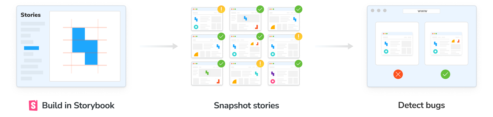
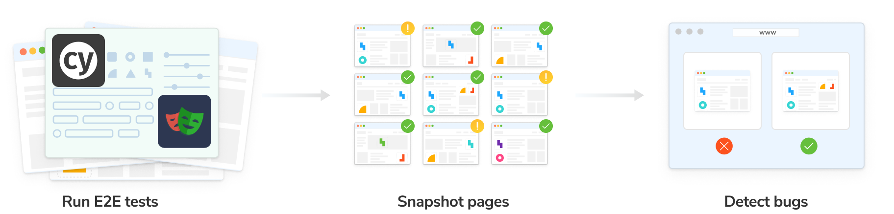

import { YouTubeCallout } from "../../components/YouTubeCallout";

# Why Chromatic?

Chromatic is a testing platform that scans every possible UI state across browsers to catch bugs in appearance, functionality, and accessibility. It enables you to assign reviewers and resolve discussions to streamline team sign-off.

Chromatic is made by the [team](https://www.chromatic.com/company/about) behind Storybook and integrates with Storybook, Playwright, and Cypress.

<YouTubeCallout
  client:load
  id="zhrboql8UuU"
  summary="Watch a quick demo video of Chromatic's key features"
/>

## Test how UIs look & function

Every time you push code, Chromatic runs the suite of UI Tests on your code to pinpoint bugs instantly. All tests run in parallel, including testing across your chosen combinations of viewports and browsers.

- [**Visual tests**](/docs/visual): Pinpoint changes in appearance, layout, fonts, and colors.
- [**Interaction tests**](/docs/interactions): Simulate user actions such as clicking, typing, hovering, dragging, etc., to confirm your app behaves as expected.
- [**Accessibility tests**](/docs/accessibility) (beta): run axe on each component to identify accessibility violations and get remediation tips.

## Benefits of testing with Chromatic

Chromatic’s UI Tests lets you gain full confidence in your UIs on every commit and code change.

🎛️ **Test the real UI**: Chromatic takes pixel-perfect snapshots of real code, styling, and assets. Your tests reflect exactly what your users see.

✅ **No test flake**: Chromatic uses [SteadySnap](https://www.chromatic.com/features/steadysnap) to eliminate test flake by stabilizing frontend rendering. It tracks browser activity, freezes dynamic content, and uses burst capture to ensure consistent results every time.

🏎️ **Run tests in parallel by default**: Chromatic tests run on as many machines as required to deliver results in the least time possible. Parallelization is automatic with no extra configuration or cost required.

🌐 **Cross-browser testing**: Chromatic test coverage extends to Chrome, Firefox, Safari, and Edge. All browser tests run in parallel so your test suite stays fast.

📲 **Responsive viewport testing**: Chromatic allows testing at all viewport sizes. You can adjust both width and height, and configure viewports globally or for individual tests.

⚡ **Test only what's changed**: Chromatic’s [TurboSnap](https://www.chromatic.com/features/turbosnap) feature speeds up test runs and reduces usage costs by up to 80%. It works by analyzing your project’s Git history and bundler dependency graph to identify component files and dependencies with changes, then it snapshots only the tests related to those changes.

## Powered by your existing tests

Chromatic's UI Tests build on the Storybook, Playwright, and Cypress tests you’ve already written. This dramatically reduces maintenance burden and setup.

###  Storybook

Storybook lets you capture every component state and variation as stories. Chromatic then automatically converts them into tests, catching any unexpected changes and guaranteeing a flawless UX for your users.

Why use Storybook?

[Storybook](https://storybook.js.org/) is an open-source tool for developing UI components in isolation and creating living, interactive component documentation. It makes it trivial to reproduce hard-to-reach component states and ensures those states are documented in code. When you adopt Storybook, you also unlock automation for UI components and libraries via Chromatic.

New to Storybook? Check out our hands-on tutorials at [storybook.js.org/tutorials](https://storybook.js.org/tutorials/).

[Stories](https://storybook.js.org/docs/get-started/whats-a-story) capture all states and variations of a component. They’re a pragmatic, reproducible way to keep track of UI test cases. Using [play functions](https://storybook.js.org/docs/writing-stories/play-function), stories allow you to simulate user interactions to run functional tests on components. Chromatic uses these stories to power visual tests.

Chromatic manages the entire testing process for you. Everything from building and publishing your Storybook to running tests in cloud browsers.

[**Zero-config interaction tests:**](/docs/interactions#how-to-write-interaction-tests) If you use Storybook's [play functions](https://storybook.js.org/docs/writing-stories/play-function) for functional testing, Chromatic intelligently waits for their completion before capturing snapshots.

[**Effortless variant testing:**](/docs/modes/) Chromatic harnesses the power of [Storybook Globals](https://storybook.js.org/docs/essentials/toolbars-and-globals#globals) to comprehensively test UI variations across themes, viewports, locales, and media features.

###  Playwright and  Cypress

Run your E2E tests as usual. While those tests run, Chromatic collects a complete archive of your UI (DOM, styles, and assets). It then renders that archived UI in cloud browsers, captures visual snapshots, and identifies visual regressions through pixel diffing.

## Get started

Experience the power of Chromatic firsthand! Setup takes just two minutes. Pick your testing tool of choice and get started.

  
  
  

