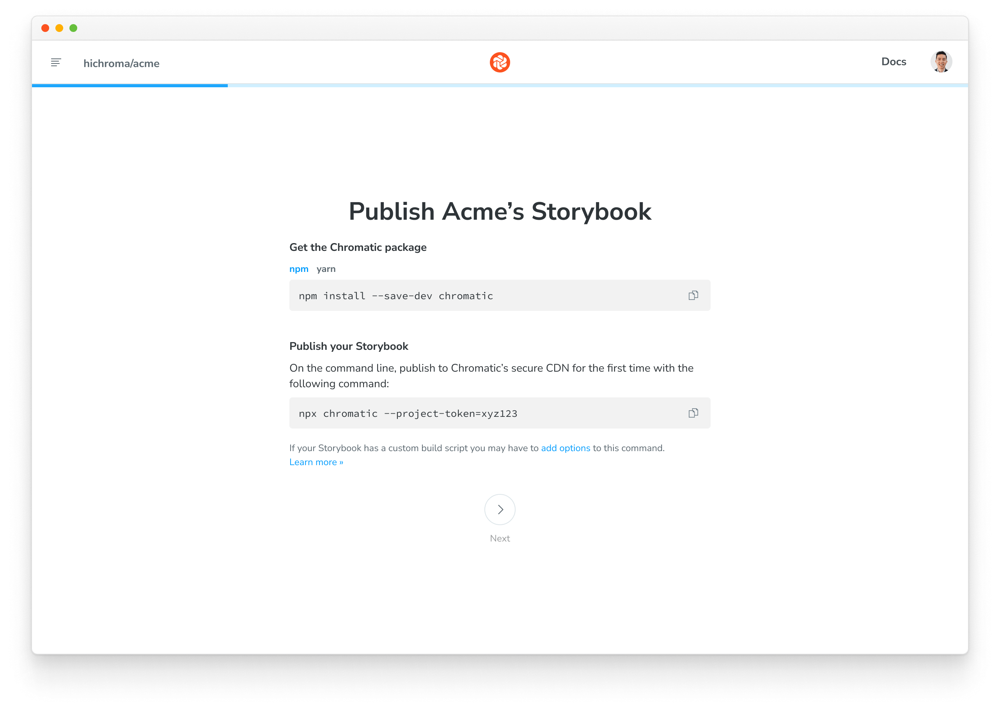
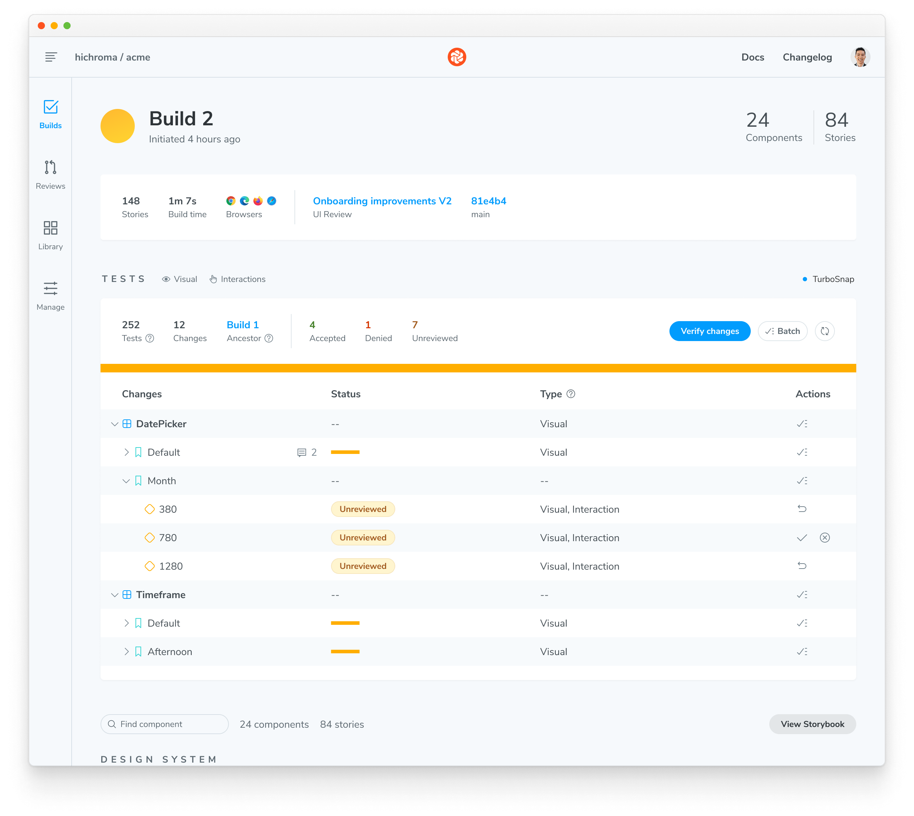
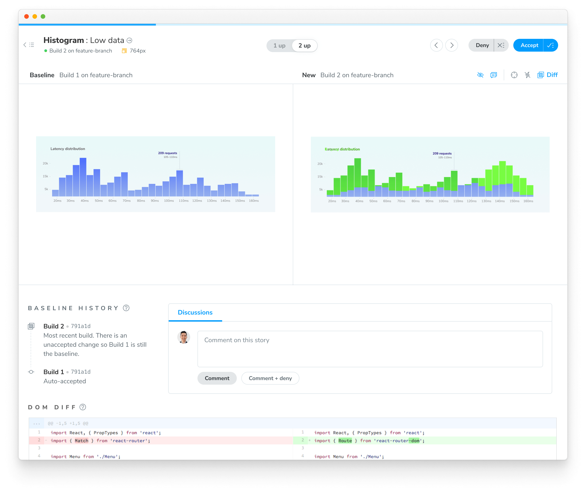
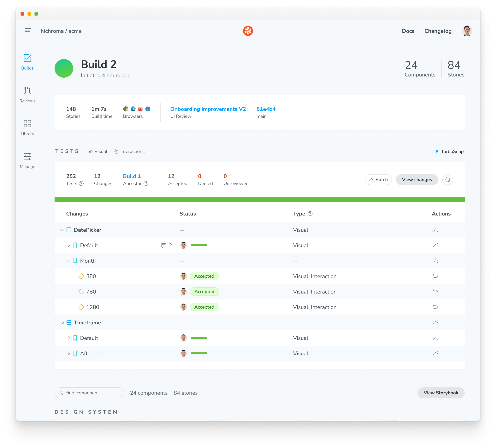
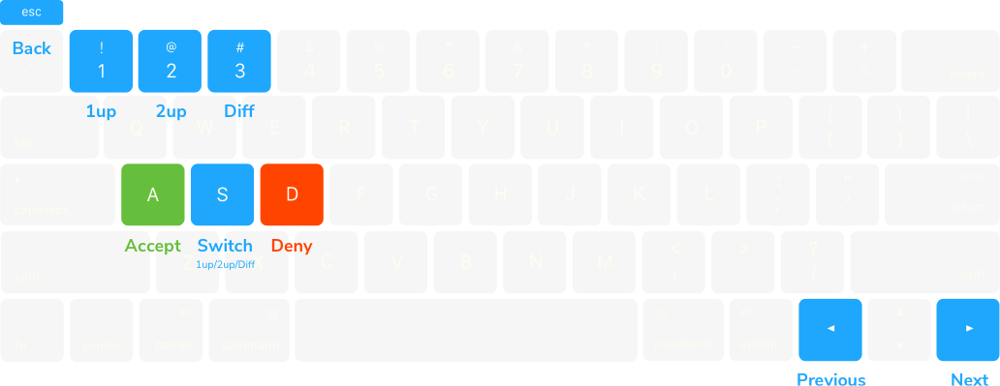
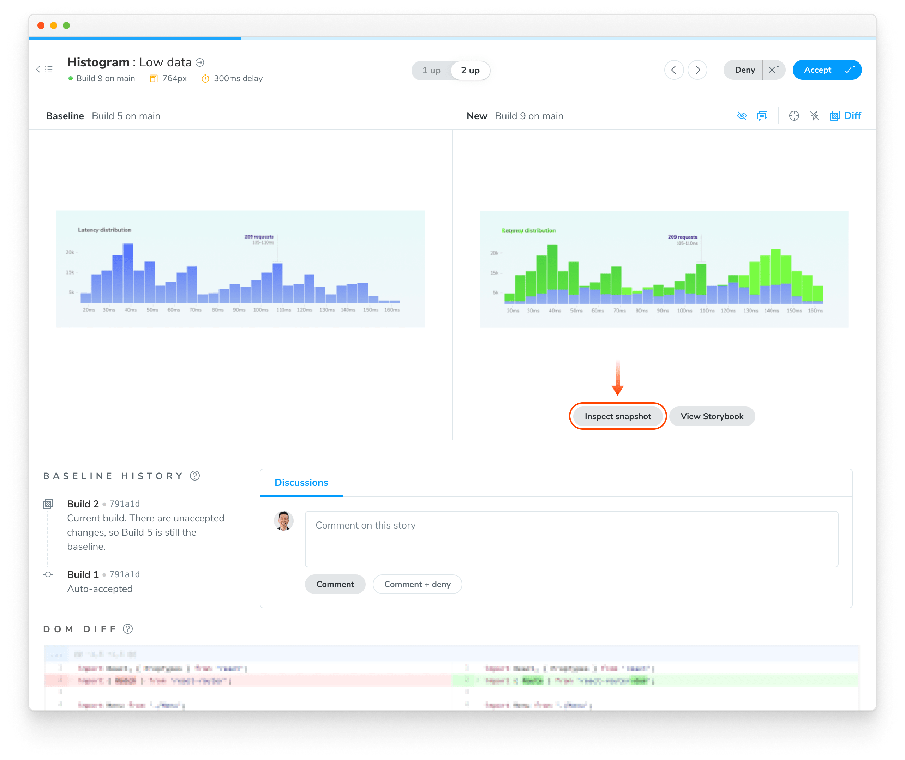

import TroubleshootingSetup from "../../shared-snippets/setup/troubleshooting.mdx";
import DemoChromaticUnlinked from "../../shared-snippets/demo-chromatic-unlinked.mdx";
import InstallSnippets from "../../components/InstallSnippets.astro";
import KeyboardShortcuts from "../../components/KeyboardShortcuts.astro";

# Chromatic for Storybook

Chromatic, created by the team behind Storybook, seamlessly integrates visual testing into your UI development workflow. Storybook lets you capture every component state and variation as [stories](https://storybook.js.org/docs/get-started/whats-a-story). Then, Chromatic automatically executes visual, interaction and accessibility tests on those stories.

<div class="aside">
  ℹ️ Not using Storybook? Chromatic integrates with
  [Playwright](/docs/playwright) and [Cypress](/docs/cypress) to transform your
  E2E tests into visual regression tests.
</div>

## Set up Chromatic for Storybook

The Chromatic CLI builds and uploads your Storybook to the Chromatic cloud infrastructure and triggers UI tests without requiring any additional configuration.

### 1. Sign up and create a new project

Generate a unique project token for your app by signing in to [Chromatic](https://www.chromatic.com/start) and creating a project. Sign in with your GitHub, GitLab, Bitbucket, or email.

<DemoChromaticUnlinked />



### 2. Install

Install the [chromatic](https://www.npmjs.com/package/chromatic) package from npm.

{/* prettier-ignore-start */}

<InstallSnippets>
  <Fragment slot="npm">
  ```shell
  $ npm install --save-dev chromatic
  ```
  </Fragment>
  <Fragment slot="yarn">
  ```shell
  $ yarn add --dev chromatic
  ```
  </Fragment>
  <Fragment slot="pnpm">
  ```shell
  $ pnpm add --save-dev chromatic
  ```
  </Fragment>
</InstallSnippets>

{/* prettier-ignore-end */}

<div class="aside">
  Storybook 6.5 or later is required. We also guarantee support for officially
  maintained version of Node, currently 18, 20 & 21. Other Node releases may
  encounter errors. To switch between Node versions, we recommend using{" "}
  <a href="https://github.com/nvm-sh/nvm">nvm</a>,{" "}
  <a href="https://github.com/tj/n">n</a>, or another version manager.
</div>

<details>
<summary>Learn how to add <code>chromatic</code> to your package.json</summary>

The `chromatic` command will also give you the option of adding an npm script to your `package.json` so you can run future builds with `npm run chromatic/yarn chromatic`. If you want to add it manually, it should look something like:

```json
{
  "scripts": {
    "chromatic": "chromatic"
  }
}
```

The above script command will pick up your project token by reading the `CHROMATIC_PROJECT_TOKEN` environment variable. After adding the above, ensure you set `CHROMATIC_PROJECT_TOKEN` when you run builds - such as in your CI config.

If you allowed `chromatic` to add the above line, it will also have written the environment variable to your `package.json`. This environment variable can also be set via your CI config for extra privacy.

</details>

<details>
<summary>Setup <code>.gitignore</code> to ignore certain files in your Git repository</summary>

Running the Chromatic command may generate certain files for logging and debugging purposes. Exactly which files it generates depends on your configuration, but these entries should likely be added to your `.gitignore` file:

```
build-storybook.log
chromatic.log
chromatic-build-*.xml
chromatic-diagnostics.json
```

</details>

### 3. Run your first build to establish baselines

Once you installed the `chromatic` package and have a project token, you can establish baselines by running a Chromatic build in a new project. This captures a snapshot of each test in a cloud browser and sets it as the baseline.

Subsequent builds will generate new snapshots that are compared against existing baselines to detect UI changes.

{/* prettier-ignore-start */}

<InstallSnippets>
  <Fragment slot="npm">
  ```shell
  $ npx chromatic --project-token <your-project-token>
  ```
  </Fragment>
  <Fragment slot="yarn">
  ```shell
  $ yarn chromatic --project-token <your-project-token>
  ```
  </Fragment>
  <Fragment slot="pnpm">
  ```shell
  $ pnpm chromatic --project-token <your-project-token>
  ```
  </Fragment>
</InstallSnippets>

{/* prettier-ignore-end */}

<div class="aside">
  We use the <code>build-storybook</code> script from your{" "}
  <code>package.json</code> by default. If you have customized the{" "}
  <code>storybook</code> script (for example, adding a static directory with{" "}
  <code>-s</code>), check that you've done the same for{" "}
  <code>build-storybook</code>.
</div>

### 4. Review changes

On each build, Chromatic compares new snapshots to existing baselines from previous builds. Try modifying the UI a bit and running another Chromatic build.

When tests are complete, you’ll see the build status and a link to review the changes. Click on that link to open Chromatic.

```shell
Build 1 published.

View it online at https://www.chromatic.com/build?appId=...&number=1.
```



The build will be marked “unreviewed” and the changes will be listed in the “Tests” table. Go through each snapshot to review the diff and approve or reject the change.

✅ **Accept change**: This updates the story baseline, ensuring future snapshots are compared against the latest approved version. Once a snapshot is accepted, it won't need re-acceptance until it changes, even across git branches or merges.

❌ **Deny change**: This marks the change as “denied”, indicating a regression and immediately failing the build. You can deny multiple changes per build. Denying a change will force a re-capture on the next build, even if [TurboSnap](/docs/turbosnap) would otherwise skip it.



### 5. Discussions

Reviewers can create discussions to point out bugs or ask questions. Discussions are shown within the same interface as Chromatic’s detected UI changes, so all collaborators have the same reference point.

Alternatively, you can click on a snapshot to create a discussion pinned to a specific change and provide precise feedback on the issue. Pair discussions with denying a change to block merging until bugs are resolved.

<video
  autoPlay
  muted
  playsInline
  loop
  width="560px"
  class="center"
  style="pointer-events: none;"
>
  <source
    src="/docs/assets/testscreen-comment-pinned-optimized.mp4"
    type="video/mp4"
  />
</video>

### 6. Merge

If you accept all the changes, the build will **🟢 Pass**. Future builds whose stories have the same appearance will pass.

If you deny any of the changes, the build will **🔴 Fail**. You will need to make code changes (and thus start a new build) to get the build to pass.

When your build is passed (all changes accepted), you’re ready to merge with confidence, knowing that your UI is bug-free. Chromatic will update the PR check for “UI Tests” to reflect the build status.

After you merge your code, Chromatic will also apply accepted baselines to stories on the target branch. That means you’ll only need to accept baselines a single time.



### 7. PR check for “UI Tests”


Chromatic adds a ‘UI Tests’ badge to the list of status checks for your pull/merge requests. The badge shows errors or changes that need to be reviewed. Require the check in [GitHub](https://help.github.com/en/github/administering-a-repository/enabling-required-status-checks), [GitLab](https://docs.gitlab.com/ee/api/commits.html#post-the-build-status-to-a-commit), or [Bitbucket](https://confluence.atlassian.com/bitbucket/suggest-or-require-checks-before-a-merge-856691474.html) to prevent accidental UI bugs from being merged.

[**Integrate Chromatic into your CI pipeline**](/docs/ci) to get notified about any visual changes introduced by a pull request. Chromatic will run tests when you push code and report changes via the “UI Tests” badge for your pull request.

---

## Next: enhance your UI Testing workflow

You can further refine your testing process and guarantee polished UIs in all scenarios with these strategies:

- [**Test component functionality with the play function:**](/docs/interactions#how-to-write-interaction-tests) Simulate clicks, hovers, and more to simultaneously test how components look & function.
- [**Test dark mode and other component variations:**](/docs/modes/) Make sure your UI adapts perfectly to different themes, locales and viewport sizes.
- [**Test for flexible user preferences:**](/docs/media-features/) Guarantee your components adapt seamlessly to media features like `forced-colors` and `prefers-reduced-motion`.
- [**Speed up tests & optimize usage:**](/docs/turbosnap/) Learn how to use Chromatic’s TurboSnap to only test stories that have code changes associated with them.

---

## Frequently asked questions

<details>
<summary>Can I disable UI Tests if I prefer not to use them?</summary>

Yes. Go to your project's manage page, where you can disable UI Tests. Once disabled, Chromatic will no longer add status checks to your PRs for UI Tests.

</details>

<details>
<summary>Can I rerun a build without running my whole CI workflow?</summary>

Yes, you can [rerun the latest build on any branch](/docs/troubleshooting-snapshots#rerun-build-to-identify-inconsistencies) outside your CI workflow. Go to the build page to kick off a new build that uses settings and configurations identical to your old build.

</details>

<details>
<summary>What&rsquo;s the difference between denied and unreviewed changes?</summary>

The purpose of denying is to mark changes you’ve looked at but not accepted. After reviewing the build, the list of denied changes helps you track what needs fixing.

When it comes to baselines, denying and leaving unreviewed have the same effect. In both cases, the original baseline is used for comparisons. This means in subsequent builds, Chromatic compares the latest build to the original baseline (not the previously denied snapshot).

Denied changes will be marked as unreviewed in subsequent builds for you to review again.

</details>

<details>
<summary>Speed up review with keyboard shortcuts</summary>

Use keyboard shortcuts to verify UI changes faster. Protip: Pressing 1 multiple times switches between the baseline and the new snapshot in the 1up view.

<KeyboardShortcuts />



</details>

<details>
<summary>What about baselines on other branches?</summary>

Chromatic automatically changes the baseline snapshots used for each build, depending on your branch. Each branch has a separate set of baselines.

This means you can update UI components on multiple feature branches in parallel without conflicts. When you merge branches, the most recent baseline takes precedence. [Learn about branching and baselines »](/docs/branching-and-baselines)

</details>

<details>
<summary>How do I reproduce the snapshot?</summary>

Sometimes, you need to look closer to determine why a snapshot is rendering as it does. Along with pixel and DOM diffs, Chromatic displays the interactive page just as it appears in your app and E2E tests.

Click “Inspect snapshot” to open the Inspector. Switch between the “Canvas” and “Snapshot” tabs to compare the live component to the snapshot. Learn more about snapshots [here](/docs/snapshots).



</details>

<details>
<summary>Can I retake a snapshot?</summary>

Yes, [rerun the latest build](/docs/troubleshooting-snapshots#rerun-build-to-identify-inconsistencies) on your branch to retake snapshots of unreviewed or denied changes.


</details>

<details>
<summary>How are changes on builds different from those listed in the UI Review ‘Changeset’ tab?</summary>

UI tests (shown on the build screen) detect changes between builds, specifically between the last accepted baseline and the latest build. This is useful for detecting defects during development and when merging to the main branch to ship.

In contrast, [UI Review](/docs/review) shows the changeset between the latest commit on the PR branch (head) and the ‘merge base’ (base). Think of it as a code review but for UI.

</details>

<details>
<summary>Why is review disabled on the build page?</summary>

Reviewing is only enabled for the latest build on a branch to ensure that only the most up-to-date UI is accepted as a baseline.

</details>

<details>
<summary>Why is commenting disabled on old builds?</summary>

Comments are turned off on old builds to ensure that discussions are always on topic and up to date with the latest UI. This prevents the situation where different reviewers comment on different versions of the code.

</details>

<details>
<summary>Can I review the same commit on separate branches?</summary>

Yes, but it‘s not a best practice.

Every branch has independent baselines for each test until the branch gets merged. If two builds reference the same commit hash but are on _different branches_ it will be possible to review those builds separately so long as they're the latest build on their respective branches. We don't recommend this because you'll have to review the same change multiple times.

Instead, we recommend regularly reviewing builds to keep feature branches 🟢&nbsp;passing.

</details>

---

## Troubleshooting

<TroubleshootingSetup />

<details>
<summary id="chromatic-build-no-commits">Why do I see "Didn't find any commits in this Git repository in the last X builds"?</summary>

If you run into this situation, it is likely because across the number of unique commits across all builds connected to your project, Chromatic could not find a single one that exists in the repository. This can happen for various reasons (i.e., rebasing, squash merging). However, something has likely gone wrong if all previous X builds' commits are missing.

If you see this message and can't resolve the issue, please get in touch with us via our in-app chat or email us at support@chromatic.com.

</details>

<details>
<summary>Why do I see "Failed to find common ancestors with most recent builds within X commits"?</summary>

This is an uncommon issue that may happen only in specific cases due to some unusual configuration in your repository. If you see this message, it means that although we found a recent build connected to your repository history (see the item [above](#chromatic-build-no-commits)), we couldn't find any common history between your checked-out build and any other build in the latest number of commits.

We recommend contacting us via our in-app chat or email us at support@chromatic.com for further assistance.

</details>

<details>
<summary>Why do I see "Build X is based on a commit without ancestor builds"?</summary>

Unless you're creating the first build to establish baselines, when you generate a new build, Chromatic searches your repository history for the most recent build based on an ancestor commit (i.e., commits that are part of the history of the current commit). If it can't find any, it will show this message. However, this is an uncommon issue that may happen due to the following reasons:

1. You switched between branches and re-ran Chromatic without checking out the changes that installed Chromatic in the first place. In this situation, you can safely ignore the message and continue your workflow.

2. Your repository's Git history was rewritten via a rebase or squash merge (e.g., via GitHub's "Squash and Merge" or "Rebase and Merge" options), which you can quickly solve by referring to our CI documentation based on your CI provider.

3. You're working with a shallow clone of your repository to generate builds. Chromatic needs access to the entire Git history to establish baselines (or at least the history until the previous build), which you can address via our [baselines documentation](/docs/branching-and-baselines).

4. Some other unusual configuration in your repository is causing the issue, or there is an issue (e.g., an outage) on our end.

If you are in this situation and having trouble resolving the issue, contact us via our in-app chat or email us at support@chromatic.com.

</details>

<details>
<summary>Chromatic doesn't work with my custom Storybook script</summary>

We do our best to interpret your Storybook script in package.json, but you might need to pass additional options to the `chromatic` command. [Check out all the options »](/docs/cli)

</details>

<details>
<summary>Why do I get errored builds randomly?</summary>

Chromatic builds and runs Storybook flawlessly _most of the time_, but we're not perfect (we wish). Sometimes builds don't run due to rare infrastructure issues. If this happens, try to re-run the build via your CI provider. We keep track of these errors to improve the service.

</details>

<details>
<summary>Why is my build failing with the message <code>Cannot run a build with no stories</code>?</summary>

This happens if certain stories were disabled via the [`chromatic: { disableSnapshot: true }`](/docs/disable-snapshots#with-storybook) option at a higher level.

To solve this you can:

1. Remove the top-level [`chromatic: { disableSnapshot: true }`](/docs/disable-snapshots#with-storybook) option
1. Enable snapshots for specific stories
1. Run `yarn storybook-build` locally and fix the issues in your stories

</details>

<details>
<summary>How can I troubleshoot issues in Storybook?</summary>

From **Storybook 7.6** onwards, you can use the storybook doctor command to run checks and identify issues in Storybook: npx storybook@latest doctor

This tool helps detect problems like mismatched Storybook versions, duplicated dependencies, and incompatible add-ons.
For each detected issue, it offers detailed descriptions, references, and suggestions for follow-up actions. Learn more [here](https://storybook.js.org/docs/api/cli-options#doctor).

</details>

<details>
<summary>How can I debug syntax issues in my Storybook project?</summary>

You can add the Storybook [ESlint plugin](https://www.npmjs.com/package/eslint-plugin-storybook) to help you debug Storybook syntax issues and comply with best practices.

</details>

<details>
<summary>Why is my build failing with the message <code>✖ Failed to build Storybook</code>?</summary>

To debug an issue with your Storybook project, run the commands below locally and confirm all stories are loading correctly without console log errors and warnings.

```shell
​npm run build-storybook
npx http-server storybook-static -o
```

Use the same method to debug the following errors:

`✖ Failed to verify your Storybook`

`✖ Failed to publish your built Storybook`

`✖ Failed to publish build - Failed to extract stories from your Storybook`

</details>

<details>
<summary>Why are styles not applied correctly in stories?</summary>

If styles are not rendering correctly, there could be several reasons behind that:

1. **The order in which stylesheets are loaded.**

   - In development mode, styles from the preview might be imported earlier than component styles, while in production mode, this order could be reversed. This affects the specificity and, ultimately, the rendering of styles. If this is the case, the styles render but are overwritten by others.
   - In Storybook 6 and earlier, stylesheets were loaded upfront, while from Storybook 7 onwards, stylesheets are loaded on-demand when the story is viewed. This affects how styles load.

2. **Browser compatibility.** If the browser version does not support certain CSS features, styles may not apply correctly. Find browser versions supported by our Capture Infrastructure [here](/docs/infrastructure-release-notes).

If you have additional questions, use our **in-app chat** to contact or email us at [support@chromatic.com](mailto:support@chromatic.com).

</details>
