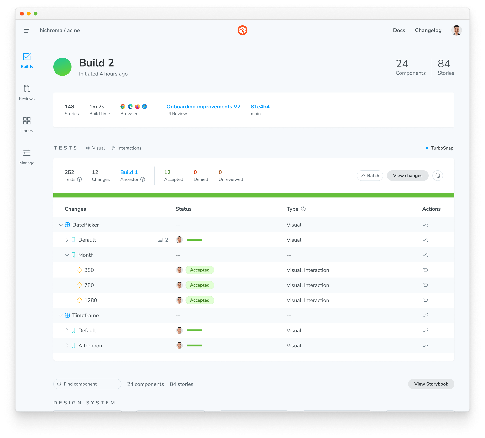

import { YouTubeCallout } from "../../components/YouTubeCallout";
import DemoChromaticUnlinked from "../shared-snippets/demo-chromatic-unlinked.mdx";
import IntegrationSnippets from "../../components/IntegrationSnippets.astro";

# Test how UIs look & function

UI Tests are a powerful tool for catching visual regressions and ensuring your app functions as expected. They work by capturing [snapshots](/docs/snapshots) of every test within a cloud browser environment. Then, whenever you push code, Chromatic compares your new snapshots to [baseline versions](/docs/branching-and-baselines#whats-a-baseline) to identify visual changes. If changes are detected, you will be prompted to verify that they are intentional or fix any errors.

Chromatic executes two types of UI Tests:

- [**Visual tests**](/docs): Pinpoint changes in appearance, layout, fonts, and colors
- [**Interaction tests**](/docs/interactions) (Storybook only): Simulate user actions such as clicking, typing, hovering, dragging, etc., to confirm your app behaves as expected


Every time you push code, Chromatic runs a suite of UI Tests on your code to pinpoint bugs instantly. All tests run in parallel, including testing across your chosen combinations of viewports and browsers.

<div class="aside">

**How to use this guide?**<br />This guide explains the fundamentals of Chromatic's UI Test workflow. You can read through for a basic understanding or, for a more hands-on learning experience, clone one of our demo projects and follow along: [learnstorybook-code](https://github.com/chromaui/learnstorybook-code), [e2e-demo-playwright](https://github.com/chromaui-demo/e2e-demo-playwright) or [e2e-demo-cypress](https://github.com/chromaui-demo/e2e-demo-cypress).

</div>

## Workflow

Chromatic integrates with your existing functional testing framework to enable visual testing of your UI. Here's how Chromatic works, depending on your setup:

####  Storybook

Chromatic handles the entire test process, including building and uploading your Storybook to the Chromatic cloud infrastructure. Chromatic renders your stories in cloud browsers, runs any interaction tests attached to them, captures snapshots of each story, and detects visual changes using pixel diffing.

####  Playwright and  Cypress

Run your E2E tests as usual. While those tests run, Chromatic collects a complete archive of your UI (DOM, styles, and assets). It then renders that archived UI in cloud browsers, captures visual snapshots, and identifies visual regressions through pixel diffing.

### Sign up

Generate a unique project token for your app by signing in to [Chromatic](https://www.chromatic.com/start) and creating a project. Sign in with your GitHub, GitLab, Bitbucket, or email.

<DemoChromaticUnlinked />


### Enable

Enable visual tests for your project on the manage page. If your stories have [interaction tests](/docs/interactions), they’ll run automatically when visual tests are enabled.

All snapshots are taken in Chrome by default. Select additional browsers to expand test coverage.


### Run your first build to establish baselines

Once visual tests are enabled, you can establish baselines by running a Chromatic build in a new project. This captures a snapshot of each test in a cloud browser and sets it as the baseline. Subsequent builds will generate new snapshots that are compared against existing baselines to detect UI changes.

{/* prettier-ignore-start */}

<IntegrationSnippets>
  <Fragment slot="storybook">
    ```bash
    # Install Chromatic
    $ npm install --save-dev chromatic

    # Use your project token and run the following command
    # in your project directory
    $ npx chromatic --project-token <YOUR_PROJECT_TOKEN>
    ```
  </Fragment>
  <Fragment slot="playwright">
  ```bash
  # Install Chromatic dependencies
  $ npm install --save-dev chromatic @chromatic-com/playwright

  # Run your Playwright tests as you normally would. For example:
  $ npx playwright test

  # Use your project token and run the following command
  # in your project directory
  $ npx chromatic --playwright -t=<YOUR_PROJECT_TOKEN>
  ```
  </Fragment>
  <Fragment slot="cypress">
  ```bash
  # Install Chromatic dependencies
  $ npm install --save-dev chromatic @chromatic-com/cypress

  # Run your Cypress tests as you normally would
  # along with the ELECTRON_EXTRA_LAUNCH_ARGS prefix
  $ ELECTRON_EXTRA_LAUNCH_ARGS=--remote-debugging-port=9222 npx cypress run

  # Use your project token and run the following command
  # in your project directory
  $ npx chromatic --cypress -t=<YOUR_PROJECT_TOKEN>
  ```
  </Fragment>
</IntegrationSnippets>

{/* prettier-ignore-end */}

### View changes between baselines

On each build, Chromatic compares new snapshots to existing baselines from previous builds. Try modifying the UI a bit and running another Chromatic build.

The list of changes is shown on the build page in the web app. The build will be marked “unreviewed” and the changes will be listed in the “Tests” table.


### Verify UI changes

Chromatic detects UI changes, but it’s up to you to verify if those changes are intentional. For intentional changes, you need to update the baseline so future tests will be compared to the _latest baseline_ for the story. If a change is unintentional, it will need to be fixed.

- ✅ **Accept change**: This updates the story baseline. When a snapshot is accepted, it won’t need to be re-accepted until it changes, even through git branches or merges.
- ❌ **Deny change**: This marks the change as “denied”, indicating a regression and immediately failing the build. You can deny multiple changes per build. Denying a change will force a re-capture on the next build, even if [TurboSnap](/docs/turbosnap) would otherwise skip it.


### Discussions

Reviewers can create discussions to point out bugs or ask questions. Discussions are shown within the same interface as Chromatic’s detected UI changes, so all collaborators have the same reference point.

Alternatively, you can click on a snapshot to create a discussion pinned to a specific change and provide precise feedback on the issue. Pair discussions with denying a change to block merging until bugs are resolved.

<video
  autoPlay
  muted
  playsInline
  loop
  width="560px"
  class="center"
  style="pointer-events: none;"
>
  <source
    src="/docs/assets/testscreen-comment-pinned-optimized.mp4"
    type="video/mp4"
  />
</video>

### Merge

If you accept all the changes, the build will **🟢 Pass**. Future builds whose stories have the same appearance will pass.

If you deny any of the changes, the build will **🔴 Fail**. You will need to make code changes (and thus start a new build) to get the build to pass.

When your build is passed (all changes accepted), you’re ready to merge visual changes with confidence, knowing that your UI is bug-free. Chromatic will update the PR check for “UI Tests” to reflect the build status.

After you merge your code, Chromatic will also apply accepted baselines to stories on the target branch. That means you’ll only need to accept baselines a single time.



---

## PR check for “UI Tests”


Chromatic adds a ‘UI Tests’ badge to the list of status checks for your pull/merge requests. The badge shows errors or changes that need to be reviewed. Require the check in [GitHub](https://help.github.com/en/github/administering-a-repository/enabling-required-status-checks), [GitLab](https://docs.gitlab.com/ee/api/commits.html#post-the-build-status-to-a-commit), or [Bitbucket](https://confluence.atlassian.com/bitbucket/suggest-or-require-checks-before-a-merge-856691474.html) to prevent accidental UI bugs from being merged.

[**Integrate Chromatic into your CI pipeline »**](/docs/ci)

---

## Frequently asked questions

<details>
<summary>Can I disable UI Tests if I prefer not to use them?</summary>

Yes. Go to your project's manage page, where you can disable UI Tests. Once disabled, Chromatic will no longer add status checks to your PRs for UI Tests.

</details>

<details>
<summary>Can I rerun a build without running my whole CI workflow?</summary>

Yes, you can [rerun the latest build on any branch](/docs/troubleshooting-snapshots#rerun-build-to-identify-inconsistencies) outside your CI workflow. Go to the build page to kick off a new build that uses settings and configurations identical to your old build.

</details>

<details>
<summary>What&rsquo;s the difference between denied and unreviewed changes?</summary>

The purpose of denying is to mark changes you’ve looked at but not accepted. After reviewing the build, the list of denied changes helps you track what needs fixing.

When it comes to baselines, denying and leaving unreviewed have the same effect. In both cases, the original baseline is used for comparisons. This means in subsequent builds, Chromatic compares the latest build to the original baseline (not the previously denied snapshot).

Denied changes will be marked as unreviewed in subsequent builds for you to review again.

</details>

<details>
<summary>Speed up review with keyboard shortcuts</summary>

Use keyboard shortcuts to verify UI changes faster. Protip: Pressing 1 multiple times switches between the baseline and the new snapshot in the 1up view.


</details>

<details>
<summary>What about baselines on other branches?</summary>

Chromatic automatically changes the baseline snapshots used for each build, depending on your branch. Each branch has a separate set of baselines.

This means you can update UI components on multiple feature branches in parallel without conflicts. When you merge branches, the most recent baseline takes precedence. [Learn about branching and baselines »](/docs/branching-and-baselines)

</details>

<details>
<summary>How do I reproduce the snapshot?</summary>

Sometimes, you need to look closer to determine why a snapshot is rendering as it does. Along with pixel and DOM diffs, Chromatic displays the interactive page just as it appears in your app and E2E tests.

Click “Inspect snapshot” to open the Inspector. Switch between the “Canvas” and “Snapshot” tabs to compare the live component to the snapshot. Learn more about snapshots [here](/docs/snapshots).


</details>

<details>
<summary>Can I retake a snapshot?</summary>

Yes, [rerun the latest build](/docs/troubleshooting-snapshots#rerun-build-to-identify-inconsistencies) on your branch to retake snapshots of unreviewed or denied changes.


</details>

<details>
<summary>How are changes on builds different from those listed in the UI Review ‘Changeset’ tab?</summary>

UI tests (shown on the build screen) detect changes between builds, specifically between the last accepted baseline and the latest build. This is useful for detecting defects during development and when merging to the main branch to ship.

In contrast, [UI Review](/docs/review) shows the changeset between the latest commit on the PR branch (head) and the ‘merge base’ (base). Think of it as a code review but for UI.

</details>

<details>
<summary>Why is review disabled on the build page?</summary>

Reviewing is only enabled for the latest build on a branch to ensure that only the most up-to-date UI is accepted as a baseline.

</details>

<details>
<summary>Why is commenting disabled on old builds?</summary>

Comments are turned off on old builds to ensure that discussions are always on topic and up to date with the latest UI. This prevents the situation where different reviewers comment on different versions of the code.

</details>

<details>
<summary id="chromatic-build-no-commits">Why do I see "Didn't find any commits in this Git repository in the last X builds"?</summary>

If you run into this situation, it is likely because across the number of unique commits across all builds connected to your project, Chromatic could not find a single one that exists in the repository. This can happen for various reasons (i.e., rebasing, squash merging). However, something has likely gone wrong if all previous X builds' commits are missing.

If you see this message and can't resolve the issue, please get in touch with us via our in-app chat or email us at support@chromatic.com.

</details>

<details>
<summary>Why do I see "Failed to find common ancestors with most recent builds within X commits"?</summary>

This is an uncommon issue that may happen only in specific cases due to some unusual configuration in your repository. If you see this message, it means that although we found a recent build connected to your repository history (see the item [above](#chromatic-build-no-commits)), we couldn't find any common history between your checked-out build and any other build in the latest number of commits.

We recommend contacting us via our in-app chat or email us at support@chromatic.com for further assistance.

</details>

<details>
<summary>Why do I see "Build X is based on a commit without ancestor builds"?</summary>

Unless you're creating the first build to establish baselines, when you generate a new build, Chromatic searches your repository history for the most recent build based on an ancestor commit (i.e., commits that are part of the history of the current commit). If it can't find any, it will show this message. However, this is an uncommon issue that may happen due to the following reasons:

1. You switched between branches and re-ran Chromatic without checking out the changes that installed Chromatic in the first place. In this situation, you can safely ignore the message and continue your workflow.

2. Your repository's Git history was rewritten via a rebase or squash merge (e.g., via GitHub's "Squash and Merge" or "Rebase and Merge" options), which you can quickly solve by referring to our CI documentation based on your CI provider.

3. You're working with a shallow clone of your repository to generate builds. Chromatic needs access to the entire Git history to establish baselines (or at least the history until the previous build), which you can address via our [baselines documentation](/docs/branching-and-baselines).

4. Some other unusual configuration in your repository is causing the issue, or there is an issue (e.g., an outage) on our end.

If you are in this situation and having trouble resolving the issue, contact us via our in-app chat or email us at support@chromatic.com.

</details>

<details>
<summary>Can I review the same commit on separate branches?</summary>

Yes, but it‘s not a best practice.

Every branch has independent baselines for each test until the branch gets merged. If two builds reference the same commit hash but are on _different branches_ it will be possible to review those builds separately so long as they're the latest build on their respective branches. We don't recommend this because you'll have to review the same change multiple times.

Instead, we recommend regularly reviewing builds to keep feature branches 🟢&nbsp;passing.

</details>
