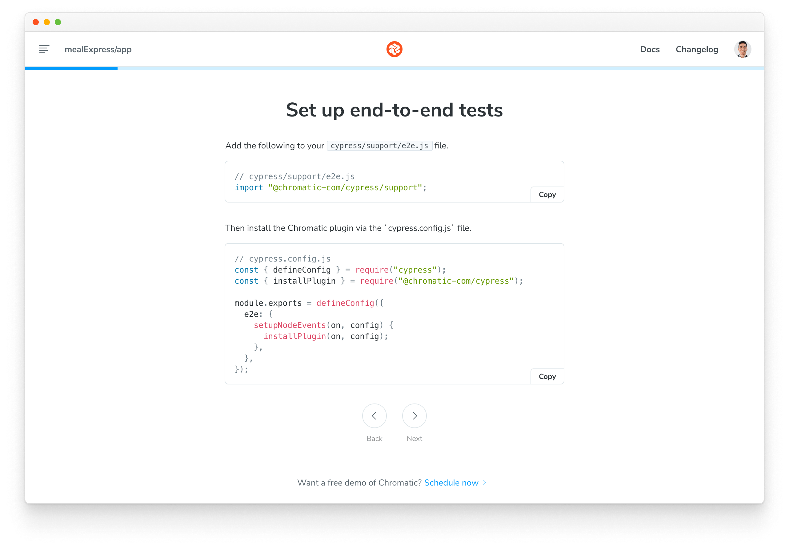

import { YouTubeCallout } from "../../components/YouTubeCallout";
import DemoChromaticUnlinked from "../shared-snippets/demo-chromatic-unlinked.md";
import IntegrationSnippets from "../../components/IntegrationSnippets.astro";

# Test how UIs look & function

UI Tests are a powerful tool for catching visual regressions and ensuring that your app functions as expected. They work by capturing [snapshots](/docs/snapshots) of every test within a cloud browser environment. Then, whenever you push code, Chromatic compares your new snapshots to [baseline versions](/docs/branching-and-baselines#whats-a-baseline) to identify visual changes. If changes are detected, you will be prompted to verify that they are intentional or fix any errors.

Chromatic executes two types of UI Tests:

- [**Visual tests**](/docs): Pinpoint changes in appearance, layout, fonts, and colors
- [**Interaction tests**](/docs/interactions) (Storybook only): Simulate user actions such as click, type, hovering, drag, etc. to confirm your app behaves as expected


Every time you push code, Chromatic runs a suite of UI Tests on your code to pinpoint bugs instantly. All tests run in parallel, including testing across your chosen combinations of viewports and browsers.

<div class="aside">

**How to use this guide?**<br />This guide explains the fundamentals of Chromatic's UI Test workflow. You can read through for a basic understanding or, for a more hands-on learning experience, clone one of our demo projects and follow along: [storybook-demo](https://github.com/chromaui-demo/shapes-demo-2), [e2e-demo-playwright](https://github.com/chromaui-demo/e2e-demo-playwright) or [e2e-demo-cypress](https://github.com/chromaui-demo/e2e-demo-cypress).

</div>

## Workflow

Chromatic integrates with your existing functional testing framework to enable visual testing of your UI. Here's how Chromatic works, depending on your setup:

####  Storybook

Chromatic handles the entire test process, including building and uploading your Storybook to the Chromatic cloud infrastructure. Chromatic renders your stories in cloud browsers, runs any interaction tests attached to them, captures snapshots of each story, and detects visual changes using pixel diffing.

####  Playwright and  Cypress

Run your E2E tests as usual. While those tests run, Chromatic collects a complete archive of your UI (DOM, styles, and assets). It then renders that archived UI in cloud browsers, captures visual snapshots, and identifies visual regressions through pixel diffing.

### Sign up

Generate a unique project token for your app by signing in to [Chromatic](https://www.chromatic.com/start) and creating a project. Sign in with your GitHub, GitLab, Bitbucket, or email.

<DemoChromaticUnlinked />



### Enable

Enable visual tests for your project on the manage page. If your stories have [interaction tests](/docs/interactions), they’ll run automatically when visual tests are enabled.

All snapshots are taken in Chrome by default. Select additional browsers to expand test coverage.


### Run your first build to establish baselines

Once visual tests are enabled, you can establish baselines by running a Chromatic build in a new project. This captures a snapshot of each test in a cloud browser and sets it as the baseline. Subsequent builds will generate new snapshots that are compared against existing baselines to detect UI changes.

{/* prettier-ignore-start */}

<IntegrationSnippets>
  <Fragment slot="storybook">
```bash
# Use your project token and run the following command
# in your project directory
npx chromatic --project-token <YOUR_PROJECT_TOKEN>
```
  </Fragment>
  <Fragment slot="playwright">
```bash
# Run your Playwright tests as you normally would. For example:
$ npx playwright test

# Use your project token and run the following command
# in your project directory
$ npx chromatic --playwright -t=<TOKEN>
```
  </Fragment>
  <Fragment slot="cypress">
```bash
# Run your Cypress tests as you normally would
# along with the ELECTRON_EXTRA_LAUNCH_ARGS prefix
$ ELECTRON_EXTRA_LAUNCH_ARGS=--remote-debugging-port=9222 yarn cypress run

# Use your project token and run the following command
# in your project directory
$ npx chromatic --cypress -t=<TOKEN>
```
  </Fragment>
</IntegrationSnippets>

{/* prettier-ignore-end */}

### View changes between baselines

On each build, Chromatic compares new snapshots to existing baselines from previous builds. Try modifying the UI a bit and running another Chromatic build.

The list of changes is shown on the build page in the web app. The build will be marked “unreviewed” and the changes will be listed in the “Tests” table.


### Verify UI changes

Chromatic detects UI changes, but it’s up to you to verify if those changes are intentional. For intentional changes, you need to update the baseline so future tests will be compared to the _latest baseline_ for the story. If a change is unintentional, it will need to be fixed.

- ✅ **Accept change**: This updates the story baseline. When a snapshot is accepted, it won’t need to be re-accepted until it changes, even through git branches or merges.
- ❌ **Deny change**: This marks the change as “denied”, indicating a regression and immediately failing the build. You can deny multiple changes per build. Denying a change will force a re-capture on the next build, even if [TurboSnap](/docs/turbosnap) would otherwise skip it.


### Discussions

Reviewers can point out bugs or ask questions by creating discussions. Discussions are shown within the same interface as Chromatic’s detected UI changes, so all collaborators have the same reference point.

Alternatively, you can click on a snapshot to create a discussion pinned to a specific change and provide precise feedback on the issue. Pair discussions with denying a change to block merging until bugs are resolved.

<video
  autoPlay
  muted
  playsInline
  loop
  width="560px"
  class="center"
  style="pointer-events: none;"
>
  <source
    src="/docs/assets/testscreen-comment-pinned-optimized.mp4"
    type="video/mp4"
  />
</video>

### Merge

If you accept all the changes, the build will **🟢 Pass**. Future builds whose stories have the same appearance will pass.

If you deny any of the changes, the build will **🔴 Fail**. You will need to make code changes (and thus start a new build) to get the build to pass.

When your build is passed (all changes accepted), you’re ready to merge visual changes with confidence, knowing that your UI is bug-free. Chromatic will update the PR check for “UI Tests” to reflect the build status.

After you merge your code, Chromatic will also apply accepted baselines to stories on the target branch. That means you’ll only need to accept baselines a single time.


---

## PR check for “UI Tests”


Chromatic adds a ‘UI Tests’ badge to the list of status checks for your pull/merge requests. The badge shows errors or changes that need to be reviewed. Require the check in [GitHub](https://help.github.com/en/github/administering-a-repository/enabling-required-status-checks), [GitLab](https://docs.gitlab.com/ee/api/commits.html#post-the-build-status-to-a-commit), or [Bitbucket](https://confluence.atlassian.com/bitbucket/suggest-or-require-checks-before-a-merge-856691474.html) to prevent accidental UI bugs from being merged.

[**Integrate Chromatic into your CI pipeline »**](/docs/ci)
