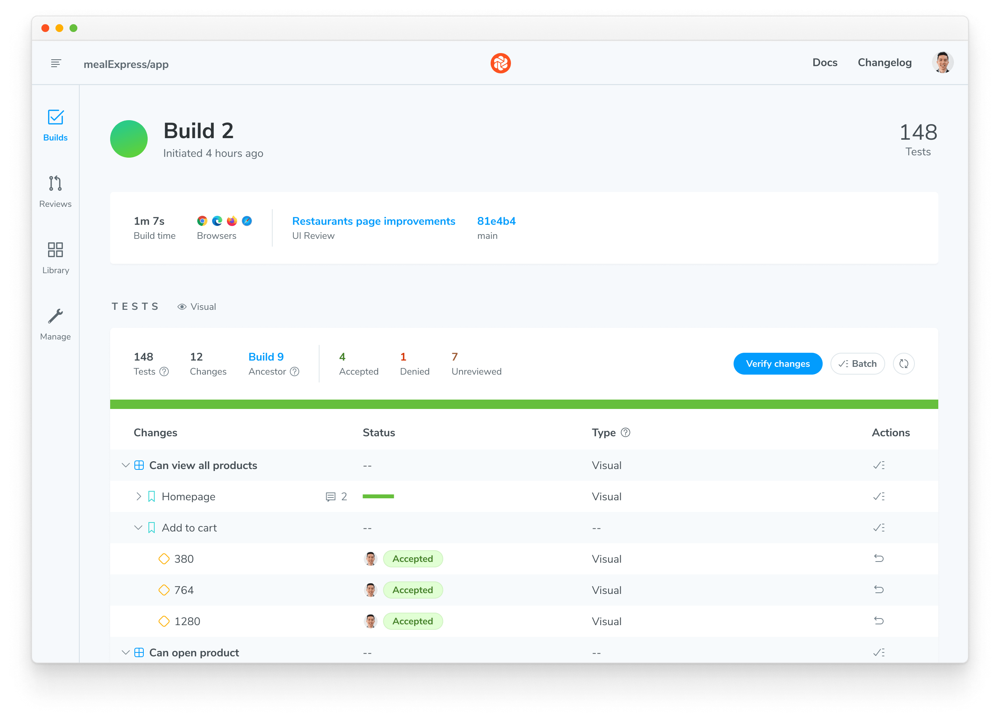

import DemoChromaticUnlinked from "../../shared-snippets/demo-chromatic-unlinked.mdx";
import TroubleshootingSetup from "../../shared-snippets/setup/troubleshooting.mdx";
import RunE2E from "../../shared-snippets/setup/run-e2e.mdx";
import InstallSnippets from "../../components/InstallSnippets.astro";

# Chromatic for Playwright

Chromatic’s visual tests integrate with Playwright by extending Playwright’s `test` and `expect` utilities. That means you can transform your existing Playwright end-to-end (E2E) tests into visual regression tests with a single import change. Start capturing interactive snapshots within your Playwright E2E tests, and review visual changes in Chromatic’s cloud environment.


## Why visual test with Playwright?

Playwright enables you to write E2E tests that drive the browser to simulate and verify key user journeys like ‘sign up’ and ‘add to cart’. By snapshotting the UI states generated during your E2E tests, you can proactively catch visual bugs that might slip through traditional logic-based tests.

## How does Chromatic work?

Chromatic works alongside your E2E tests. During your E2E test, Chromatic captures an [**archive**](/docs/faq/what-is-archive#what-is-an-archive) of each page and uploads it to Chromatic’s cloud. There, Chromatic generates snapshots and performs pixel diffing to identify any unintended visual changes.

### How does Chromatic’s visual testing differ from Playwright’s?

While Playwright offers a basic ability to capture and visually compare screenshots of UI. Chromatic’s difference is that it provides a significantly more robust and developer-friendly visual testing solution:

- **Robustness:** Chromatic captures full-page [archives](/docs/faq/what-is-archive) (including DOM, styling, and assets) of your test cases, which you can debug interactively in the Chromatic app, using browser dev tools. This eliminates the need to run further tests to troubleshoot errors.
- **Workflow:** Chromatic removes the need to manage snapshots locally in your repo. Chromatic’s snapshots are indexed automatically, linked to git commits, and stored in the cloud for easy access.
- **Parallelized testing:** Chromatic's cloud infrastructure automatically scales to run all tests simultaneously, eliminating the need for you to configure multiple workers on your CI.
- **Dedicated review app:** Chromatic offers a suite of visual diffing tools to spot regressions fast. Features include unified and split diffs, highlighting ignored regions, spotlight mode to focus and zoom in on changes, and strobe diff to pinpoint subtle changes.

## Setup Chromatic for Playwright

Chromatic supports Playwright version 1.38.0 and above.

### 1. Sign up and create a new project

Generate a unique project token for your app by signing in to Chromatic and creating a project. Sign in with your GitHub, GitLab, Bitbucket, or email.

<div class="callout">
  If your repository already has a Chromatic project linked to it, you can
  create an additional Chromatic project to run visual tests with Playwright.
  Follow the instructions for [sub-projects support](/docs/combine-stories-e2e).
</div>

<DemoChromaticUnlinked />


### 2. Install Chromatic

Install **[chromatic](https://www.npmjs.com/package/chromatic)** and `@chromatic-com/playwright` packages from npm.

{/* prettier-ignore-start */}

<InstallSnippets>
  <Fragment slot="npm">
  ```shell
  $ npm install --save-dev chromatic @chromatic-com/playwright
  ```
  </Fragment>
  <Fragment slot="yarn">
  ```shell
  $ yarn add --dev chromatic @chromatic-com/playwright
  ```
  </Fragment>
  <Fragment slot="pnpm">
  ```shell
  $ pnpm add --dev chromatic @chromatic-com/playwright
  ```
  </Fragment>
</InstallSnippets>

{/* prettier-ignore-end */}

<div class="aside">
  Chromatic only works with tests written in Playwright v1.12+.
</div>

### 3. Add Chromatic to Playwright tests

Update your Playwright tests to use the Chromatic specific testing utilities from `@chromatic-com/playwright`.

```js
import { test, expect } from "@playwright/test"; // [!code --]
import { test, expect } from "@chromatic-com/playwright"; // [!code ++]

// Then use as normal 👇
test("Homepage", async ({ page }) => {
  await page.goto("https://mealexpress.com/");

  await expect(page).toHaveTitle("Mealdrop - find your next meal");

  // ...
});
```

### 4. Run Playwright

Run your Playwright tests as you normally would.

While your Playwright tests are running, Chromatic captures an [archive](/docs/playwright#what-is-an-archive) of your app’s UI for each test.

{/* prettier-ignore-start */}

<InstallSnippets>
  <Fragment slot="npm">
  ```shell
  $ npx playwright test
  ```
  </Fragment>
  <Fragment slot="yarn">
  ```shell
  $ yarn playwright test
  ```
  </Fragment>
  <Fragment slot="pnpm">
  ```shell
  $ pnpm playwright test
  ```
  </Fragment>
</InstallSnippets>

{/* prettier-ignore-end */}

### 5. Run Chromatic

Use your project token and run the following command in your project directory.

{/* prettier-ignore-start */}

<InstallSnippets>
  <Fragment slot="npm">
  ```shell
  $ npx chromatic --playwright -t=<TOKEN>
  ```
  </Fragment>
  <Fragment slot="yarn">
  ```shell
  $ yarn chromatic --playwright -t=<TOKEN>
  ```
  </Fragment>
  <Fragment slot="pnpm">
  ```shell
  $ pnpm chromatic --playwright -t=<TOKEN>
  ```
  </Fragment>
</InstallSnippets>

{/* prettier-ignore-end */}

<RunE2E type="Playwright" />

### 6. Review changes

When complete, you’ll see the build status and a link to review the changes. Click on that link to open Chromatic.

```shell
✔ Started build 1
  → Continue setup at https://www.chromatic.com/setup?appId=...
✔ Build 1 auto-accepted
  → Tested X stories across 10 components; captured 10 snapshots in 1 minute 3 seconds
```


The build will be marked “unreviewed” and the changes will be listed in the “Tests” table. Go through each snapshot to review the diff and approve or reject the change.


Once you accept all changes, your build is marked as passed 🟢. This updates the baselines for those tests, ensuring future snapshots are compared against the latest approved version.



---

## Next: enhance your UI Testing workflow

You're building robust components by uncovering bugs during development. Take your testing to the next level and safeguard against visual bugs by automating Chromatic whenever you push code.


[**Integrate Chromatic into your CI pipeline**](/docs/ci) to get notified about any visual changes introduced by a pull request. Chromatic runs test any time you push code and reports changes via the “UI Tests” badge for your pull request.

### Advanced configuration options

Take full control of your Chromatic and Playwright setup to match your team's specific workflows. Here are some powerful customizations we offer:

- [**Take targeted snapshots:**](/docs/playwright/targeted-snapshots) Learn how to programmatically capture snapshots at specific points during your tests.
- [**Fine-tune snapshot capture:**](/docs/playwright/configure#chromatic-options) Add delays before snapshots, modify the sensitivity threshold for change detection, and employ other granular controls.
- [**Test for flexible user preferences:**](/docs/media-features#media-features) Ensure your UI gracefully adapts to user preferences like `forced-colors` and `prefers-reduced-motion`.
- [**Responsive testing:**](/docs/playwright/configure#viewports) Verify your UI's responsiveness across various screen sizes. Easily configure viewport dimensions in Playwright, both globally and within individual tests.
- [**Manage sharded Playwright runs:**](/docs/playwright/sharding) If your Playwright test suite is distributed across multiple CI jobs, learn how to coordinate their completion before running Chromatic.

---

## Frequently asked questions

<TroubleshootingSetup />

<details>
<summary id="turbosnap-support">Can I use TurboSnap with Playwright visual tests?</summary>

No. Playwright is a "black box" tool that tests your fully built app UI in a browser. TurboSnap is incompatible with this testing methodology because it requires tracking code changes and git history to identify the UI that's likely to change. We would love to integrate TurboSnap and Playwright but it isn't technically feasible right now.

</details>

<details>
<summary id="storybook-step">Why is there a `Build your Storybook` step when running Playwright visual tests?</summary>

Chromatic creates and runs a Storybook [archive](/docs/faq/what-is-archive) based on your Playwright project, so the build Storybook step is required. Chromatic doesn't run Playwright directly.

</details>

<details>
<summary id="third-party-integrations">Can I use custom fixtures with Playwright visual tests?</summary>

Chromatic’s Playwright integration is designed to work with third-party integrations and tools. It allows you to combine your existing fixtures via the [`mergeTests`](https://playwright.dev/docs-fixtures#combine-custom-fixtures-from-multiple-modules) option. See our FAQ on [BDD support with Playwright](/docs/faq/bdd-with-playwright) to learn more.

</details>

<details>
<summary id="chrome-browser">Is using Chrome mandatory when running Playwright with Chromatic?</summary>

Yes. Chromatic relies on Chrome for snapshotting, so Chrome **must** be included in your Playwright configuration.
Omitting it will trigger error: `Failed to run chromatic -playwright`

Refer to Playwright documentation: [**Run tests on different browsers**](https://playwright.dev/docs/browsers#run-tests-on-different-browsers)

</details>
