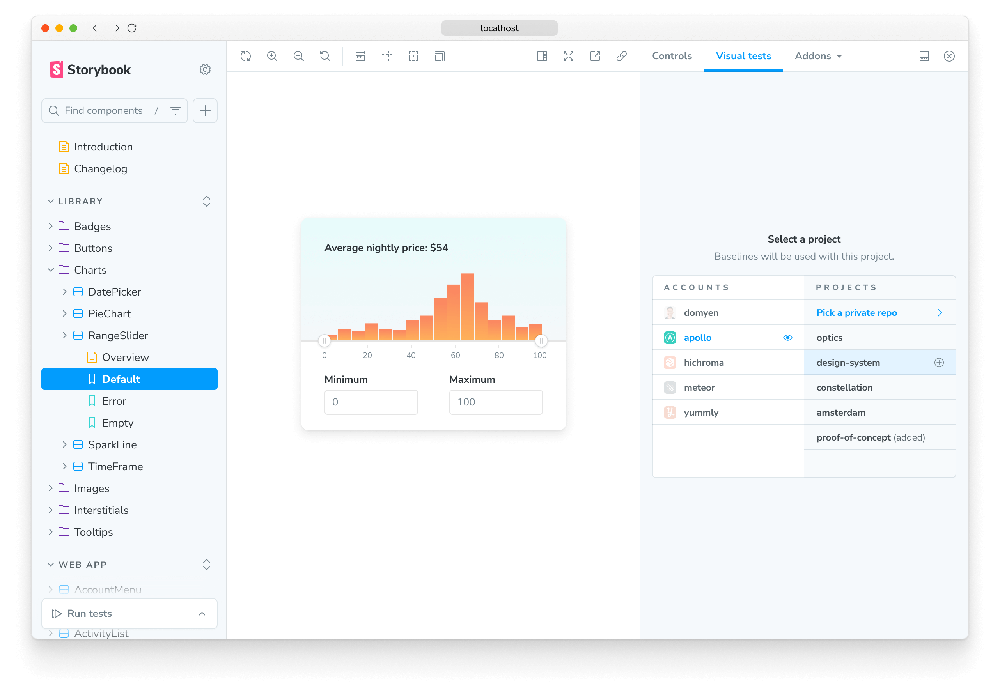

# Visual Tests addon for Storybook

<div class="aside" style="margin-bottom: 2rem;">

🧪 Currently in beta: [Sign up for early access](https://forms.gle/NCDV1BMGuNfjWrPm9)

</div>

Pinpoint visual bugs in local development without leaving Storybook.

## Installation

Run the following command to install the addon:

```shell
yarn add --dev @chromaui/addon-visual-tests
```

<div class="aside">

Storybook 7.4 and higher required. Read the [migration guide](https://storybook.js.org/docs/migration-guide) for help migrating Storybook versions.

</div>

Update your Storybook configuration file `.storybook/main.js|ts` file to include the addon:

```js
// .storybook/main.js

const config = {
  stories: ["../src/**/*.mdx", "../src/**/*.stories.@(js|jsx|mjs|ts|tsx)"],
  addons: [
    // Other Storybook addons
    "@chromaui/addon-visual-tests",
  ],
};
export default config;
```

When you start Storybook, you'll see a new addon panel for "Visual Tests" where you can run tests and view the results.


## Authentication

Sign in to Chromatic to create a new project or link an existing project.

You'll see list of available projects that you have access to. Select a project to finish setup. The addon will automatically adjust the configuration file, add the necessary project identifiers, and retrieve any existing baselines if available.



## Configure

Chromatic is configured using the [`.storybook/chromatic.config.json`](/docs/cli#configuration) file. By default, the recommended configuration for most projects is already applied. You can also customize the default behavior and provide additional options for full control.

### Addon configuration options

The shortlist of options that are addon-specific are below. View the full list of [options](/docs/cli#configuration-options).

| Option            | Description                                                                                                                  |
| ----------------- | ---------------------------------------------------------------------------------------------------------------------------- |
| `projectId`       | Automatically configured. Sets the value for the project identifier <br/> `"projectId": "Project:64cbcde96f99841e8b007d75"`  |
| `projectToken`    | Automatically configured. Sets the value for the project token <br/> `"projectToken": "chpt_b2ae83517a0a706"`                |
| `buildScriptName` | Defines the custom Storybook build script <br/> `"buildScriptName": "deploy-storybook"`                                      |
| `debug`           | Output verbose debugging information to the console <br/> `"debug": true`                                                    |
| `zip`             | Recommended for large projects. Configures the addon to deploy your Storybook to Chromatic as a zip file <br/> `"zip": true` |

```json
// .storybook/chromatic.config.json
{
  "projectId": "Project:64cbcde96f99841e8b007d75",
  "projectToken": "chpt_fa88b088041ccde",
  "buildScriptName": "deploy-storybook",
  "debug": true,
  "zip": true
}
```

<details>
<summary >Custom addon config files & environments</summary>

If you have separate config for different environments, use `configFile` to specify which file to load. Here's how you'd apply one config for `development` and another for `production`.

```js
// .storybook/main.js

const config = {
  stories: ["../src/**/*.mdx", "../src/**/*.stories.@(js|jsx|mjs|ts|tsx)"],
  addons: [
    // Other Storybook addons
    {
      name: "@chromaui/addon-visual-tests",
      options: {
        //👇 Loads the configuration file based on the current environment
        configFile:
          process.env.NODE_ENV === "development"
            ? "chromatic.config.json"
            : "production.config.json",
      },
    },
  ],
};
export default config;
```

</details>

## How to run visual tests

Click the ▶️ Play button in the Storybook sidebar to start visual testing. Behind the scenes, this sends your stories to the cloud to snapshot and find visual changes.


## Review changes

The addon highlights which stories require your attention 🟡 in the Storybook sidebar. Results will stream in while the test runs.

Use the "Visual Tests" addon tab to see which pixels changed. If the changes are intentional, accept them as baselines. If they're not intentional, fix the story and run the tests again with the ▶️ Play button.


When you finish accepting changes as baselines in the addon, you're ready to push the code to your remote repository. If you have Chromatic running in CI (recommended), your updated baselines will be reconciled automatically without you having to re-accept changes.

---

#### What’s the difference between testing with the addon vs. CI?

The addon allows running tests on-demand to detect bugs earlier in development. It saves time because you don’t have to wait for CI jobs to finish running.

---

## Troubleshooting

<details>
<summary>Running Storybook with the addon enabled throws an error</summary>

When running Storybook with the addon enabled, you may encounter the following error:

```shell
const stringWidth = require('string-width');

Error [ERR_REQUIRE_ESM]: require() of ES Module /my-project/node_modules/string-width/index.js is not supported.
```

This is a [known issue](https://github.com/storybookjs/storybook/issues/22431#issuecomment-1630086092) when using an older version of the Yarn package manager (e.g., version 1.x). To solve this issue, you can upgrade to the latest stable version. However, if you cannot upgrade, adjust your `package.json` file and provide a resolution field to enable the Yarn package manager to install the correct dependencies. In doing so, you may be required to delete your `node_modules` directory and `yarn.lock` file before installing the dependencies again.

```json
{
  "resolutions": {
    "jackspeak": "2.1.1"
  }
}
```

</details>

<details>
<summary>Does the addon affect snapshot usage?</summary>

Yes, running tests in the addon counts towards snapshot usage. The addon connects to our cloud to allow you to run tests on-demand in Storybook instead of waiting on CI. But you’re still taking snapshots all the same.

For customers in the early access program, the snapshots are free. Your usage will be credited to your account if there are any overages as a result of using the addon. Snapshots will be billed when the early access program concludes. If you still see them listed in your bill or have any questions, contact us <a class="intercom-concierge-bot"><b>via in-app chat</b></a>.

</details>

<details>
<summary id="turbosnap-support">Does the addon support TurboSnap?</summary>

Not yet. Visual Tests Addon is in beta with free usage. Support for TurboSnap will be added as part of a future release.

</details>

<details>
<summary>Can I deny a change with the addon?</summary>

No. Denying changes is only available when running builds from CI or the CLI. If you need to, you can revert changes by clicking the ”Unaccept” button in the addon panel.

</details>
