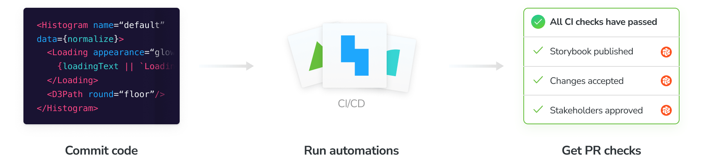

Configure CI to publish your Storybook and run Chromatic's automation whenever you push code. Badge your PRs to get notified about test and review results.



## Configure CI

Before we begin, make sure you set the `CHROMATIC_PROJECT_TOKEN` environment variable (sometimes referred to as "secrets") in your CI service's configuration. Add a `chromatic` script to your `package.json` if you don't have one already, and make sure `chromatic` is listed in `devDependencies`.

```json
"scripts": {
  "chromatic": "chromatic --playwright --exit-zero-on-changes"
}
```

Integrate with popular CI tools like you would any other job. Run `npm run chromatic` to publish your Storybook. If [UI Test](test) or [UI Review](review) are enabled, it will return a non-zero exit code when there are changes. For example:
