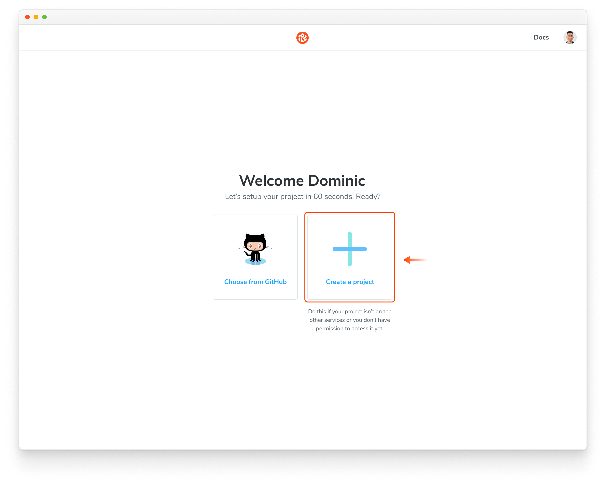

How to continue setup if you require SSO, on-premises, or have a different Git provider.

These instructions will teach you how to setup Chromatic with an ["unlinked" project](/docs/access#unlinked-projects). This can be useful in these situations:

- You need an enterprise plan but want to trial Chromatic in your project first
- You use an OAuth provider that we don't support right now
- You use Git hosting that we don't support right now

Start by signing in using your _personal_ account via any of the supported providers. We'll use this to authenticate you as a user only so the account doesn't have to be associated with your work.

Select "Create a project" and type your project name to create an unlinked project.

Nice! You created an unlinked project. This will allow you to get started with [UI Testing](/docs/test) workflow regardless of the underlying git provider. You can then configure your CI system to automatically run a Chromatic build on push.

The Chromatic CLI provides the option to generate a JUnit XML report of your build, which you can use to handle commit / pull request statuses yourself. See [debug options](/docs/cli#debug-options) for details.

Unlinked projects have certain drawbacks:

- You won't get automatic PR checks, so pull requests will not be marked with our status messages. You'll need to set this up manually via your CI provider.
- Authentication and access control must be handled manually through user invites.

Now continue with the next step to complete setting up Chromatic

