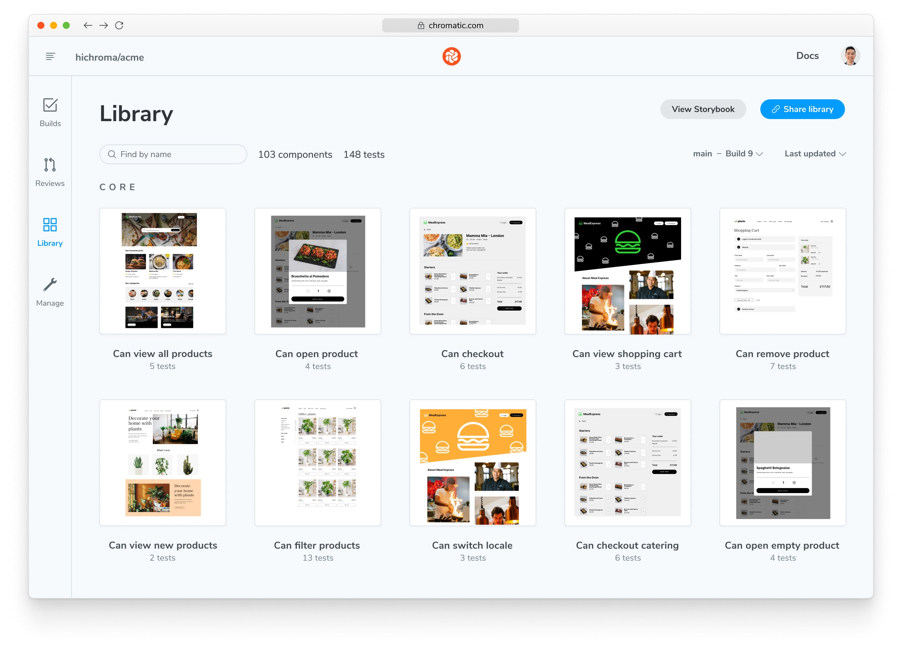

While your {props.type} tests are running, Chromatic captures an [archive](#what-is-an-archive) of your app's UI for each test. When you execute the `chromatic` command, it uploads this archive to Chromatic's cloud infrastructure to capture a snapshot of each test.

<details>
<summary>What is an archive?</summary>

An **archive** is a self-contained, re-renderable HTML “snapshot” of your UI captured during {props.type} tests. It contains all the assets and data required to re-render your app UI for Chromatic’s <a href={`/docs/${props.type.toLowerCase()}/test`}><b>Visual Tests</b></a> and [**UI Review**](/docs/review) features.

The archives generated during each test run can be accessed through the Chromatic web app and are fully inspectable, enabling you to troubleshoot changes and errors effectively.

</details>

When complete, you’ll see the build status:

```shell
✔ Started build 1
  → Continue setup at https://www.chromatic.com/setup?appId=...
✔ Build 1 auto-accepted
  → Tested X stories across 10 components; captured 10 snapshots in 1 minute 3 seconds
```


