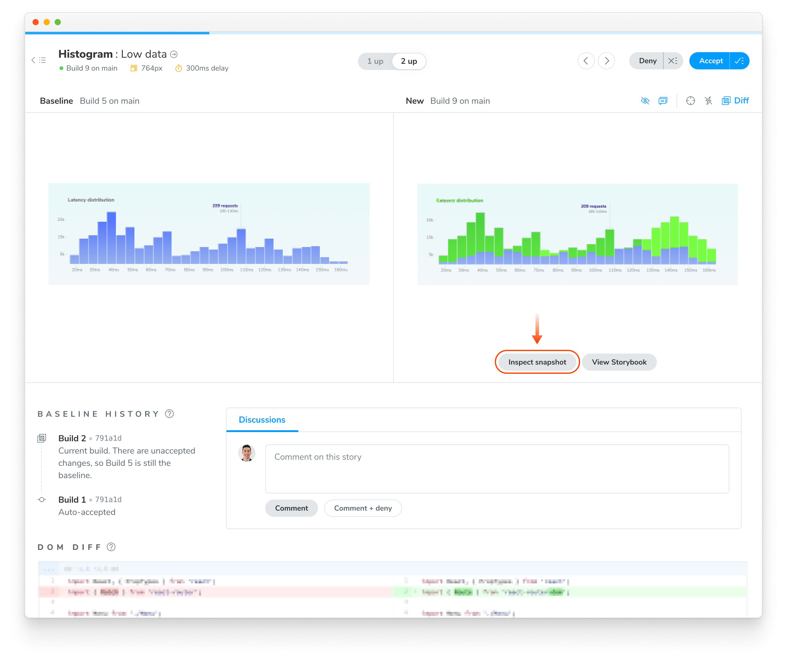

## Verify UI changes

Chromatic detects UI changes but it’s still up to you to verify if changes are intentional. For intentional changes, you need to update the baseline so future tests will be compared to the _latest baseline_ for the test. If a change is unintentional it needs to be fixed.

- ✅**Accept change**: This updates the test baseline. When a snapshot is accepted it won’t need to be re-accepted until it changes, even through git branches or merges.

- ⌠**Deny change**: This marks the change as “denied†indicating a regression and immediately fails the build. You can deny multiple changes per build. Denying a change will force a re-capture on the next build, even if [TurboSnap](/docs/turbosnap) would otherwise skip it.

What&rsquo;s the difference between denied and unreviewed changes?

The purpose of denying is to mark changes you’ve looked at but not accepted. When you’ve finished reviewing the build, the list of denied changes helps you track what needs fixing.

When it comes to baselines, denying and leaving unreviewed have the same effect. In both cases, the original baseline is used for comparisons. This means in subsequent builds, Chromatic compares the latest build to the original baseline (not the previously denied snapshot).

Denied changes will be marked as unreviewed in subsequent builds for you to review again.

Speed up review with keyboard shortcuts

Verify UI changes faster using keyboard shortcuts. Protip: Pressing 1 multiple times switches between the baseline and new snapshot in the 1up view.

What about baselines on other branches?

Chromatic automatically changes the baseline snapshots that it uses for each build depending on your branch. Each branch has a separate set of baselines.

This means you can update UI components on multiple feature branches in parallel without conflicts. When you merge branches, the most recent baseline takes precedence. [Learn about branching and baselines »](/docs/branching-and-baselines)

How do I reproduce the snapshot?

Sometimes you need a closer look to determine why a snapshot is rendering as it does. Along with pixel and DOM diffs, Chromatic displays the interactive page just as it appears in your app and E2E tests.

Click “Inspect snapshot” to open the Inspector. Switch between the “Canvas” and “Snapshot” tabs to compare the live component to the snapshot. Learn more about snapshots [here](/docs/snapshots).

Can I retake a snapshot?

Yes, [rerun the latest build](/docs/snapshots#rerun-builds-to-retake-snapshots) on your branch to retake snapshots of unreviewed or denied changes.

How are changes on builds different from those listed on the Review page ‘Changeset’ tab?

UI tests (shown on the build screen) detect changes between builds, specifically, between the last accepted baseline and the latest build. This is useful for detecting defects during the development process and when merging to the main branch to ship.

In contrast, the Review page shows the changeset between the latest commit on the PR branch (head) and the ‘merge base’ (base). Think of it like code review, but for UI.

#### Discussions

Reviewers can point out bugs or ask questions by creating discussions. Discussions are shown in situ of a UI change so all collaborators have the same reference point.

Pin discussions on a change to give precise feedback on what’s wrong. Pair discussions with denying a change to block merging until bugs are resolved.

<video autoPlay muted playsInline loop width="560px" class="center" style="pointer-events: none;">
  <source src="/docs/assets/testscreen-comment-pinned-optimized.mp4" type="video/mp4" />
</video>

## Merge

If you accept all the changes, the build will **🟢&nbsp;Pass**. Future builds whose tests have the same appearance will pass.

If you deny any of the changes, the build will **🔴&nbsp;Fail**. You will need to make code changes (and thus start a new build) to get the build to pass.

When your build is passed (all changes accepted), you’re ready to merge visual changes with confidence knowing that your UI is bug free. Chromatic will update the PR check for “UI Tests” to reflect the build status.

After you merge your code, Chromatic will also apply accepted baselines to tests on the target branch. That means you’ll only need to accept baselines a single time.

Why is review disabled in the build page?

Reviewing is only enabled for the latest build on a branch to ensure that only the most up-to-date UI gets accepted as baselines.

Why is commenting disabled on old builds?

Comments are disabled on old builds to ensure that discussions are always on topic and up to date with the latest UI. This prevents the situation where different reviewers comment on different versions of the code.

Can I review the same commit on separate branches?

Yes, but it‘s not a best practice.

Every branch has independent baselines for each test until the branch gets merged. If two builds reference the same commit hash but are on _different branches_ it will be possible to review those builds separately so long as they're the latest build on their respective branches. We don't recommend this because you'll have to review the same change multiple times.

Instead, we recommend you regularly review builds to keep feature branches 🟢&nbsp;passing.

