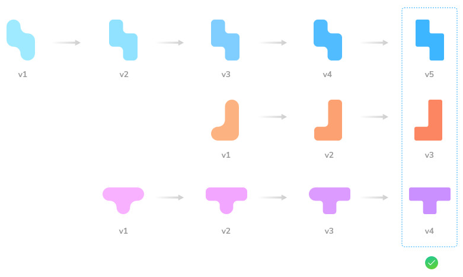

# Branches and baselines

Chromatic uses your git history to decide how to check stories for changes for both [UI Tests](test) and [UI Review](review). The way it works is intended to get out of your way and do what you expect. However, there can be situations where things get confusing; this document describes in detail the way Chromatic does it.

### UI Review: comparing branches

For [UI Review](review), Chromatic's aim is to show you what will change on the base branch when you merge this PR.

As such, Chromatic will compare each story on the head branch with the way the story looked on the base branch when you branched off or last merged-in. This is similar to what systems like GitHub do when showing you the code changes in a PR.

Technically, to achieve that, we need to find the "merge-base build" to compare with. The method to do so is [explained below](#how-the-merge-base-is-calculated).

### UI Tests: tracking baselines

For [UI Tests](test), we aim to keep an up to date "baseline" for each story (at a given viewport) that lives alongside the git history. One way to think about it is as if we checked in a snapshot file into your repository every time you accept a change (we don't do this but we aim to behave as if we did).

That means once a snapshot is accepted as a baseline, it won’t need to be re-accepted until it changes, even through git branching and merging. The mechanism to achieve this is explained below.



## Baselines

Chromatic's [UI Tests](test) compare snapshots to a baseline: the last known “good” state of the story. Each story has its own baseline that is tracked independently on each branch.

When you accept a snapshot you also update the baseline for that story on that branch. When you merge that branch into another (for instance back into `main`), the baseline comes with it. [Learn how we calculate baselines »](#how-baselines-are-calculated)

## Branches

Chromatic uses the branch that is checked out when you run a build to mark builds in our system. This means it is easy to see which builds belong to which branch of development, which components exist and are tested in which branch, and how a component has changed over the history of a branch.

#### Multiple branches

When you are developing in a branch, it is natural that the baseline image should be chosen from previous commits on the branch. This means if your team is developing on multiple branches in parallel, changes to the approved component screenshots on one branch will not affect the others.

#### Merging

When you merge two branches together, Chromatic can sometimes have two (or more) potential screenshots to use as the baseline (one from each branch). In such situations, Chromatic will choose the _most recent approved change_ as the baseline.

#### Rebasing

If you rebase a branch (say updating to branch off the latest commit off `main`), then you create a new commit that isn't a git descendent of the previous (pre-rebase) commit on that branch. Conceptually, that might mean that Chromatic should throw away any approvals that were made for builds on the branch, however this is probably not what you want.

For this reason, we _always_ include accepted baselines from the latest build on the current branch, regardless of git history. You can bypass this with the `--ignore-last-build-on-branch=<branch-name>` flag of `chromatic`. For example:

```shell
chromatic --ignore-last-build-on-branch=example-branch
```

<div class="aside">
Read our CI <a href="/docs/ci"> documentation</a>. 
</div>

#### Squash and rebase-merging

Chromatic detects squash and rebase merges. Your baselines are preserved between branches, even when squashing or rebasing wipes the Git history.

If you use the "squash" or "rebase" merge feature on Pull Requests, then a commit is created on your base branch that is not a descendant of the commits for the PR. See the diagram below.


This means Chromatic has no way to tell, using Git, that baselines accepted during the PR should "come over" to the main branch. Instead, we use Git provider APIs to detect this situation. When running the squash/rebase merge commit we'll use the accepted baselines of the _most recent_ commit on the head branch of the PR.

If you are using GitHub, you need to enable our GitHub App (on the [Pull Requests](review) screen) for this feature to work. Bitbucket and GitLab will work out of the box.

## How baselines are calculated

As stated above, Chromatic maintains an individual baseline for each _story_, at each _viewport_, for each _commit_. That means as you make changes to your components, either by committing new code, merging other branches or otherwise, your baselines will follow your stories.

The only way that baselines change is when you or someone in your team [accepts a change](test#verify-ui-changes). Usually what this means is that the baselines are what you’d expect as you work through a feature.

However, sometimes the choice of baseline can be confusing. Let’s dig in a little further on how it works.

#### Calculating the ancestor build(s)

In Chromatic, a build contains of a set of snapshots, each of which is a screenshot of a single story at a single viewport.

> If you are using multiple browsers, there may be more than one screenshot within a single snapshot, however as baselines are calculated above the level of the browser (all browsers share the same acceptance/denial), we can ignore multiple browsers when thinking about baselines.

When you create a new build for a new commit, Chromatic will calculate a baseline for each snapshot in the build (unless the snapshot is for a new story). The first step to do that is to calculate the ancestor(s) for the build itself.

The ancestor build is the most recent ancestor (commit) in the git history that has had Chromatic run against it. Often, it is the previous commit:

```shell
x - Build N
|
y - Build N+1
```

If you don’t run CI on every commit (which is common if you don’t push every single time you commit), there may be a gap:

```shell
x - Build N
|
y
|
z - Build N+1
```

Also, it is possible there is more than one most recent ancestor, in particular if the commit we are looking at is a merge commit:

```shell
x - Build N
|
|    p - Build N+1
|  /
y - Build N+2
```

In this case, Build N+2 will have two ancestor builds (N, and N+1).
Things can get a little more complicated (see some exceptions below) but that’s the basic idea.
You can see the ancestor builds listed on the build page:


#### Calculating a snapshot baseline from the ancestor build(s)

Once we’ve got the ancestor builds for a build, the algorithm to calculate the baseline for any given snapshot goes like this:

If there is one ancestor build, find if there is a snapshot for the same story & viewport combination.

If there is, check the status of that snapshot:

- If it was _changed and those changes accepted_ (ie the snapshot was new or changed but has been accepted by your team), then use it as the baseline.
- If it was _unchanged_ (ie it was visually identically to its own baseline), then use it as the baseline.
- If it was _changed but denied or not yet accepted_, then we need to ignore it, and use _its baseline_ as the baseline for the new snapshot..

The last case bears thinking about a bit. Consider this scenario:

```shell
x - Build N
|
y - Build N+1
|
z - Build N+2
```

Suppose then in commit y, we changed the color of our submit buttons to be orange rather than green. However, we realized this was a mistake and denied the change. Then in commit z we changed the colour back to green.
Then in Build N+2, we should compare the “new” green buttons to the original green buttons (from Build N). If they are back to the way they were before, the build should pass without you needing to intervene. If the green color is a different shade, Chromatic should show you a diff and you can decide if that’s what you wanted.

#### Multiple ancestor builds

In the case that there are multiple ancestor builds, the algorithm to calculate the baseline is more or less the same. We can (potentially) end up with more than one baseline snapshot to use. To break ties, we assume that the most recently accepted snapshot is the one you want to compare to.

#### Visualize baseline history

When you [verify UI Test changes on Chromatic](test#verify-ui-changes), you'll see a historical set of baselines that correspond to the algorithm above. This helps you understand when the baseline changed, by who, and in which commit.

<video autoPlay muted playsInline loop width="600px" class="center" style="pointer-events: none;">
  <source src="../images/testscreen-baseline-history-detail-optimized.mp4" type="video/mp4" />
</video>

The snapshot marked "Most recent build...." is a change that hasn't been accepted as a baseline yet. The baseline marked "current baseline" is the last known good version of the snapshot that was accepted by Tom Coleman. Going back in the timeline, the listed baselines show previous times the component changed.

## How the merge base is calculated

To find the merge base build in Chromatic, it needs to track back from the current latest build on the PR until it finds a build that was on the base branch. Chromatic tracks back via the [ancestor builds](#calculating-the-ancestor-builds) of each build, which corresponds to the git commit history (keep in mind you may not have run a build for every single commit!).

Typically this leads to a situation like so:

```shell
x - y - z [base]
  \
    w - p - q [head]
```

Starting with the build corresponding to commit `q`, Chromatic walks back the commit and build history, through `p` and `w` until it reaches `x`. This is the "merge base" build (and also commit, which would be output from `git merge-base base head`).

Chromatic will now compare the stories from `q` to the corresponding stories in `x` to generate the UI changes for the PR.

If the head branch has been more recently updated from the base branch, the merge base can be a more recent commit than the point we branched off:

```shell
x - y - z [base]
  \       \
    w - p - q [head]
```

In this case the merge base starting at `q` will be `z`. It makes sense to use `z` as the point of comparison, otherwise (if we compared `q` to `x` as before) we would see a set of changes in the PR that were created by `y` and `z`, which would be confusing.

One thing to note is that if the merge base is quite old, the left hand side of the comparison may be quite old versions of your components. To work around this, merging (or rebasing) the base branch into the feature branch will resolve the issue, as demonstrated above.

### Patch builds

If Chromatic searches for a merge base and doesn't find one, it will prompt you to create a "patch build". This situation typically comes about when you are first installing Chromatic and you don't have a build for older, historical commits (like the commit `x` in the picture above).

The Chromatic CLI has a special option `--patch-build=$head...$base` which is intended for this purpose. What this does is:

1. Figure out what the merge base commit between head and base is in your git repo.
2. Check out that commit and update dependencies
3. Run a Chromatic build for that commit, flagging to the server that is is a special "patch" build (so it doesn't affect [UI Tests](tests) baselines).
4. Put your repository back as it was before.

Essentially we are retroactively creating the merge base build, so we have something to compare against.
