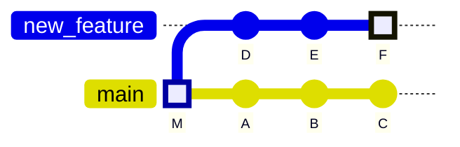
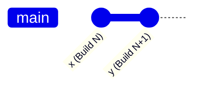
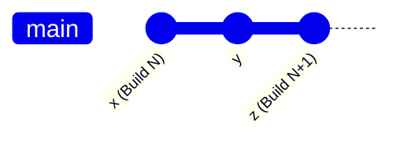
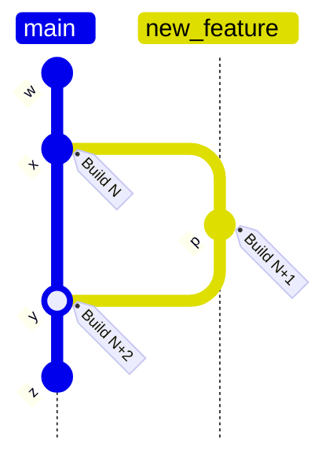
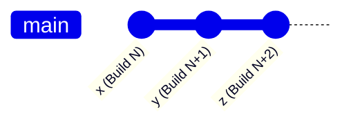
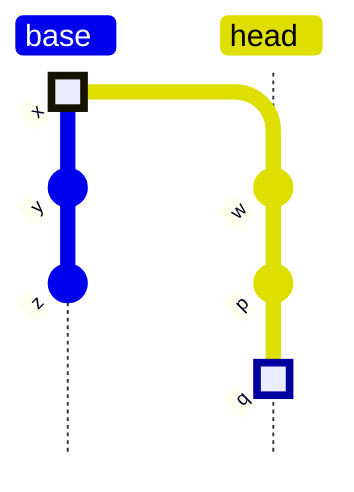
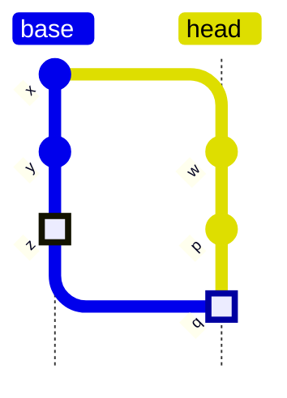

# Branches, baselines, and git history

This document describes how Chromatic decides what snapshots to compare when using UI Tests or UI Review.

- [UI Tests](#ui-tests-verify-changes-on-one-branch): Verify changes on one branch (uses baselines)
- [UI Review](#ui-review-compare-two-branches-for-changes): Compare two branches for changes (does not use baselines)



<div class="aside">

Visualize the different comparisons methods using the git history diagram above. **UI Tests** compares commit F to E, the previous commit in the git history or its direct ancestors. **UI Review** always compares commit F to M, the merge base.

</div>

## UI Tests: Verify changes on one branch

UI Tests serve as visual regression tests between builds, similar to snapshot testing. When modifications are made in a PR, the tests fail until the new snapshots are accepted as baselines.

### What’s a baseline?

A baseline is the last known “good” state of the story in a given [mode](/docs/modes). [UI Tests](/docs#test-how-uis-look--function) take snapshots and compare them to baselines to detect changes.

Chromatic’s objective is to maintain an up to date “baseline” for each story. Baselines live alongside the git history and persist through git branching and merging.

Baselines only update when changes are [accepted](/docs/quickstart#4-review-changes) by you or your team. Since baselines are tracked independently for each branch, when you merge that branch into another (for instance back into `main`), the baseline comes with it.

Conceptually, this is akin to storing a snapshot file in your repository with each accepted change, though Chromatic does not actually do this.

<details>
<summary>What happens to baselines when there are multiple branches?</summary>

In a multi-branch development workflow, each branch maintains its own baseline — a snapshot of the approved component states at that point in time.

When you’re working on a feature branch, Chromatic selects a baseline from a previous commit on that same branch. For a newly created branch, the baseline is inherited from the commit it was branched off from.

Even if someone merges approved visual changes into the `main` branch, other branches won’t automatically reflect those updates in their baselines. Each branch’s baseline remains unchanged until it's explicitly updated. That’s why, when working across multiple branches, it's important to periodically sync with the `main` branch to pick up the latest approved changes.

If your branch is using an outdated baseline, you might see false positives in visual tests — changes that look “new” but were already approved and merged elsewhere. This can lead to unnecessary review work and confusion.

To avoid that, make it a habit to regularly merge or rebase from the `main` branch into your feature branches. It helps keep your baseline up to date and reduces noise in your visual diffs. Encouraging this practice across the team can keep things aligned and workflows smooth.

</details>

<details>
<summary>What happens to baselines on merge?</summary>

When you merge two branches together, Chromatic can sometimes have two (or more) potential snapshots to use as the baseline (one from each branch). In such situations, Chromatic will choose the _most recent approved change_ as the baseline.

</details>

<details>
<summary>What happens to baselines when a branch is rebased?</summary>

If you rebase a branch, then you create a new commit that isn’t a git descendent of the previous (pre-rebase) commit on that branch. For example, you update to branch off the latest commit off `main`.

Conceptually, that might mean that Chromatic should throw away any approvals that were made for builds on the branch, however this is probably not what you want.

For this reason, we _always_ include accepted baselines from the latest build on the current branch, regardless of git history. You can bypass this with the `--ignore-last-build-on-branch=<branch-name>` flag of `chromatic`. For example:

```shell
chromatic --ignore-last-build-on-branch=example-branch
```

<div class="aside">

Read our CI [documentation](/docs/ci).

</div>

</details>

<details>
  <summary>Why is a reverted or deleted commit included in the baseline history?</summary>

Git operations that rewrite the history can cause a mismatch between your repository's history and Chromatic baseline history. Removing or altering a commit that has already been built in Chromatic will cause your histories to diverge if you don't run Chromatic after this change to update the baseline. Git "forgets" the commit, but Chromatic remembers it.

| Action              | Git             | Chromatic            |
| ------------------- | --------------- | -------------------- |
| `commit C` + `push` | `A` → `B` → `C` | `A` → `B` → `C`      |
| `reset --hard A`    | `A`             | `A` → `B` → `C`      |
| `commit D` + `push` | `A` → `D`       | `A` → `B` → `C`→ `D` |

The baseline history will keep the commits `B` and `C` which are now orphaned and may cause incorrect comparisons.
You can bypass this commit by setting the `--ignore-last-build-on-branch` flag.

</details>

<details>
<summary>How do baselines get preserved during squash and rebase-merging?</summary>

Chromatic detects squash and rebase merges. Your baselines are preserved between branches, even when squashing or rebasing wipes the git history.

If you use the “squash” or “rebase” merge feature on Pull Requests, then a commit is created on your base branch that is not a descendant of the commits for the PR. See the diagram below.


This means Chromatic has no way to tell, using git, that baselines accepted during the PR should “come over” to the main branch. Instead, we use git provider APIs to detect this situation. When running the squash/rebase merge commit, we’ll use the accepted baselines of the _most recent_ commit on the head branch of the PR.

To ensure that Chromatic uses the correct baseline with “squash” or “rebase”, we recommend the following:

- **GitHub:** enable the Chromatic GitHub App (on the [Pull Request](/docs/review) screen)
- **Bitbucket** will work out of the box
- **GitLab or an unlinked project**, follow our process for [auto-accepting changes on main](/docs/branching-and-baselines#how-do-i-auto-accept-changes-on-main).

</details>

<details>
<summary>How can I avoid re-accepting other’s changes when I update my branch?</summary>

When merging, Chromatic has to compare two branches and pick a baseline for each story. By default, Chromatic chooses the baseline that was most recently accepted.

Consider a busy repository where many people are working on the same UI. An issue occurs when you merge someone else’s changes into your branch (e.g., when you git pull) and they’ve touched the same stories as you.

As Chromatic picks the latest accepted changes, that can often mean it picks your baselines instead of incoming baselines. This results in you having to re-accept the changes the other person made which you might not have the context on.

Chromatic’s default of choosing latest accepted baseline works for most teams. If you want Chromatic to always prefer the “incoming” baselines to avoid re-accepting changes, please [email](mailto:support@chromatic.com) support and request the `preferMergedBaselines` feature be enabled for your account.

</details>

<details>
  <summary>What if you accidentally reset your baselines and are seeing only new stories?</summary>

If you're revamping your Chromatic configuration, you may accidentally reset your baselines. This happens because the continuity of your baselines git history may break. For example, a build on `main` branch lost track of its ancestor causing all tests to appear as new in subsequent builds.

You can use git to bring your old baselines back.

1. Find a past build with the correct baselines.
2. Check out the corresponding branch for that build in git (e.g., `feature-branch`).
3. Make a new branch off of that (e.g., `feature-branch-baselines`).
4. Create a new commit (empty ok) and run a build to make "more recent" baselines.
5. Merge that commit into the current `main` branch.

</details>

<details>
  <summary>How do I auto-accept changes on <code>main</code>?</summary>

Use the `--auto-accept-changes` flag with the Chromatic CLI or the `autoAcceptChanges` option in your Chromatic config with the value as `"main"`. This will ensure that Chromatic will automatically accept any changes in your build on the `main` branch.

</details>

<details>
  <summary>Will deleting a branch in git affect my baseline?</summary>

No. You can safely delete branches in git, and it will not affect your baselines or snapshot history.

</details>

<details>
  <summary>What if I accidentally accept unwanted changes. Can I delete a build?</summary>

Chromatic does not currently support deleting individual builds within a project. Builds are integral to Chromatic's baseline algorithms, making deleting individual links in the chain complex and impossible at the moment.

If you want to revert to a previous baseline, you can use Git to restore old baselines. Identify a past build with the correct baselines, create a new branch for these changes and merge them into the current `main` branch using the `--auto-accept-changes` flag.

</details>

<details>
  <summary>What's the difference between an ancestor build and the baseline history?</summary>

The **baseline history** shows all previously accepted and unreviewed baselines for a specific story, while an **ancestor build** is the most recent parent commit. A build can have [multiple ancestor builds](/docs/branching-and-baselines#what-if-there-are-multiple-ancestor-builds). An ancestor build may not be part of the baseline history of a specific story.

</details>

### How are baselines calculated?

In Chromatic, a build contains of a set of snapshots, each of which is a snapshot of a single story in a single mode. The baseline is the last accepted snapshot on a given branch. Each branch has builds associated with it, so to find the baseline, we need to traverse git history for that branch to find the “ancestor” build.

#### Find the ancestor build(s)

When you create a new build for a new commit, Chromatic will calculate a baseline for each snapshot in the build (unless the snapshot is for a new story). The first step to do that is to calculate the ancestor(s) for the build itself.

The ancestor build is the most recent ancestor (commit) in the git history that has had Chromatic run against it. Often, it is the previous commit:



If you don’t run CI on every commit (which is common if you don’t push every single time you commit), there may be a gap:



Also, it is possible there is more than one most recent ancestor, in particular if the commit we are looking at is a merge commit:



In this case, Build N+2 will have two ancestor builds (N, and N+1).
Things can get a little more complicated (see some exceptions below) but that’s the basic idea.
You can see the ancestor builds listed on the build page:


#### Calculate a snapshot baseline from the ancestor build(s)

Once we’ve got the ancestor builds for a build, the algorithm to calculate the baseline for any given snapshot goes like this:

If there is one ancestor build, find if there is a snapshot for the same story & mode combination.

If there is, check the status of that snapshot:

- If it was _changed and those changes accepted_ (ie the snapshot was new or changed but has been accepted by your team), then use it as the baseline.
- If it was _unchanged_ (ie it was visually identically to its own baseline), then use it as the baseline.
- If it was _changed but denied or not yet accepted_, then we need to ignore it, and use _its baseline_ as the baseline for the new snapshot..

The last case bears thinking about a bit. Consider this scenario:



Suppose then in commit y, we changed the color of our submit buttons to be orange rather than green. However, we realized this was a mistake and denied the change. Then in commit z we changed the colour back to green.

Then in Build N+2, we should compare the “new” green buttons to the original green buttons (from Build N). If they are back to the way they were before, the build should pass without you needing to intervene. If the green color is a different shade, Chromatic should show you a diff and you can decide if that’s what you wanted.

<details>
<summary>How do browsers work with baselines?</summary>

Baselines are calculated above the level of browsers. Clicking “accept” on a baseline will accept all snapshots taken in different browsers associated with that baseline. We can ignore multiple browsers when thinking about baselines.

</details>

<details>
<summary>What if there are multiple ancestor builds?</summary>

In the case that there are multiple ancestor builds, the algorithm to calculate the baseline is more or less the same. We can (potentially) end up with more than one baseline snapshot to use. To break ties, we assume that the most recently accepted snapshot is the one you want to compare to.

</details>

<details>
<summary>How do I visualize baseline history for a story?</summary>

When you [verify UI Test changes on Chromatic](/docs/quickstart#4-review-changes), you’ll see a historical set of baselines that correspond to the algorithm above. This helps you understand when the baseline changed, by who, and in which commit.

<video autoPlay muted playsInline loop width="600px" class="center" style="pointer-events: none;">
  <source src="/docs/assets/testscreen-baseline-history-detail-optimized.mp4" type="video/mp4" />
</video>

The snapshot marked “Most recent build....” is a change that hasn’t been accepted as a baseline yet. The baseline marked “current baseline” is the last known good version of the snapshot that was accepted by Tom Coleman. Going back in the timeline, the listed baselines show previous times the component changed.

</details>

## UI Review: Compare two branches for changes

Similar to a code review, UI Review shows what changes will occur on the base branch upon PR merge, minimizing unintentional or disruptive merges. Chromatic compares each story on the head branch with its appearance on the base branch at the time of branching off (in git this is called the `merge base`).

### How changesets are generated

A changeset is a list of UI changes between two branches. [UI Review](/docs/review) compares the latest snapshots on a feature branch to the latest snapshots on the base branch (referenced as `merge base`) to generate a changeset.

Conceptually, this is similar to what systems like GitHub do when showing you the code changes in a pull/merge request.

Unlike UI Tests, UI Review does not use baselines to generate changesets so the list of changes may also show snapshots that were unreviewed in UI Tests.

<details>
<summary>What if I skip running Chromatic on a base branch?</summary>

UI Review will not work if you skip running `chromatic` on a base branch like `main`. Chromatic needs to have two builds to generate a changeset.

UI Review works differently than UI Tests. Some customers skip running `chromatic` on their base branches in UI Tests. This works for UI Tests because our baseline detection algorithm. UI Review needs `chromatic` to run in order to create a build that captures snapshots for comparison.

</details>

#### How is `merge base` calculated

To find the merge base build in Chromatic, we need to track back from the current latest build on a pull request until we find a build that was on the base branch. We then check that the build matches what’s in the git commit history (keep in mind you may not have run a build for every single commit!). Learn more about how we use [ancestor builds](#find-the-ancestor-builds).

Typically this leads to a situation like so:



Starting with the build corresponding to commit `q`, Chromatic walks back the commit and build history, through `p` and `w` until it reaches `x`. This is the “merge base” build (and also commit, which would be output from `git merge-base base head`).

Chromatic will now compare the stories from `q` to the corresponding stories in `x` to generate the UI changes for the PR.

If the head branch has been more recently updated from the base branch, the merge base can be a more recent commit than the point we branched off:



In this case the merge base starting at `q` will be `z`. It makes sense to use `z` as the point of comparison, otherwise (if we compared `q` to `x` as before) we would see a set of changes in the PR that were created by `y` and `z`, which would be confusing.

One thing to note is that if the merge base is quite old, the left hand side of the comparison may be quite old versions of your components. To work around this, merging (or rebasing) the base branch into the feature branch will resolve the issue, as demonstrated above.

<details>
<summary>What happens when the merge base build isn’t found? (patch builds)</summary>

If Chromatic searches for a merge base and doesn’t find one, it will prompt you to create a “patch build.” This situation typically comes about when you are first installing Chromatic and you don’t have a build for older, historical commits (like the commit `x` in the picture above).

The Chromatic CLI has a special option `--patch-build=$head...$base` which is intended for this purpose. What this does is:

1. Figure out what the merge base commit between head and base is in your git repo.
2. Check out that commit and update dependencies
3. Run a Chromatic build for that commit, flagging to the server that is is a special “patch” build (so it doesn’t affect [UI Tests](/docs#test-how-uis-look--function) baselines).
4. Put your repository back as it was before.

Essentially we are retroactively creating the merge base build, so we have something to compare against.

</details>
