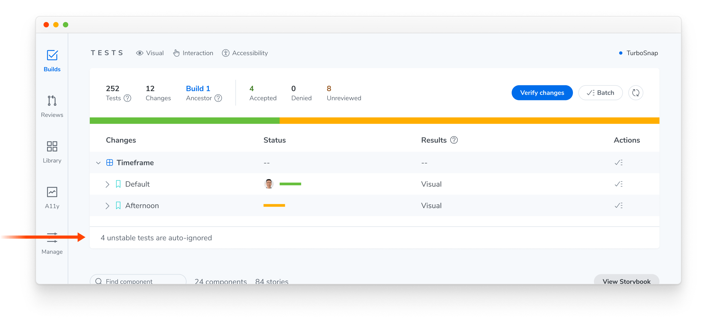
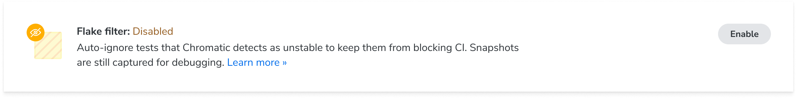
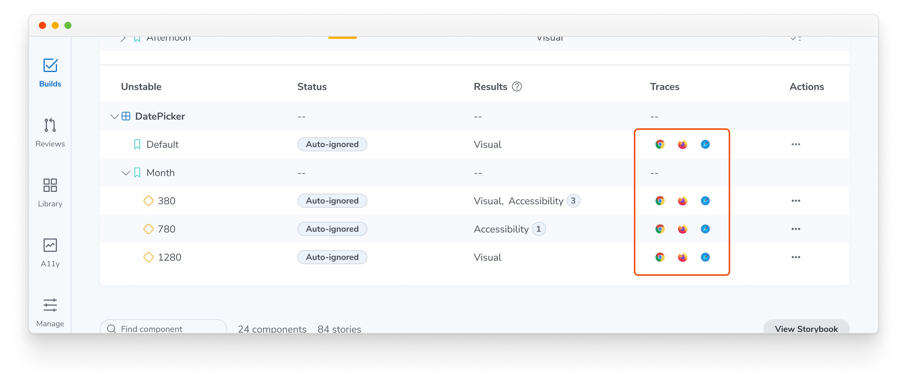

# Flake filter for unstable tests

Flake filter detects unstable tests automatically, and automatically ignores them so that they don't block your build. Chromatic also records a [trace](#fix-unstable-tests) of the rendering session so you can diagnose the root cause without re-running the build.

## What is an unstable test?

An unstable test fails intermittently because it renders differently on each test run without any change to your code. This might be because of an animation caught mid-frame, a font that loads late, randomized or dynamic data, a network request that doesn't finish in time, etc.

## How flake filter works

Chromatic renders each test multiple times to evaluate whether it's a genuine change, a temporary flake, or an unstable test.

When Chromatic detects that a test is unstable, it ignores that test automatically so it doesn't require an approval for the build to pass. On the build page, actual changes show up top while ignored tests are grouped separately in a collapsed section below.

Tests labelled as unstable and automatically ignored won't affect your [baselines](/docs/branching-and-baselines) unless you take action to accept or deny them, and they won't surface changes in the [UI Review](/docs/review) workflow.

### Auto-ignores don't persist across builds

Flake filter runs on each build to re-evaluate whether a test is still unstable. When a test stops flaking, it automatically re-enters the test suite.

### Disable flake filter

You can turn off flake filter, i.e., auto-ignoring for unstable tests, from your project settings.

## Fix unstable tests

Instability is a signal that a test needs attention. To help you diagnose it, every unstable test includes a [Playwright trace](https://playwright.dev/docs/trace-viewer) recorded during the snapshot process.

The trace includes network requests, console logs, and DOM snapshots from the test run, giving you the information you need to pinpoint why the test rendered inconsistently. Learn how to read a trace in [Debug snapshots with the trace viewer](/docs/trace-viewer).

Once you've identified the cause, the [Troubleshooting unstable tests](/docs/troubleshooting-snapshots) page covers common fixes, such as pausing animations, preloading fonts, and seeding randomness.

## Frequently asked questions

Do auto-ignored tests count toward my snapshot usage?

Yes. Chromatic has to capture a test to determine whether it's stable, so ignored tests still count toward your snapshot usage. However, even when Chromatic [captures a test multiple times](#how-it-works) to detect instability, you are only billed for one snapshot per test.

