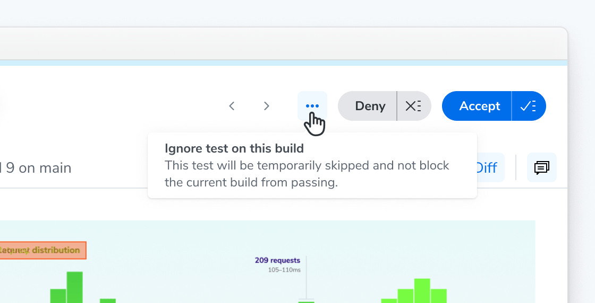
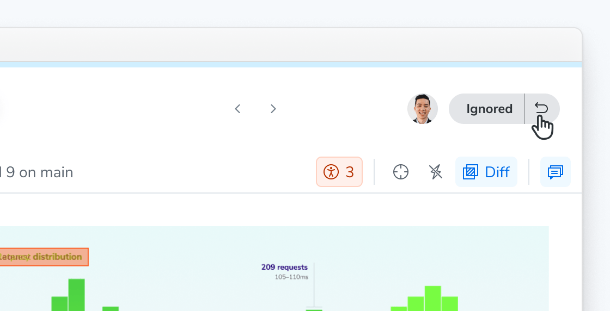

# Ignore tests

Sometimes a test shows a change you're not ready to address, such as an unexpected diff from an unrelated commit or a new story that isn't ready for review. Ignoring the test lets the build pass while you address the change later.

Looking for a different kind of ignore? [Flake Filter](/docs/flake-filter) automatically ignores unstable tests. You can also [ignore specific elements](/docs/ignoring-elements) within a snapshot, or [disable snapshots](/docs/disable-snapshots) for tests you never want captured.

To ignore a test, open the context menu on the test's page and select **Ignore test on this build**.

If you change your mind, you can un-ignore the test to return it to the unreviewed state on the same build.

**Ignoring is scoped to a single build:** an ignored test is captured and compared as usual on future builds. Ignoring a test also doesn't affect your [baselines](/docs/branching-and-baselines) unless you take action to accept or deny it.

## Ignored, auto-ignored, and disabled: which is which?

Two different mechanisms stop a test from blocking your build, and they behave differently. A third — disabling — stops the test from running at all.

|                      | What it does                                                                                      | Scope & Persistence                                      |
| -------------------- | ------------------------------------------------------------------------------------------------- | -------------------------------------------------------- |
| **Manually ignored** | You ignore a specific test on a specific build so the build can pass without accepting the change | That build only and does not carry over to other builds. |
| **Auto-ignored**     | [Flake filter](/docs/flake-filter) ignores a test it detected as unstable                         | Specific build. Re-evaluated on every build.             |
| **Disabled**         | For every build where the parameter is set.                                                       |

Ignored and auto-ignored tests share the same `IGNORED` status, which means the test:

- does not update the baseline
- does not block the build from passing

Crucially, **ignoring a test doesn't change what Chromatic captures**. An ignored test is captured and compared on later builds like any other test, and [TurboSnap](/docs/turbosnap) skips unchanged stories whether they were ignored or not. Ignoring is about removing review noise, not about saving snapshots. If you want to stop snapshotting a test entirely, [disable it](/docs/disable-snapshots) with `disableSnapshot` — don't rely on ignoring to do that.

## Frequently asked questions

What happens if I accept or deny an auto-ignored test?

Once you accept or deny the snapshot, the test behaves like any other reviewed test for that build and stops following the auto-ignore rules.

Can I ignore tests for a whole project instead of build by build?

No. Ignoring is only available. If a test is consistently problematic you can [disable it](/docs/disable-snapshots) with `disableSnapshot`.

Are ignored tests shown in UI Review?

Auto-ignored tests are filtered out of UI Review. An unstable test is unlikely to be related to the code changes under review, so showing it to reviewers adds noise.

What happens to ignored tests on an upgrade build?

On [upgrade builds](/docs/infrastructure-upgrades), ignored tests are treated as passed and auto-accepted rather than staying ignored. This applies to both manually ignored and auto-ignored tests.

How does auto-ignore impact accessibility tests?

An accessibility regression that occurs within an unstable test is also auto-ignored. However, if you accept the snapshot, it update the accessibility baseline too.

Can I batch-accept ignored tests?

Manually ignored tests are excluded from batch operations: "accept all", "deny all", and "mark all unreviewed".

