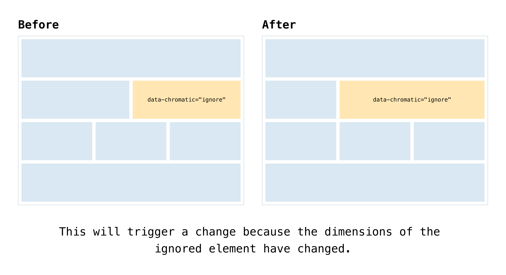
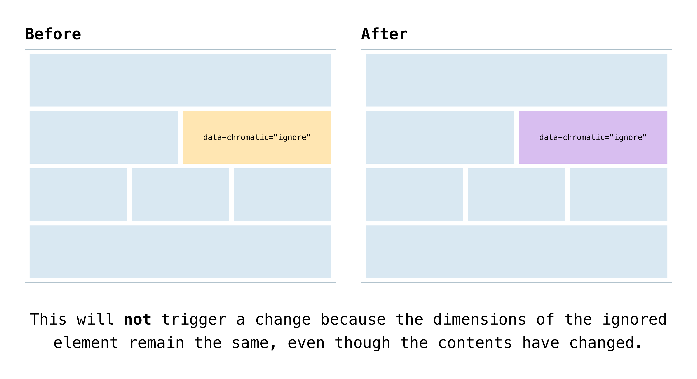

import ParamsCallout from "../../components/ParamsCallout.astro";

import IntegrationSnippets from "../../components/IntegrationSnippets.astro";

# Ignore DOM elements

Sometimes a component's appearance changes every render or contains content like video and [animation](/docs/animations) that is impossible to test consistently. This will trigger visual changes even when the component code hasn't changed. Ignore tests or DOM elements to tell Chromatic to skip them when looking for changes.

## Ignoring elements inline

To ignore specific elements in your UI, add the `.chromatic-ignore` class or `data-chromatic="ignore"` attributes to the elements you want Chromatic to skip. Enabling these attributes notifies Chromatic's diffing algorithm to disregard the pixels when running your UI tests and comparing snapshots for visual changes, including the element's bounding box and position (e.g., width, height, and relative positioning).

```tsx title="src/components/VideoComponent.ts|tsx"
import React from "react";

interface VideoPlayerProps {
  src: string;
  datePublished?: string;
}

export const VideoPlayer: React.FC<VideoPlayerProps> = ({
  src,
  datePublished = new Date().toLocaleString(),
}) => {
  return (
    <div>
      <video data-chromatic="ignore" src={src} controls>
        Your browser does not support video tags.
      </video>
      <p className="chromatic-ignore">Published on: {datePublished}</p>
    </div>
  );
};
```

## Ignoring elements via test configuration

You can specify a list of CSS selectors with the `ignoreSelectors` option to ignore multiple elements simultaneously. This option supports valid CSS selectors, such as `.any-selector-the-browser-supports`, `#even-really-weird-ones`, or `a[href$=".zip" i]:after`.

{/* prettier-ignore-start */}

<IntegrationSnippets>
  <Fragment slot="storybook" visible="true">
    ```ts title="src/components/Product.stories.ts|tsx"
    // Adjust this import to match your framework (e.g., nextjs, vue3-vite)
    import type { Meta, StoryObj } from "@storybook/your-framework";

    /*
    * Replace the storybook/test import with `@storybook/test` and adjust the stories accordingly if you're not using Storybook 9.0.
    * Refer to the Storybook documentation for the correct package and imports for earlier versions.
    */
    import { expect } from "storybook/test";

    import { Product } from "./Product";

    const meta = {
      component: Product,
      title: "Product",
      parameters: {
        // Ignores the diff for elements targeted by the specified list of selectors
        chromatic: { ignoreSelectors: ['.product-price'] },
      },
    } satisfies Meta<typeof Product>;

    export default meta;
    type Story = StoryObj<typeof meta>;

    export const Default: Story = {
      play: async ({ canvas }) => {
        await expect(canvas.getByText("Product details")).toBeInTheDocument();
      },
    };
    ```
    <ParamsCallout name="ignoreSelectors" integration="storybook" />
  </Fragment>
  <Fragment slot="playwright" visible="true">
    ```ts title="tests/Product.spec.js|ts"
    import { test, expect } from "@chromatic-com/playwright";

    test.describe("Products Page", () => {
      // Ignores the diff for elements targeted by the specified list of selectors
      test.use({ ignoreSelectors: ['.product-price'] });

      test("Successfully loads the page", async ({ page }) => {
        await page.goto("/products");
        await expect(page.getByText("Product details")).toBeVisible();
      });
    });
    ```
    <ParamsCallout name="ignoreSelectors" integration="playwright" />
  </Fragment>
  <Fragment slot="cypress" visible="true">
    ```ts title="cypress/e2e/Product.cy.js|ts"
    describe("Products Page", () => {
      it("Successfully loads the page", { env: {
        // Ignores the diff for elements targeted by the specified list of selectors
        ignoreSelectors: ['.product-price']
      }}, () => {
        cy.visit("/products");
        cy.get("h3").should("contain", "Product details");
      });
    });
    ```
    <ParamsCallout name="ignoreSelectors" integration="cypress" />
  </Fragment>
</IntegrationSnippets>

{/* prettier-ignore-end */}

## Dimension changes in ignored elements still trigger diffs

Adding the `data-chromatic="ignore"` attribute or specifying a selector with the `ignoreSelectors` option instructs the diffing algorithm to disregard pixels within the bounding box of the ignored element. However, dimension changes of this element still trigger a change.

Ensure that both the baseline and new snapshots maintain the exact dimensions, such as width, height, and relative positioning.




