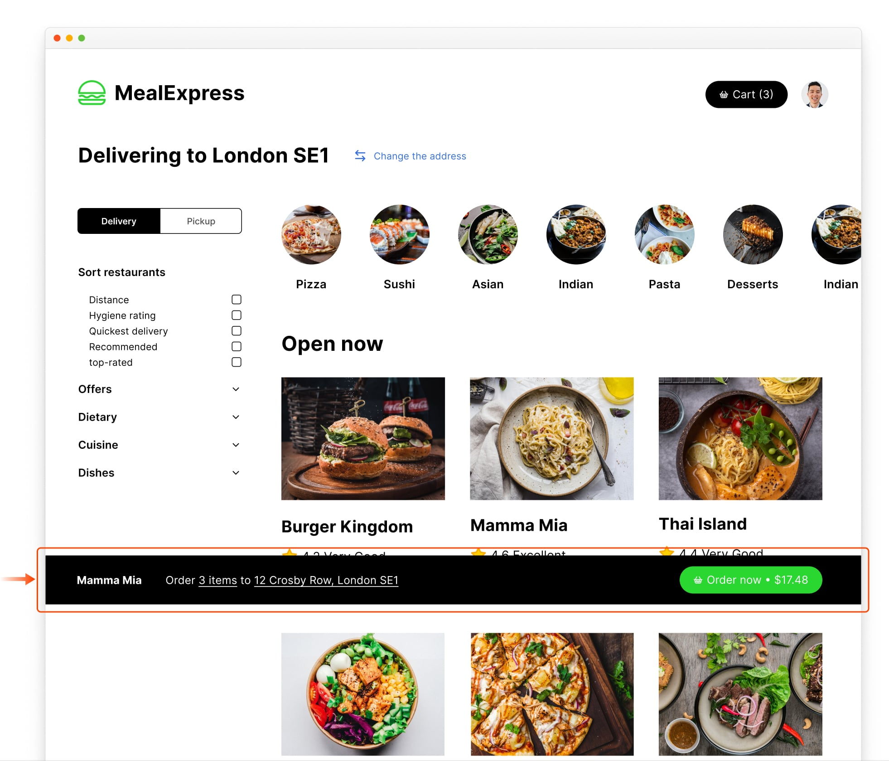

# Position sticky & fixed

Chromatic captures `position:sticky` and `position:fixed` elements in their initial positions once per snapshot.

We do this because sticky and fixed elements can persist in the viewport even when content extends beyond it. Since these elements can change with scroll, we use the element's initial position when the browser loads to anchor it where it appears in your snapshot.

For example, if your UI has a bottom positioned element the sticky element will appear in the bottom position when the browser loads, the remaining content will flow under it.

```css
position: sticky;
bottom: 0;
```



---

## Troubleshooting

<details>

<summary>I set an element to use sticky positioning, but it's not working. What could be the issue?</summary>

If the parent of your sticky element uses `display: grid;`, `display: flex;`, or similar styles, the layout might behave differently when rendering a story by itself. In such cases, we recommend wrapping the story with a [decorator](https://storybook.js.org/docs/writing-stories/decorators#wrap-stories-with-extra-markup) `div` and setting `display: initial;` to it.

</details>
