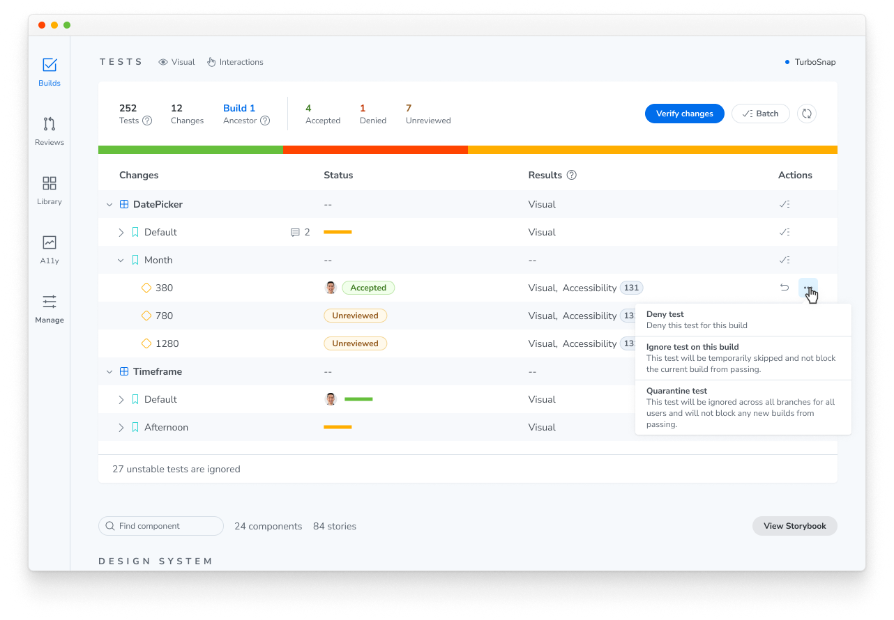
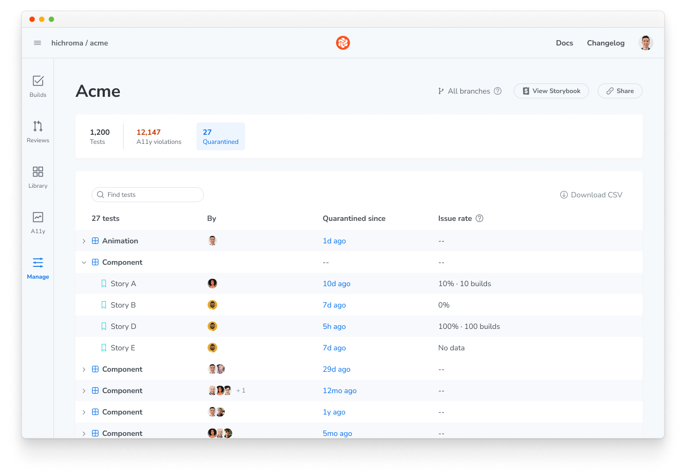

# Quarantine tests

Unstable tests produce diffs that have nothing to do with your code changes. You may not have time to fix a test right away. If you drop it, you lose coverage, and nothing reminds you to add it back later.

Quarantine lets you set an [unstable test](/docs/unstable-tests#what-is-an-unstable-test) aside without losing track of it. Chromatic ignores diffs from a quarantined test on every build and lists all quarantined tests on a dashboard, so you can fix them when you're ready.

## Quarantine a test

You can quarantine a test from the build page or the test page. Open the three-dot menu for the test and select **Quarantine test**.

After you quarantine a test, Chromatic ignores its diffs on all builds, across all branches and for all users. Its diffs won't block new builds from passing until you remove it from quarantine.

## Manage quarantined tests

To see every quarantined test in your project, go to **Library > Quarantined**. The dashboard shows who quarantined each test and when.

To fix a quarantined test:

1. Select the test on the dashboard.
2. Follow the [unstable tests debugging guide](/docs/unstable-tests#improve-test-stability) to make it render consistently.
3. Remove the test from quarantine to return it to your regular test suite.

## Quarantine vs. Flake filter

[Flake filter](/docs/flake-filter) automatically detects unstable tests and ignores them so they don't block your build. Those auto-ignores don't carry over between builds. Chromatic checks each build again to see whether a test is still unstable.

Quarantine is a choice you make yourself, and it lasts. Chromatic ignores a quarantined test's diffs on every build until you remove it from quarantine, whether or not Flake filter flags it on a given build.

See [ignored, auto-ignored, and disabled tests](/docs/ignore-tests#whats-the-difference-between-ignored-auto-ignored-and-disabled-tests) for how quarantine compares to the other ways a test can stop blocking your build.

## Frequently asked questions

Do quarantined tests count toward my billed snapshot usage?

Yes. Chromatic still captures quarantined tests even though it ignores their diffs, and each captured snapshot incurs a billed snapshot. If you never want a test captured, [disable snapshots](/docs/disable-snapshots) for it instead.

