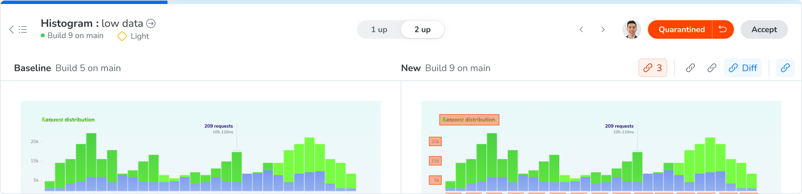

# Quarantine tests

It's frustrating when you run Chromatic and see diffs from components you never touched. This happens because of [flaky tests](/docs/unstable-tests#what-is-an-unstable-test). Your agents can get sidetracked "fixing" code that isn't broken, because they can't tell a flake from a real regression.

[Flake filter](/docs/flake-filter) already filters out most flaky diffs automatically. The ones that slip through need human judgment to tell them apart from real changes, so you end up [ignoring those diffs](/docs/ignore-tests) again and again.

Quarantine permanently ignores a flaky test's diffs on all builds. Chromatic tracks quarantined tests on a dashboard, so you can come back and fix them later.

## How quarantine works

When you spot a flaky test, quarantine it from the build page or the test page. Open the three-dot menu and select **Quarantine test**.

Once quarantined, Chromatic still captures the test, but ignores its diffs across all builds, branches, and users.

## Quarantined tests are collapsed, not gone

Quarantine unblocks your PR. But because Chromatic ignores a quarantined test's diffs, the test won't catch regressions until you remove it from quarantine.

On the build page, quarantined tests are in the **Unstable** group, alongside tests that Flake filter auto-ignored. Expand the group to see their diffs.

## Track quarantined tests

To see every quarantined test in your project, go to **Library > Quarantined**. The dashboard shows who quarantined each test and when.

Chromatic continues to run quarantined tests across all branches to track how they would have performed without quarantine. **Issue rate** shows how often each test had an issue, including an unstable result, a visual diff, a capture error, or an interaction test failure. A lower issue rate may mean it's safer to un-quarantine the test.

## Fix flakes to restore coverage

1. Find out why the test renders unstably using the [unstable tests debugging guide](/docs/unstable-tests#improve-test-stability).
2. Once you've fixed it, select **Remove quarantine** on the dashboard to return the test to your regular test suite.

## Flake filter vs. Quarantine

[Flake filter](/docs/flake-filter) automatically detects and ignores unstable tests so they don't block your build. These ignores don't persist across builds, so each build checks the test for unstable rendering again.

Quarantine is your call, and it sticks. Chromatic ignores diffs from a quarantined test on every build until you un-quarantine it.

See [ignored, auto-ignored, and disabled tests](/docs/ignore-tests#whats-the-difference-between-ignored-auto-ignored-and-disabled-tests) for how quarantine compares to the other ways a test can stop blocking your build.

## Frequently asked questions

Do quarantined tests count toward my billed snapshot usage?

Yes. Chromatic still captures quarantined tests even though it ignores their diffs, and each captured snapshot incurs a billed snapshot. If you never want a test captured, [disable snapshots](/docs/disable-snapshots) for it instead.

