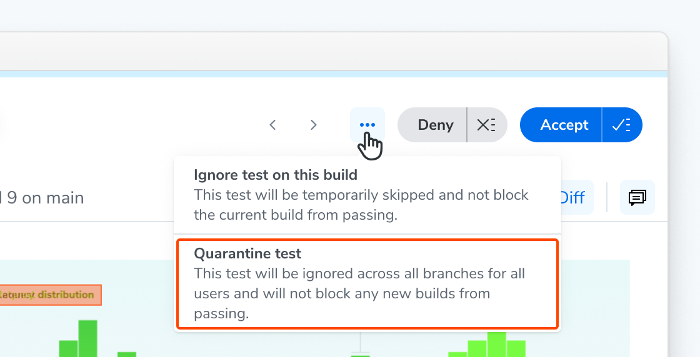
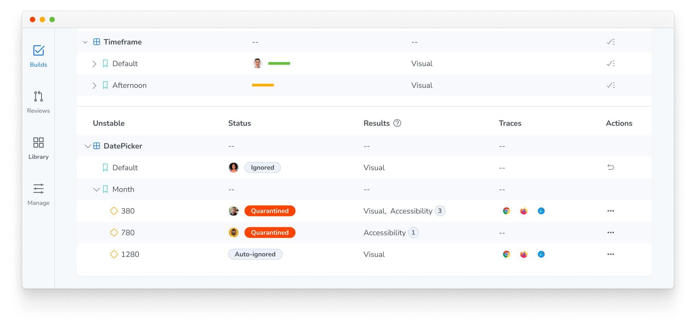
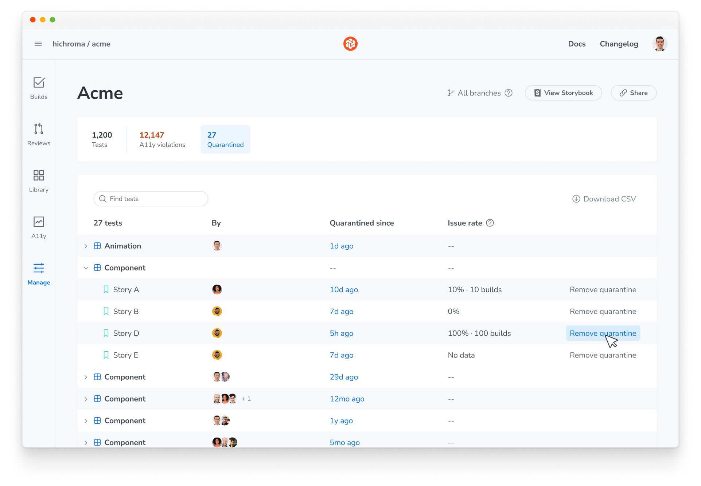

# Quarantine tests

You run Chromatic and see diffs in a component your code changes didn't touch. It's an [unstable test](/docs/unstable-tests#what-is-an-unstable-test). You're left with two bad options: wait for someone to fix it, or delete it and lose coverage.

Quarantine gives you a third option. Diffs for quarantined tests don't block PRs, and Chromatic tracks every quarantined test on a dashboard so you can come back to it when you're ready to fix the instability.

## Quarantine a test

An unstable test renders differently across repeated runs even when your code hasn't changed. Sometimes the fix is obvious. Other times it [needs investigation](/docs/unstable-tests#improve-test-stability) that you don't have time for right now. Quarantine it instead.

From the build page or the test page, open the three-dot menu and select **Quarantine test**.

Once quarantined, the test's diffs stop blocking builds on every branch, for everyone on the project. On the build page, quarantined tests are listed in the **Unstable** section with a **Quarantined** badge.

## Track quarantined tests

To see every quarantined test in your project, go to **Library > Quarantined**. Think of it as a to-do list for your unstable tests. It shows who quarantined each test and when.

When you're ready to fix a test:

1. Follow the [unstable tests debugging guide](/docs/unstable-tests#improve-test-stability) to stabilize rendering.
2. Select **Remove quarantine** to return the test to your regular test suite.

## Flake filter vs. Quarantine

[Flake filter](/docs/flake-filter) automatically detects and ignores unstable tests so they don't block your build. These ignores don't persist across builds, so each build checks the test for unstable rendering again.

Quarantine is your call, and it sticks. Chromatic ignores diffs from a quarantined test on every build until you un-quarantine it.

See [ignored, auto-ignored, and disabled tests](/docs/ignore-tests#whats-the-difference-between-ignored-auto-ignored-and-disabled-tests) for how quarantine compares to the other ways a test can stop blocking your build.

## Frequently asked questions

Is quarantining the same as deleting a test?

No. A quarantined test stays in your suite and on the Quarantined dashboard, so everyone on the team can see which tests are known problems. Its diffs just don't block your build. When the test is stable again, un-quarantine it.

Do quarantined tests count toward my billed snapshot usage?

Yes. Chromatic still captures quarantined tests even though it ignores their diffs, and each captured snapshot incurs a billed snapshot. If you never want a test captured, [disable snapshots](/docs/disable-snapshots) for it instead.

