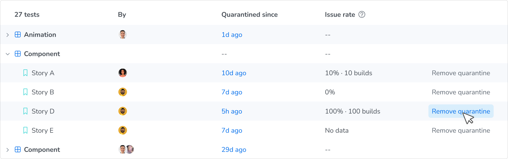

# Quarantine tests

Chromatic [automatically filters](/docs/flake-filter) out most flaky diffs. The ones that slip through need human judgement to tell them apart from real changes. Instead of [ignoring those diffs](/docs/ignore-tests) repeatedly, you can quarantine them.

Quarantine permanently ignores a flaky test's diffs on all builds. Chromatic tracks quarantined tests in a dashboard, so you can come back and fix them later.

## How quarantine works

When you spot a flaky test, you can quarantine it from either the build page or the test page.

Once a test is quarantined, Chromatic still captures it but ignores its diffs across all builds, branches, and users.

### Quarantined tests are collapsed on the build page

On the build page, quarantined tests live under the collapsed **Unstable** section, along with ignored and auto-ignored tests. This list only includes quarantined tests that generated a diff in the current build. Expand the section to view their diffs.

### Dashboard tracks all the quarantined tests

To see every quarantined test in your project, go to **Library > Quarantined**. The dashboard shows who quarantined each test and when.

Chromatic continues to run quarantined tests across all branches to track how they would have performed without quarantine. **Issue rate** shows how often each test had an issue, such as an unstable result, a visual diff, a capture error, or an interaction test failure. A lower issue rate may mean it's safer to un-quarantine the test.

## Fix flakes to restore coverage

Quarantining helps you unblock a PR. But because quarantined tests are ignored, they won't stop any regressions until you remove them from quarantine.

Find out why the test renders unstably using the [unstable tests debugging guide](/docs/unstable-tests#improve-test-stability). Once you've fixed it, select **Remove quarantine** on the dashboard to return the test to your regular test suite.

## Frequently asked questions

Do quarantined tests count toward my billed snapshot usage?

Yes. Chromatic still captures quarantined tests even though it ignores their diffs, and each captured snapshot incurs a billed snapshot. If you never want a test captured, [disable snapshots](/docs/disable-snapshots) for it instead.

What's the difference between quarantine and flake filter?

[Flake filter](/docs/flake-filter) automatically detects and ignores unstable tests so they don't block your build. These ignores don't persist across builds, so each build checks the test for unstable rendering again.

Quarantine explicitly marks a test as unstable and ignores its diffs until you decide to un-quarantine it.

See [ignored, auto-ignored, and disabled tests](/docs/ignore-tests#whats-the-difference-between-ignored-auto-ignored-and-disabled-tests) for how quarantine compares to the other ways a test can stop blocking your build.

