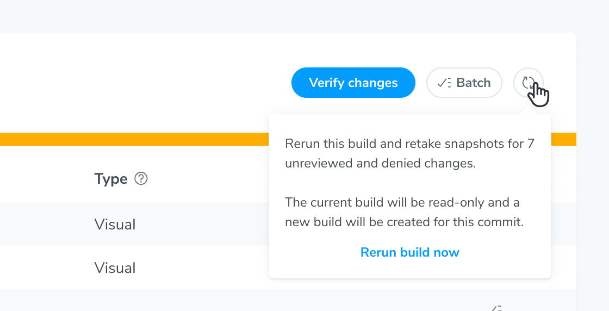
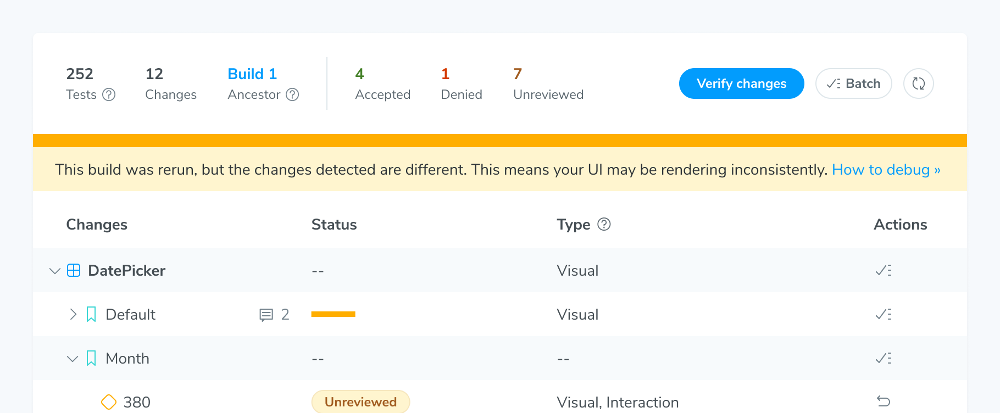

# Rerun builds to identify unstable tests

Double-check whether a visual change is real or caused by test instability by retaking snapshots. Click the **Rerun** button to kick off a build with the same settings as the original build. Chromatic only captures snapshots for denied, unreviewed, or errored changes. It doesn't recapture snapshots for accepted changes in a rerun build.

Compare the changes in the original and rerun builds. You might encounter these common scenarios:

- **Identical changes between builds:** The snapshots show bona fide UI changes that need your verification. Continue the [UI Tests workflow](/docs/quickstart#4-review-changes) as usual.

- **Different changes between builds:** The tests might be unstable and introducing false positives. Use the [trace viewer](/docs/trace-viewer) to identify the root cause, then [improve test stability](/docs/troubleshooting-snapshots#improve-test-stability).

When Chromatic detects potential test instability in a rerun build, it displays a message.

