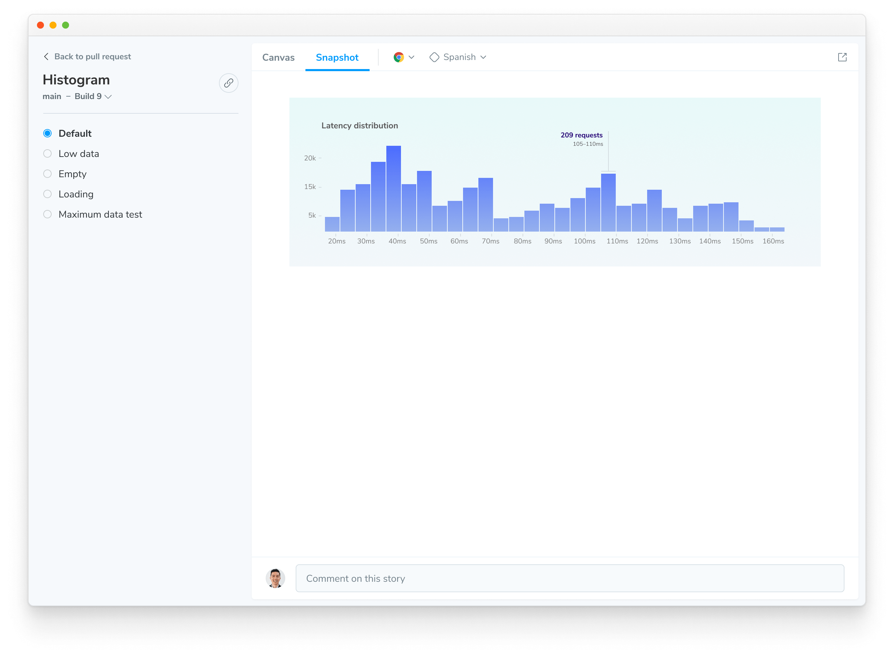
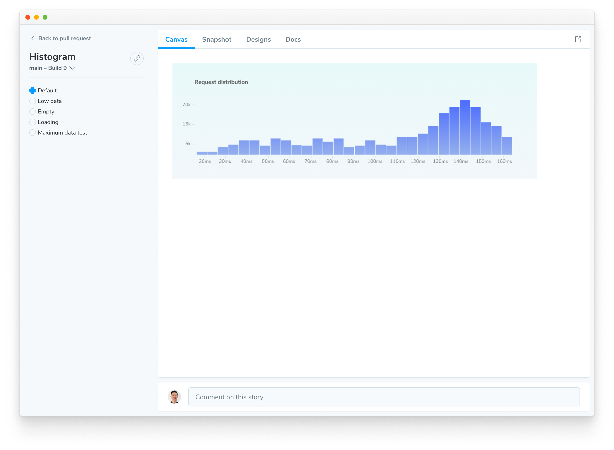

# Snapshots

A **snapshot** is an image of the UI rendered by a test, along with metadata captured in Chromatic’s Capture Cloud infrastructure. Snapshots power Chromatic's [UI Tests](/docs#test-how-uis-look--function) and [UI Review](/docs/review) features.

Looking for information on snapshot billing? [Go to billing docs](/docs/billing)

## Snapshot-compatible tests

A **test** represents a piece of UI rendered in a specific state. Chromatic can capture snapshots for a two types of tests:

- **Storybook Stories:** By default, a story captures the rendered state of a UI component. Therefore Chromatic uses stories as is for visual testing.

- **End-to-End (E2E) tests:** Chromatic captures snapshots of your Playwright or Cypress E2E tests by first creating a self-contained [archive](/docs/faq/what-is-archive). This archive, generated during Playwright/Cypress test runs, contains all the assets and data required to re-render your app UI for visual testing.

Each test can generate [multiple snapshots](/docs/billing#snapshots), varying by [browser](/docs/browsers#browser-support), [theme](/docs/themes), [viewport size](/docs/viewports), and other configurations you define. This ensures comprehensive coverage of your UI's visual appearance.

With Playwright and Cypress, you can even capture snapshots at [specific moments within a single test](/docs/playwright/targeted-snapshots) for even more granular analysis.

## How are snapshots captured?

Chromatic captures snapshots by following these steps:

1. Load each test in the designated browser and viewport

Chromatic's Capture Cloud leverages a fleet of standardized [browsers](/docs/browsers) to load all of your tests (either stories or archives) in parallel, at the specified [viewport size](/docs/viewports).

2. Wait for the test to render

Capture Cloud uses underlying browser APIs combined with our own set of heuristics to determine when the UI has "loaded". Various factors can influence this waiting period, which are detailed in the following section: [When is a snapshot captured?](#when-is-a-snapshot-captured)

3. Take a screenshot and crop it to the dimensions of the UI

Chromatic crops the screenshot to the size of the rendered UI.

**Stories:** It determines crop dimensions by measuring the bounding box of the `<body>` element. For atomic components, cropping eliminates negative spaces around snapshots reducing the visual information you must review.

**E2E Tests:** For pages, Chromatic captures the full width and height of the rendered UI.

4. Save snapshot and diff between previous baseline snapshots for a build or branch

Each snapshot is associated with a story and tagged with commit, branch, and other relevant metadata. Snapshots are stored in Chromatic's cloud. For UI Test and UI Review, snapshots are visually compared (diff) to identify changes. Our infrastructure is effectively capable of snapshotting every story in parallel, no matter how many stories you have.

## When is a snapshot captured?

Various factors can influence the waiting period, for [**step 2**](/docs/snapshots#2-wait-for-the-test-to-render), before the snapshot is captured.

One of the primary heuristics Chromatic uses is **network quiesence**—a period of network inactivity which signals that all resources have loaded. This loading analysis is our best approximation for determining when the UI has finished rendering.

Other factors that impact when a snapshot is captured include:

#### Animations and videos

Chromatic [proactively pauses](/docs/animations) CSS animations/transitions, videos and GIFs to prevent false positives. However, Chromatic cannot disable JavaScript-driven animations, so you are responsible for [pausing them](/docs/animations#javascript-animations).

If not paused during testing, the snapshot will be captured mid-animation and trigger false positives.

#### Interaction tests

If you are using [Storybook interaction tests](/docs/interactions/), Chromatic waits for the play function to complete before capturing the snapshot. That includes any interactions, assertions or delays defined within the play function.

#### Delays

[Delays](/docs/delay#delay-snapshots) ensure that a minimum amount of time (in milliseconds) has passed before Chromatic takes a screenshot. The delay is applied after the network quiescent phase.

If you apply a delay to a story that has interactions, the delay is applied after the interactions have completed.

## View snapshots for a test

The component screen allows you to switch between 'Canvas' and 'Snapshot'. Under the Snapshot tab, you'll find the image captured by Chromatic's cloud browser — this is exactly what the browser _saw_ when it rendered the test. This could be the component's _initial_ or _intermediate_ state.

Tip: Click the expand icon in the top right to open the test. Stories open in your published Storybook.

### View live rendered test using the Canvas

**Canvas** is an interactive environment that renders your test code live in the browser. These are fully inspectable, enabling you to troubleshoot changes and errors effectively.

With Storybook, it displays the story, and with Playwright or Cypress, it shows the [archive](/docs/faq/what-is-archive) of your E2E test. It visualizes the _final state_ of the test UI.

### Differences in Snapshot vs Canvas

The snapshot might differ from the `Canvas` due to various reasons, such as JavaScript execution being blocked during capture, which can prevent certain elements from being captured, or the use of the `isChromatic()` function to alter rendering on Chromatic.
