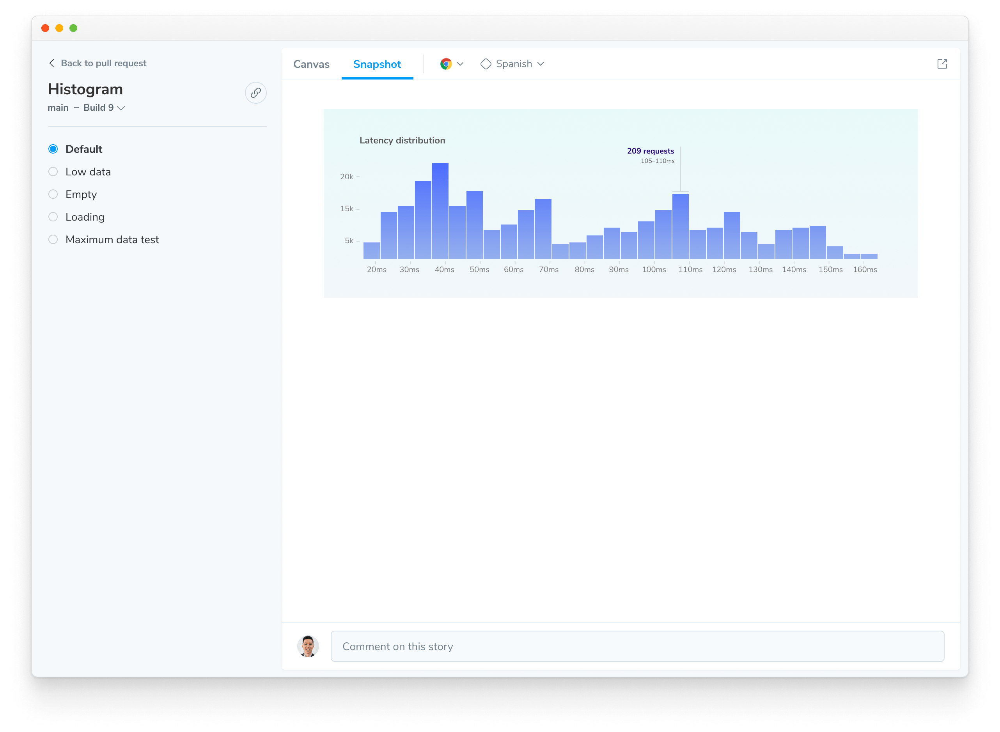
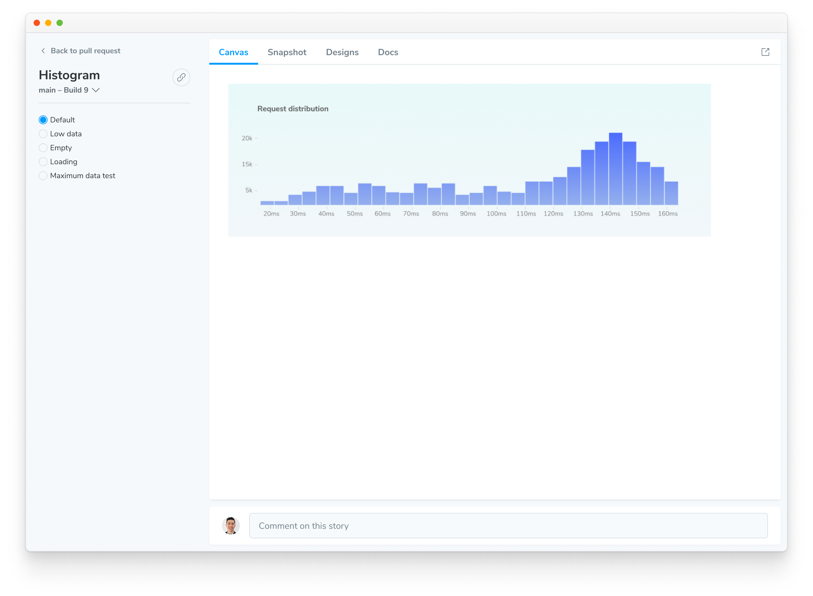

# Snapshots

A **snapshot** is the unit of work executed by Chromatic to run a [UI Test](/docs#test-how-uis-look--function). This work can be taking a screenshot, capturing accessibility data, copying such information from one test to another, or even bypassing such work completely if it is found to be unnecessary.

Looking for information on snapshot billing? [Go to billing docs](/docs/billing)

The type of work performed by Chromatic is determined by the following factors:

- **Visual vs. Accessibility:** A [visual test](/docs/visual) captures the rendered state of the UI, whereas an [accessibility test](/docs/accessibility) captures accessibility information about the UI. Both types of tests take a snapshot and compare it to a baseline snapshot to detect changes.

- **Capture vs. TurboSnap:** A captured snapshot performs the full suite of work, including taking screenshots or capturing accessibility data, and running diffs. A [TurboSnap](/docs/turbosnap) snapshot avoids unnecessary work if it is determined that the associated code has not changed, speeding up the testing process.

These dimensions stack to create a snapshot. For example, you can have a "captured visual snapshot" or a "turbo accessibility snapshot". The short forms are "visual snapshot" and "accessibility turbosnap", respectively.

## Snapshot-compatible tests

A **test** represents a piece of UI rendered in a specific state that Chromatic can capture as a snapshot. Chromatic supports the following types of tests:

- **Storybook Stories:** By default, a story captures the rendered state of a UI component. Chromatic uses stories as is for UI testing.
- **Playwright & Cypress End-to-End (E2E) tests:** Chromatic [archives](/docs/faq/what-is-archive) these E2E tests during Playwright/Cypress test runs, and then replays them in the cloud to run visual tests.
- **Vitest browser mode tests:** Chromatic [archives](/docs/faq/what-is-archive) these tests during Vitest test runs, and then replays them in the cloud to run visual tests.

Each test can generate multiple snapshots, varying by [browser](/docs/browsers#browser-support) (or mobile simulators and emulators), [theme](/docs/themes), [viewport size](/docs/viewports), and other configurations you define.

With [Playwright](/docs/playwright/targeted-snapshots), [Cypress](/docs/cypress/targeted-snapshots), and [Vitest](/docs/vitest/targeted-snapshots), you can even capture multiple visual snapshots within a single test for even more granular analysis.

## How are snapshots captured?

Chromatic captures snapshots by following these steps:

1. Load each test in the designated device and viewport

Chromatic's Capture Cloud leverages a fleet of standardized [browsers](/docs/browsers) and mobile emulators to load all of your tests (either stories or archives) in parallel, at the specified [viewport size](/docs/viewports).

2. Wait for the test to render

Capture Cloud uses underlying browser APIs combined with our own set of [heuristics](/features/steadysnap) to determine when the UI has "loaded" and is ready to be captured.

3. Capture screenshot and/or accessibility data

For visual tests, Chromatic takes a screenshot and crops it to the dimensions of the UI.

For accessibility tests, Chromatic runs accessibility audits and collects information about the rendered UI.

4. Save snapshot and diff between baseline and new snapshot

Each snapshot is associated with a test and tagged with commit, branch, and other relevant metadata. Chromatic then runs pixel diffs between the new snapshot and the previous baseline snapshot for that test, highlighting any visual changes. For accessibility tests, Chromatic compares the new accessibility data with the previous baseline data to identify any changes.

## Visual snapshots

### When is a visual web snapshot captured?

Various factors can influence the waiting period, for [**step 2**](/docs/snapshots#2-wait-for-the-test-to-render), before the snapshot is captured.

One of the primary heuristics Chromatic uses is **network quiesence**, a period of network inactivity which signals that all resources have loaded. This loading analysis is our best approximation for determining when the UI has finished rendering.

Other factors that impact when a snapshot is captured include:

#### Animations and videos

Chromatic [proactively pauses](/docs/animations) CSS animations/transitions, videos and GIFs to prevent false positives. However, Chromatic cannot disable JavaScript-driven animations, so you are responsible for [pausing them](/docs/animations#javascript-animations).

If not paused during testing, the snapshot will be captured mid-animation and trigger false positives.

#### Interaction tests

If you are using [Storybook interaction tests](/docs/interactions/), Chromatic waits for the play function to complete before capturing the snapshot. That includes any interactions, assertions or delays defined within the play function.

#### Delays

[Delays](/docs/delay#delay-snapshots) ensure that a minimum amount of time (in milliseconds) has passed before Chromatic takes a screenshot. The delay is applied after the network quiescent phase.

If you apply a delay to a story that has interactions, the delay is applied after the interactions have completed.

### View visual snapshot for a test

The component screen allows you to switch between 'Canvas' and 'Snapshot'. Under the Snapshot tab, you'll find the image captured by Chromatic's cloud browser. This is exactly what the browser _saw_ when it rendered the test. This could be the component's _initial_ or _intermediate_ state.

Tip: Click the arrow icon in the top right to open the test. Stories open in your published Storybook.

### View live rendered test using the Canvas

**Canvas** is an interactive environment that renders your test code live in the browser. These are fully inspectable, enabling you to troubleshoot changes and errors effectively.

With Storybook, it displays the story, and with Playwright, Cypress and Vitest, it shows the [archive](/docs/faq/what-is-archive) of your test. It visualizes the _final state_ of the test UI.

### Differences in visual snapshot vs Canvas

The visual snapshot might differ from the `Canvas` for various reasons, such as JavaScript execution being blocked during capture, which can prevent certain elements from being captured. Or the use of the `isChromatic()` function to alter rendering on Chromatic.
