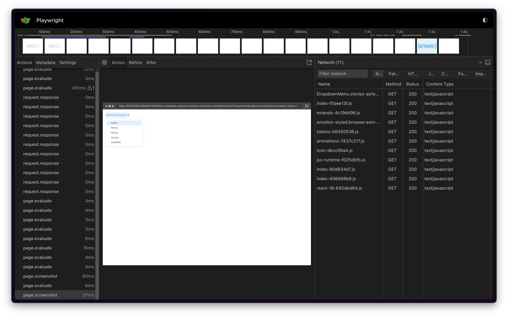
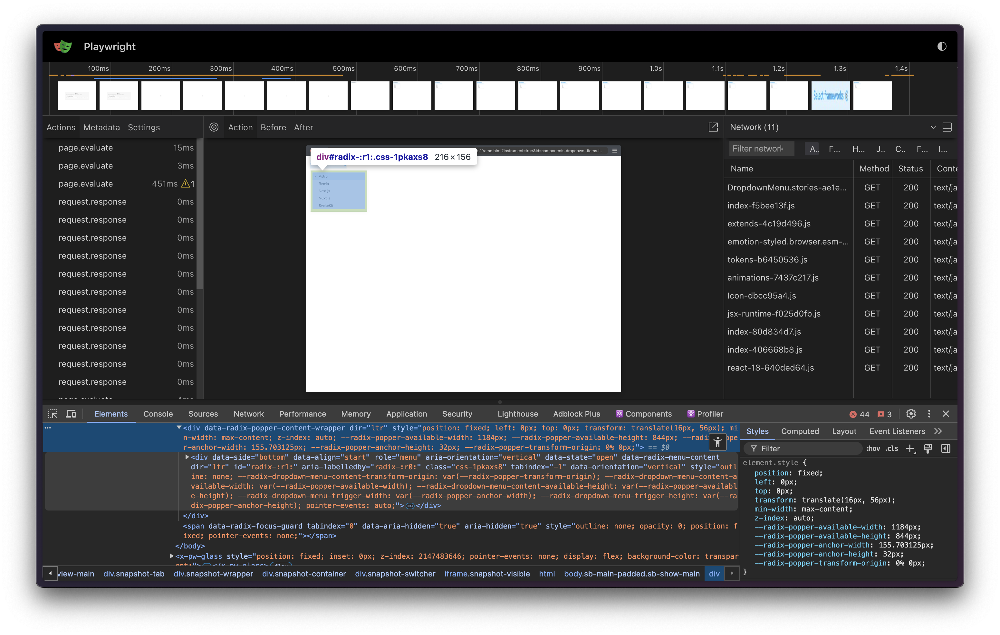
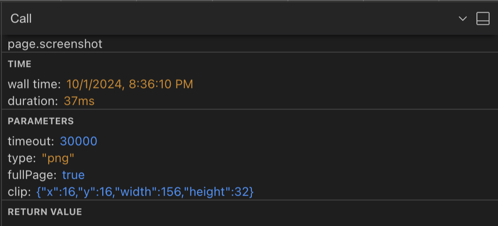

# Trace viewer to debug snapshots

Trace Viewer lets you explore network requests, console logs, and other debugging information captured during the snapshot process. It helps you pinpoint the root cause of rendering issues, such as missing fonts, incorrect styles, or unexpected layout changes.

Chromatic records traces automatically. When test is [unstable](/docs/flake-filter#what-is-an-unstable-test), Chromatic flags it as unstable and attaches a trace of the capture session, no rerun required. Builds containing unstable tests feature a "Traces" column, which links to the trace viewer for each unstable snapshot, with one link per enabled browser. Click on one of the browser buttons to open the trace viewer.

  
Why does the trace viewer indicate that Chromatic captured multiple screenshots for a test?

During the capture process, Chromatic continually takes screenshots until it either reaches the maximum allowed timeout or it captures two matching screenshots, indicating that the page has settled. This ensures the snapshot is consistent and that UI is in its final state.

## How to use the snapshot trace?

Chromatic uses Playwright to render and capture snapshots in [Capture Cloud](/docs/infrastructure-release-notes), even if your tests are written using Cypress or Storybook. Therefore, it's able to leverage Playwright's [built-in capability](https://playwright.dev/docs/trace-viewer#trace-viewer-features) to generate these traces. These traces capture network activity, console logs, DOM snapshots, and other debugging information.

Below are some common scenarios where the trace viewer can help you debug snapshot issues:

### Network tab analysis

The network tab displays the resources loaded during capture, including fonts, stylesheets, scripts, and other assets. Check for resources that failed to load or took a long time. For example, if fonts aren't incorrect or styles are missing, ensure that the font or CSS files have loaded successfully with the correct MIME type. Consider loading slow assets [statically](/docs/troubleshooting-snapshots#serve-static-files).

For a detailed list of trace viewer features, see the [Playwright documentation](https://playwright.dev/docs/trace-viewer#trace-viewer-features).

### Inspect the DOM

The trace archives the DOM for each step or action executed, allowing you to inspect the DOM at the time of capture. Use this tab to verify the DOM structure is as expected.

Check for missing elements, incorrect styles, or unexpected layout changes. If styles are missing but the CSS file has loaded, ensure the styles are applied correctly.

### Screenshot metadata

When Chromatic captures a screenshot, it includes metadata like viewport information and clip rectangle dimensions, providing context for the capture. Use this data to identify issues such as:

- **Responsive design issues**: Viewport information reveals the screen size used for the capture. Compare this with your breakpoints to ensure that the correct styles are applied.
- **Element positioning problems**: The clip rectangle shows precisely what was captured. If an element is missing from the snapshot, verify if it falls within the expected clip area.

## Fix the root cause

Once the trace has helped you identify why a test is unstable, the [Troubleshooting Snapshots](/docs/troubleshooting-snapshots#improve-snapshot-consistency) page covers common fixes, such as pausing animations, preloading fonts, and seeding randomness.
