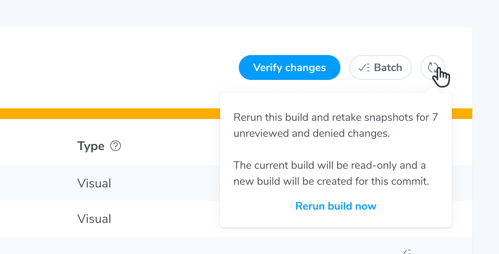
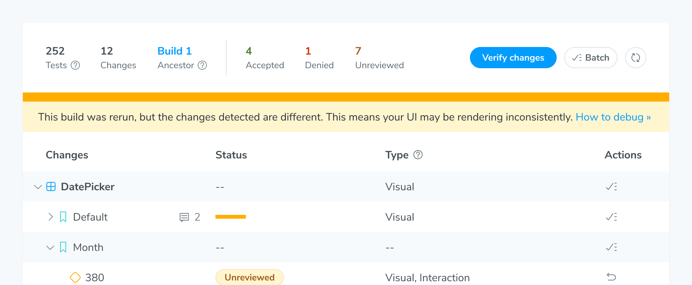
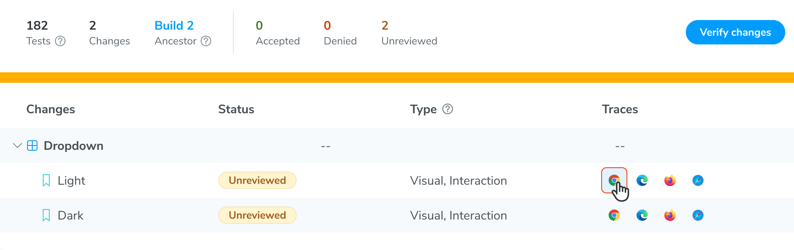
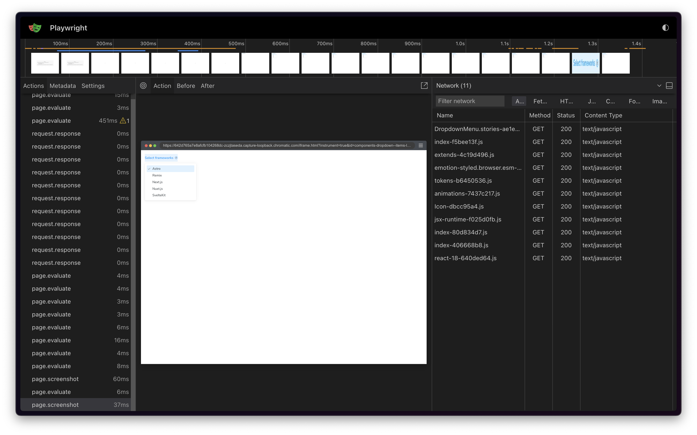
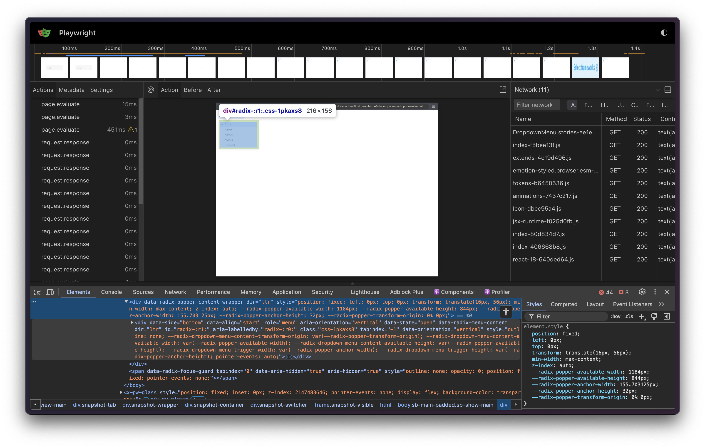
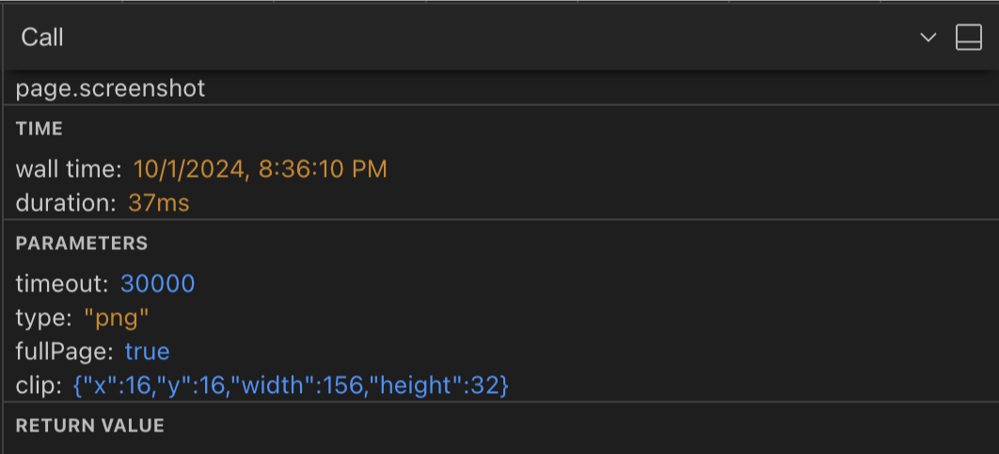

# Troubleshooting Snapshots

Did you encounter inconsistent, blank, or other rendering issues in your snapshots? This guide helps you identify common causes and improve snapshot consistency.

## Rerun build to identify inconsistencies

Double-check whether a visual change is real or caused by inconsistencies in your app code by retaking snapshots. Click the "rerun" button to kick off a new build that uses identical settings and configuration as your original build. Only snapshots for denied, unreviewed, or errored changes will be captured. Any changes you accepted in the original build will not be snapshotted again in a rerun build.



Debug inconsistent snapshots by looking at the set of changes between the original build and the rerun build. You might encounter these common scenarios:

- Identical changes between builds: This means the snapshots are accurately showing bonafide UI changes that need your verification. Continue the [UI Tests workflow](/docs/quickstart#4-review-changes) as usual.

Different changes between builds: This means inconsistent snapshots are introducing false positives to your visual tests. Learn how to use the [Snapshot Tracer Viewer](#debug-snapshots-with-trace-viewer-beta) to identify the root cause and check out our recommendations for [improving snapshot consistency](#improve-snapshot-consistency).

When there are potential rendering inconsistencies in a rerun build, Chromatic will call them out in a message.


## Debug snapshots with Trace Viewer (beta)

The Snapshot Trace Viewer lets you explore recorded traces of tests rendered and snapshotted in the Chromatic Capture Cloud. It captures network requests, console logs, and other debugging information, helping you identify the root cause of rendering issues.

Once you rerun a build, the subsequent build will feature a "Traces" column. This column links to the Trace Viewer for each snapshot in the build, with one link per enabled browser. Click on one of the browser buttons to open the Trace Viewer.



<details>
  <summary>Why does the Trace Viewer indicate that Chromatic captured multiple screenshots for a test?</summary>

During the capture process, Chromatic continually takes screenshots until it either reaches the maximum allowed timeout or it captures two matching screenshots, indicating that the page has settled. This ensures the snapshot is consistent and that UI is in its final state.

</details>

### How to use the snapshot trace?

Chromatic uses Playwright to render and capture snapshots in its [Capture Cloud](/docs/infrastructure-release-notes), even if your tests are written using Cypress or Storybook. Therefore, it's able to leverage Playwright's [built-in capability](https://playwright.dev/docs/trace-viewer#network) to generate these traces. These traces capture network activity, console logs, DOM snapshots, and other debugging information.



Below are some common scenarios where the Trace Viewer can help you debug snapshot issues:

#### Network tab analysis

The network tab displays the resources loaded during capture, including fonts, stylesheets, scripts, and other assets. Check for resources that failed to load or took a long time. For example, if fonts aren't incorrect or styles are missing, ensure that the font or CSS files have loaded successfully with the correct MIME type. Consider loading slow assets [statically](#serve-static-files).

<div class="aside">

For a detailed list of trace viewer features, see the [Playwright documentation](https://playwright.dev/docs/trace-viewer#trace-viewer-features).

</div>

#### Inspect the DOM

The Trace archives the DOM for each step or action executed, allowing you to inspect the DOM at the time of capture. Use this tab to verify the DOM structure is as expected.

Check for missing elements, incorrect styles, or unexpected layout changes. If styles are missing but the CSS file has loaded, ensure the styles are applied correctly.



#### Screenshot metadata

When Chromatic captures a screenshot, it includes metadata like viewport information and clip rectangle dimensions, providing context for the capture. Use this data to identify issues such as:

- **Responsive design issues**: Viewport information reveals the screen size used for the capture. Compare this with your breakpoints to ensure that the correct styles are applied.
- **Element positioning problems**: The clip rectangle shows precisely what was captured. If an element is missing from the snapshot, verify if it falls within the expected clip area.



## Common snapshot rendering issues

<details>
<summary>Where are my images and fonts?</summary>

Image and font rendering can be tricky. Resources that load from unpredictable or flaky sources may not load in time (15s) to capture. Work around this by:

- Ensure fonts load [reliably fast in Chromatic](/docs/font-loading)
- Ensure resources load [reliably fast in Chromatic](/docs/resource-loading)
- Serve resources as [static files](#serve-static-files) (this also improves your test speed)
- Using a [placeholder service](https://placeholder.com/).

If your resources are behind a firewall, whitelist our domain so we can load your resources.

</details>

<details>
<summary>Why am I seeing inconsistent snapshots for a component using srcset?</summary>

The `srcset` attribute is a useful mechanism that provides the browser with a list of potential images to display, based on specified conditions such as media queries.

In most cases, Chromatic will capture the correct image from the `srcset` list. However, if multiple tests list the same image in their respective `srcset` lists, browser cache issues can result in inconsistent snapshots.

In situations like this, the best workaround is to make the `srcset` URLs unique for each test by adding a random query parameter value.

For instance, one test could have a srcset with a query parameter of `?cachebuster=1714593641616`.

```html
<picture>
  <source
    sizes="(max-width: 768px) 100vw, 50vw"
    type="image/webp"
    srcset="
​      https://placehold.co/384x384.webp?cachebuster=1714593641616 384w,
​      https://placehold.co/640x640.webp?cachebuster=1714593641616 640w,
​      https://placehold.co/750x750.webp?cachebuster=1714593641616 750w"
  />
  
</picture>
```

If another test uses the same images, they can alter the query parameter in the URL to `?currenttime=1714593641620`.

```html
<picture>
  <source
    sizes="(max-width: 768px) 100vw, 50vw"
    type="image/webp"
    srcset="
​      https://placehold.co/384x384.webp?currenttime=1714593641620 384w,
​      https://placehold.co/640x640.webp?currenttime=1714593641620 640w,
​      https://placehold.co/750x750.webp?currenttime=1714593641620 750w"
  />
  
</picture>
```

Any query parameter name can be used, just so long as the value is unique to each test.

</details>

<details>
<summary>Why do my emojis look different in the snapshot versus on my machine?</summary>

Emojis are handled by your operating system's emoji font. Most OSs have a different emoji font and those fonts tend to change over time. For example, if you view a story on a Mac you'll get Apple’s set of emojis.

Chromatic captures Chrome and Firefox snapshots in a Linux environment. It includes a common set of emojis used by most systems. Those emojis will likely look different from emojis on a consumer OS like Mac or Windows. Unfortunately, there's no workaround available at this time.

</details>

<details>
<summary>Where are my videos?</summary>

Videos are interactive and time-based which introduces inconsistencies in snapshots. Chromatic hides videos by default to prevent false positives. You'll see the poster image (if specified) or a blank space where the video is supposed to render.

</details>

<details>
<summary>Why am I getting cross-origin errors with my stories?</summary>

Most likely, you are calling into `window.parent` somewhere in your code. As we serve your test preview iframe inside our `www.chromatic.com` domain, this leads to an `x-origin` error as your code doesn't have access to our frame (with good reason!).

Generally speaking it is a good idea to wrap calls like that in a `try { } catch` in case the code is running in a context where that's not possible (e.g., Chromatic).

</details>

<details>
<summary>Why is my content being cut off vertically in my snapshots?</summary>

Make sure there are no elements inadvertently cutting off content through the use of overflow or height styles.

For elements that have relative height styles based on the size of the viewport (such as `height: 100vh`), all content nested under that element will show up in a screenshot unless either `overflow: hidden` or `overflow: scroll` is used to hide what is outside of that element (and therefore outside of the viewport).

When Chromatic takes a screenshot for an element that has a viewport-relative height as well as styling to hide/scroll the overflow, a default viewport height of `900px` will be used. This default is only used when we can't detect a "natural" height for the outermost DOM element (root ancestor), for instance, in the case of scrollable divs.

To set the height, you can add a decorator for stories that wraps them in a container with a fixed height:

```ts title="MyComponent.stories.js|jsx"
// Adjust this import to match your framework (e.g., nextjs, vue3-vite)
import type { Meta } from "@storybook/your-framework";

import { MyComponent } from "./MyComponent";

const meta = {
  component: MyComponent,
  title: "Example Story",
  decorators: [
    (Story) => (
      <div style={{ margin: "3em" }}>
        <Story />
      </div>
    ),
  ],
} satisfies Meta<typeof MyComponent>;
```

</details>

<details>
<summary>How do I capture content inside scrollable <code>divs</code>?</summary>

Scrollable divs constrain the height of their children. Change the height of the scrollable div to ensure all content fits. It's not possible for Chromatic to infer how tall scrollable divs are intended to be.

</details>

<details>
<summary>Why don't scrollbars appear in my snapshots?</summary>

Chromatic intentionally disables scrollbars during snapshot capture to focus on testing your content rather than browser UI elements. This ensures consistent snapshots across different browsers and operating systems, since scrollbar appearance varies significantly between platforms.

Unfortunately, there are currently no workarounds available to capture scrollbars in snapshots. This applies to both default browser scrollbars and custom-styled scrollbars using CSS.

If you're testing custom scrollbar styling or need to detect overflow issues, you may need to use alternative testing approaches outside of Chromatic's visual regression testing.

</details>

<details>
<summary>Why isn’t my portal component (modal, dialog, popover, tooltip or menu) captured? Or why is its snapshot cut off</summary>

If you use an “animateIn” effect set [delay](/docs/delay) to ensure we snapshot when the animation completes.

Your component might be rendering outside of the viewport. Either reposition the component or adjust the [viewport size](/docs/modes/viewports/).

</details>

<details>
<summary>Do you support taking snapshots of a component with multiple themes?</summary>

Yes, check out the Chromatic's [modes feature](/docs/modes) is simplifies the process of visually testing your stories with different global configs such as themes. Check out the [Themes in modes](/docs/themes) guide to get started.

</details>

<details>

  <summary>Why are stories with mocked data not being snapshotted correctly?</summary>

Chromatic snapshots sometimes show the initial or intermediate loading state of the UI, instead of the final state with the mocked data. This can lead to visual tests failing, even though the Storybook renders correctly locally. To debug this issue, follow these steps:

1.  Ensure that MSW (Mock Service Worker) is correctly initialized in your Storybook configuration: [here](https://github.com/mswjs/msw-storybook-addon?tab=readme-ov-file#configure-the-addon).

2.  Confirm that you're not using outdated versions of `msw`, `msw-storybook-addon`, or any other community add-ons.

3.  Run `npm run build-storybook` and `npx http-server storybook-static -o` locally to check for console output and address any MSW warnings or errors. Even if warnings pass locally, they may not work on the Chromatic side.

4.  Pay close attention to how you define MSW handlers, especially for API requests with query parameters. MSW recommends matching only the path in the handler URL and accessing query parameters inside the resolver function using `req.url.searchParams.get()`.

5.  Ensure all necessary assets (e.g., CSS files) are loading correctly in your stories. Consider preloading them in [`(.storybook/preview-head.html)`](https://storybook.js.org/docs/configure/story-rendering#adding-to-head).

6.  Add an [interaction test](/docs/interactions) to your story to assert that mocked data is present and the component is in the expected state before the test concludes.

7.  Use [delays](/docs/delay) to ensure that mocked data is fully available before Chromatic takes a snapshot.

</details>

<details>
<summary>Why am I seeing a blank snapshot?</summary>

Blank snapshots are often caused by:

- **An "animateIn" effect**—If your component use an “animateIn” effect [set delay](/docs/delay) to ensure we snapshot when the animation completes.

- **Position:fixed**—Fixed position elements may depend on viewport size but do not have dimensions themselves. Wrap your component in an element whose height and width are defined.

Learn more about [debugging snapshots](#improve-snapshot-consistency).

</details>

<details>
<summary>Why are ignored elements still causing diffs?</summary>

By default, Chromatic's diffing algorithm skips the DOM elements marked with either a `.chromatic-ignore` CSS class or `data-chromatic="ignore"` attribute.

However, if you're using this functionality but notice the incoming changes are still being captured. In that case, you'll need to ensure that both the [baseline](/docs/branching-and-baselines) and new snapshots retain the same dimensions (e.g., width, height, and relative positioning).

</details>

<details>
<summary>Why is my tab component's width rendering inconsistently in snapshots?</summary>

Certain UI libraries like Material calculate the dimensions of each tab by measuring the rendered width of the tab's children using JavaScript (for example, via `getBoundingClientRect()`).

However, this can lead to inconsistent snapshots in cases where you load a custom font. Fonts affect the dimensions of text within tabs. Since custom fonts can load before, during, or after the tab component itself loads, the dimensions calculated by the tab component can also vary.

The solution we recommend is to use a `<link rel="preload">` in your [`.storybook/preview-head.html`](https://storybook.js.org/docs/configure/story-rendering#adding-to-head) to preload the font before the story renders. This ensures that the dimensions of the contents inside of the tab component remain consistent when measured.

</details>

<details>
<summary>Why are fonts in my graph component rendering inconsistently?</summary>

Certain charting libraries like Highcharts measure the available space to determine where elements should be laid out.

But this can lead to inconsistent snapshots in cases where you load a custom font. Fonts can load before, during, or after the component itself loads. And different fonts have different dimensions when rendered.

The solution we recommend is to use a `<link rel="preload">` in your [`.storybook/preview-head.html`](https://storybook.js.org/docs/configure/story-rendering#adding-to-head) to preload the font before the story renders. This ensures that the dimensions and position of the fonts inside of the graph component remain consistent.

</details>

## Improve snapshot consistency

It's essential that your components and stories render in a **consistent** fashion to prevent false positives. Below are common reasons stories render inconsistently and ways to improve consistency:

- **Randomness in tests**: Components sometimes use random number generators to generate data for complex inputs. To avoid this, you can hard-code the input data, but often a more convenient solution is to use a tool like [seedrandom](https://github.com/davidbau/seedrandom) which you can use to make your "random" number generator consistent.

- **Animations**: Chromatic will attempt to pause all animations. However, you may need to [configure](/docs/animations) Chromatic's exact behavior.

- **Unpredictable resource hosts**: Resources that load from unpredictable or flaky sources may not load in time (15s) to capture. To work around this, serve resources as [static files](#serve-static-files) or use a [placeholder service](https://placehold.co/). Learn more about how we [load resources](/docs/resource-loading).

- **Image CDNs & compression algorithms**: Image CDNs optimize for image weight and size, which affect how it renders. Since this happens upstream of Chromatic, any changes to those images in your components will be caught as visual changes. Work around this by ensuring the served images are identical every time and using consistent compression settings. Also consider serving images as [static files](#serve-static-files) or use a [placeholder service](https://placehold.co/)

- **Web font loading**: Web fonts can load at different times impacting snapshot consistency, especially when combined with [interactions](/docs/interactions). Serve web fonts as [static files](#serve-static-files) and make sure to [preload](/docs/font-loading) them.

- **Iframes rendering out of the viewport**: Some browsers only visually render iframes when they are inside of the viewport, despite the fact that they have loaded with all of their resources. For this reason, if you have an iframe that is placed below the viewport of a tall story, it will appear blank. You may want to [ignore that element](/docs/ignoring-elements) and also test it in isolation so that it fits inside of the viewport.

- **Use of the current date/time**: Dates and times are a tester's bane! To get consistency in components or tests that use the current time, you can use a tool to also "seed" the time, like [mockdate](https://www.npmjs.com/package/mockdate) for the `Date` object.

- **UI takes time to render**: UI can take extra time to "settle" into its final orientation. Add a [delay](/docs/delay) to take a snapshot after waiting a period of time. Note that this technique can make the UI rendering inconsistency less obvious in snapshots, but it won't eliminate the underlying issue in how UI renders.

- **Intentional randomness**: Some stories may render unpredictably intentionally. If this is the case you may want to [ignore the story](/docs/disable-snapshots#with-storybook) from UI Tests and move on.
  If you still need inconsistent elements for local development purposes inside Storybook, you can use `isChromatic()` exported from [our package](/docs/ischromatic) to apply the solutions above only when in the Chromatic environment.

### Serve static files

When using Playwright or Cypress, you can serve static files like fonts, images, and videos through your app server. This ensures that resources load consistently across all snapshots.

For Storybook, use the [staticDirs](https://storybook.js.org/docs/configure/integration/images-and-assets#serving-static-files-via-storybook-configuration) option to load static files for your stories.

## Browser differences between snapshots

Chromatic attempts to render as consistently as possible across our supported browsers. But all browsers have different capabilities and built-in APIs. In practice, this means your snapshots may appear or behave differently depending on which browser you're looking at. This is ideal for customers because it mirrors what the end users who use different browsers would also encounter.
