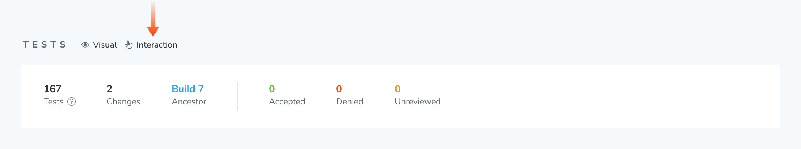
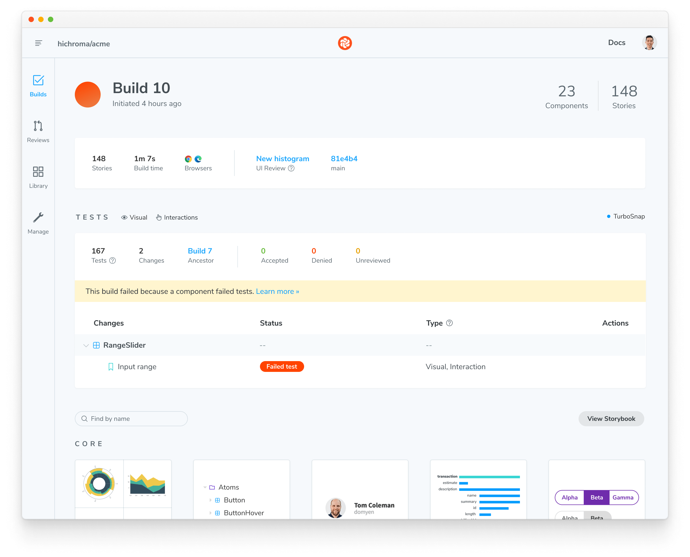

# Interaction tests

Interaction tests enable you to verify how a component responds to user behaviors like click, type, keyboard, and hover. It's powered by Storybook's [`play`](https://storybook.js.org/docs/writing-stories/play-function) function.

<div class="aside">

Interaction tests require Storybook 6.5.10+. Check which version you have in package.json or open the "About Storybook" page in your Storybook.

</div>

## How to write interaction tests

Add a [`play`](https://storybook.js.org/docs/writing-stories/play-function) function to your component's story to enable interaction tests. For example, if you want to validate a component's behavior write the following story:

```ts
// RangeSlider.stories.ts|tsx

// Adjust this import to match your framework (e.g., nextjs, vue3-vite)
import type { Meta, StoryObj } from "@storybook/your-framework";

/*
 * Replace the @storybook/test package with the following if you are using a version of Storybook earlier than 8.0:
 * import { within, userEvent } from "@storybook/testing-library";
 * import { expect } from "@storybook/jest";
 */
import { within, userEvent, expect } from "@storybook/test";

import { RangeSlider } from "./RangeSlider";

const meta: Meta<typeof RangeSlider> = {
  component: RangeSlider,
  title: "Library/Charts/RangeSlider",
};

export default meta;
type Story = StoryObj<typeof RangeSlider>;

export const InputRange: Story = {
  play: async ({ canvasElement }) => {
    // Assigns canvas to the component root element
    const canvas = within(canvasElement);

    // 🔢 Type into input field
    await userEvent.type(canvas.getByTestId("input-max-range"), "15");

    // ✅ Assert that component is responding to user behavior
    const availableOptions = await canvas.findAllByTestId("highlighted-bar");
    await expect(availableOptions.length).toBe(15);
  },
};
```

<div class="aside">

Read Storybook's interaction testing [docs](https://storybook.js.org/docs/writing-tests/interaction-testing). Get an API cheatsheet for user events [here](https://storybook.js.org/docs/writing-tests/interaction-testing#api-for-user-events).

</div>


Chromatic waits for interactions to pass before capturing a snapshot.

### Confirm interaction tests are working

Interaction tests run behind the scenes without you having to configure anything. To verify that they are working in Chromatic, publish your Storybook either via [CLI](/docs/cli) or [CI](/docs/ci). You can confirm that they’re running with the “Interaction” label in the Build page’s Tests section.



## Debug test failures

Chromatic notifies you when an interaction errors or an assertion fails. We designate these as critical failures that need immediate attention. You won’t be able to pass the build until the test is fixed.



To find out which steps failed in your interaction test, click on the change to see a snapshot of the state where the error occurred. You'll see a detailed log and browser environment metadata to help with reproductions.


### Reproduce test failures with a URL

Go to your published Storybook to reproduce the exact state of your story when the test failed. Click the "View Storybook" button on the test page to open the failed story with the error message visible. Share the link with teammates to get a second opinion.


## PR check for interaction tests

Interaction tests are reported in the UI Tests pull request check. When a test fails, you'll see a "Failed tests" status message prompting you to fix the test before moving on.


---

## Frequently asked questions

<details>
<summary>My interactions aren't getting snapshotted consistently with external web fonts?</summary>

Interactions run as soon as the DOM loads. But external resources like web fonts can load before or after the interaction runs depending on network latency. This can cause dialogs, tooltips, and menus to change position.

We recommend [preloading fonts](/docs/font-loading) to ensure they're available when the DOM renders. If preloading is not possible, try adding a [delay before running interactions](/docs/delay#use-an-assertion-to-delay-snapshot-capture).

</details>

<details>

<summary>What happens when an interaction test fails?</summary>

When interaction tests fail, the story will be badged with “Failed test.” You will not be able to “pass” a build that has failed tests. Fix interaction tests in Storybook and run the build again.

</details>

<details>

<summary>Does Chromatic capture snapshots of every step of an interaction test?</summary>

No, Chromatic waits for the entire play function to execute and captures a snapshot only at the end.

If you need a snapshot of a specific step, we recommend breaking your story into multiple stories and using [play function composition](https://storybook.js.org/docs/writing-stories/play-function#composing-stories).

</details>
