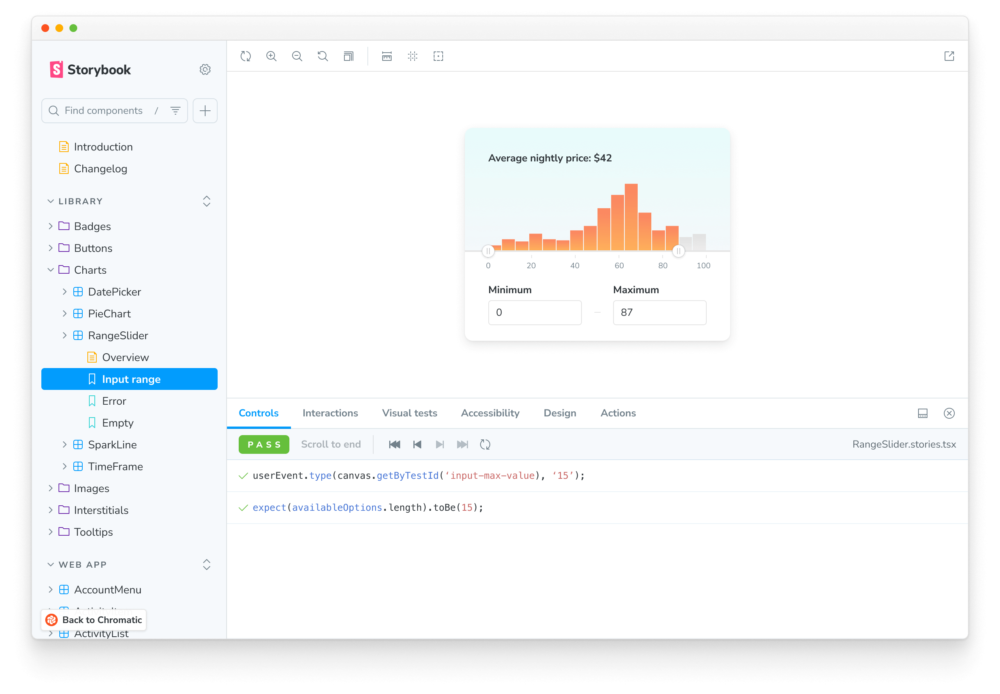
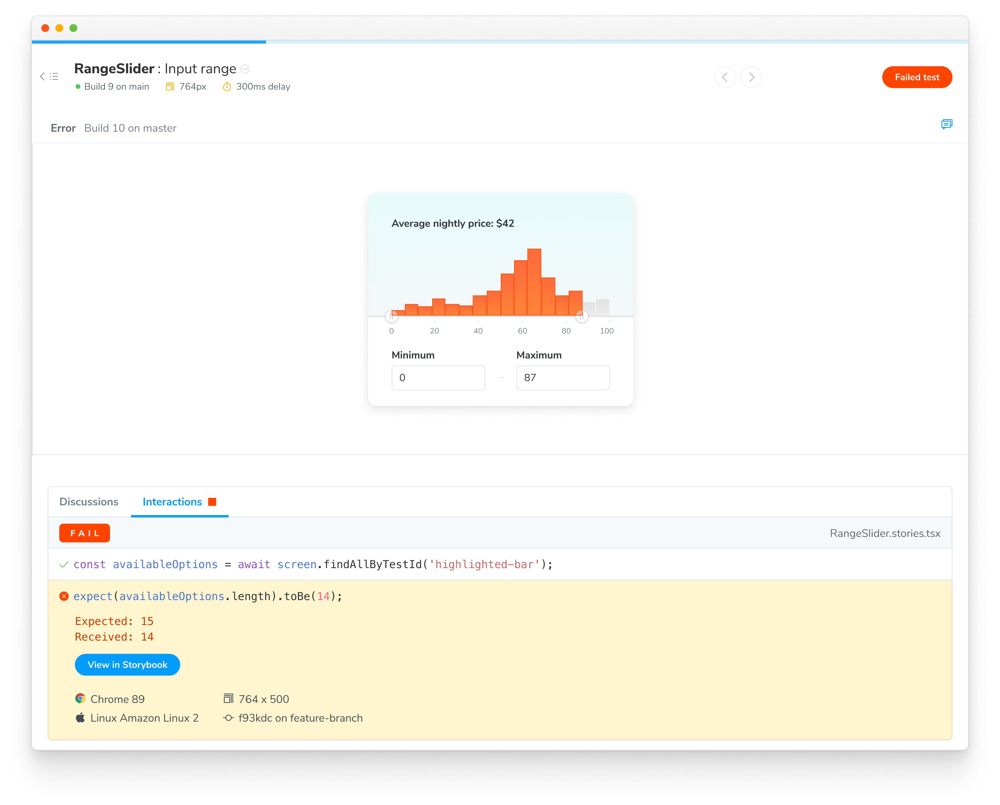
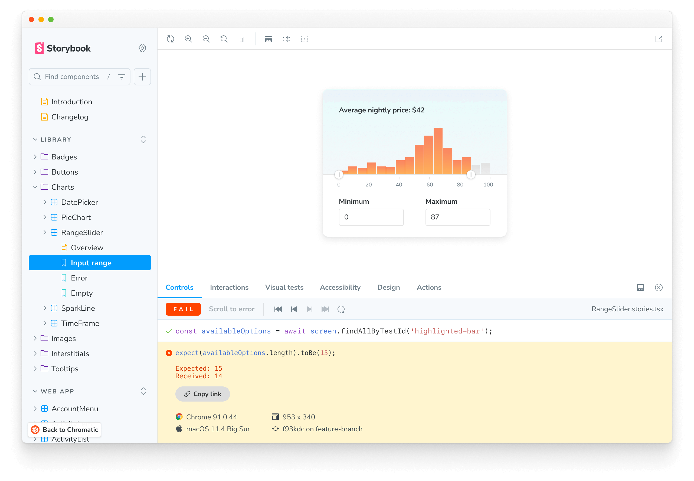

# Interaction tests

Interaction tests enable you to verify how a component responds to user behaviors like click, type, keyboard, and hover. It's powered by Storybook's [`play`](https://storybook.js.org/docs/writing-stories/play-function) function.

<div class="aside">

Interaction tests require Storybook 6.5.10+. Check which version you have in package.json or open the "About Storybook" page in your Storybook.

</div>

## How to write interaction tests

Add a [`play`](https://storybook.js.org/docs/writing-stories/play-function) function to your component's story to enable interaction tests. For example, if you want to validate a component's behavior write the following story:

```ts
// RangeSlider.stories.ts|tsx

// Adjust this import to match your framework (e.g., nextjs, vue3-vite)
import type { Meta, StoryObj } from "@storybook/your-framework";

/*
 * Replace the @storybook/test package with the following if you are using a version of Storybook earlier than 8.0:
 * import { within, userEvent } from "@storybook/testing-library";
 * import { expect } from "@storybook/jest";
 */
import { within, userEvent, expect } from "@storybook/test";

import { RangeSlider } from "./RangeSlider";

const meta: Meta<typeof RangeSlider> = {
  component: RangeSlider,
  title: "Library/Charts/RangeSlider",
};

export default meta;
type Story = StoryObj<typeof RangeSlider>;

export const InputRange: Story = {
  play: async ({ canvasElement }) => {
    // Assigns canvas to the component root element
    const canvas = within(canvasElement);

    // 🔢 Type into input field
    await userEvent.type(canvas.getByTestId("input-max-range"), "15");

    // ✅ Assert that component is responding to user behavior
    const availableOptions = await canvas.findAllByTestId("highlighted-bar");
    await expect(availableOptions.length).toBe(15);
  },
};
```

<div class="aside">

Read Storybook's interaction testing [docs](https://storybook.js.org/docs/writing-tests/interaction-testing). Get an API cheatsheet for user events [here](https://storybook.js.org/docs/writing-tests/interaction-testing#api-for-user-events).

</div>



Chromatic waits for interactions to pass before capturing a snapshot.

### Confirm interaction tests are working

Interaction tests run behind the scenes without you having to configure anything. To verify that they are working in Chromatic, publish your Storybook either via [CLI](/docs/cli) or [CI](/docs/ci). You can confirm that they’re running with the “Interaction” label in the Build page’s Tests section.


## Composing stories with the `play()` function

Similarly to `args`, `play()` functions can be [composed](https://storybook.js.org/docs/writing-stories/play-function#composing-stories) to reuse and reduce the amount of code being written. This can be helpful for instances where you are looking to snapshot multiple states of a longer interaction, or if you have interactions that can be reused to further compose other states of your component.

There is an important caveat to remember when invoking a `play()` function from another story: it is necessary to pass the _full context_ as an argument to the `play()` function. The below code uses the correct code for this rule, with `canvasContext` being used as context.

```jsx
// MyComponent.stories.jsx|tsx

import { MyComponent } from "./MyComponent";
import { userEvent, within, waitFor, screen } from "@storybook/testing-library";
import { expect } from "@storybook/jest";

export default {
  component: MyComponent,
  title: "My Component",
};

export const FirstStory = {
  play: async ({ canvasElement }) => {
    const canvas = within(canvasElement);
    const dropdownButton = canvas.getByRole("button");
    await userEvent.click(dropdownButton);
  },
};

export const SecondStory = {
  play: async (canvasContext) => {
    const canvas = within(canvasContext.canvasElement);
    //  👇 Pass the full context as an argument to the play function:
    await FirstStory.play(canvasContext);
    const findText = canvas.getByText("some text");
    await userEvent.hover(findText);
    await waitFor(() => expect(findText.focus()));
  },
};

export const ThirdStory = {
  play: async (canvasContext) => {
    //  👇 SecondStory.play will execute the play functions from FirstStory.play since this is part of the SecondStory.play function:
    await SecondStory.play(canvasContext);
    const searchbox = screen.getByRole("searchbox", { label: "Search" });
    await userEvent.type(searchbox, "text for searchbox");
  },
};
```

Additionally, you can stack multiple `play()` functions within a story. Below is a quick pseudocode example.

```jsx
// MyComponent.stories.jsx|tsx

import { MyComponent } from "./MyComponent";
import { userEvent, within, waitFor, screen } from "@storybook/testing-library";
import { expect } from "@storybook/jest";

export default {
  component: MyComponent,
  title: "My Component",
};

export const FirstStory = {
  play: async ({ canvasElement }) => {
    const canvas = within(canvasElement);
    await userEvent.type(canvas.getByTestId("an-element"), "some text");
  },
};

export const SecondStory = {
  play: async ({ canvasElement }) => {
    const canvas = within(canvasElement);
    await userEvent.type(
      canvas.getByTestId("another-element"),
      "some more text",
    );
  },
};

export const CombinedStories = {
  play: async (canvasContext) => {
    const canvas = within(canvasContext.canvasElement);
    //  👇 This executes FirstStory.play and SecondStory.play before executing the story's play function:
    await FirstStory.play(canvasContext);
    await SecondStory.play(canvasContext);
    await userEvent.type(canvas.getByTestId("another-one"), "even more text");
  },
};
```

## Debug test failures

Chromatic notifies you when an interaction errors or an assertion fails. We designate these as critical failures that need immediate attention. You won’t be able to pass the build until the test is fixed.


To find out which steps failed in your interaction test, click on the change to see a snapshot of the state where the error occurred. You'll see a detailed log and browser environment metadata to help with reproductions.



### Reproduce test failures with a URL

Go to your published Storybook to reproduce the exact state of your story when the test failed. Click the "View Storybook" button on the test page to open the failed story with the error message visible. Share the link with teammates to get a second opinion.



## PR check for interaction tests

Interaction tests are reported in the UI Tests pull request check. When a test fails, you'll see a "Failed tests" status message prompting you to fix the test before moving on.


## Testing Shadow DOM with Storybook and Chromatic

Storybook makes it easier to write component tests using the `play()` function, but what about components that use shadow DOM like Web Components? With the help of `shadow-dom-testing-library`, you can write tests that query elements inside the shadow root just like you would with standard DOM elements. This approach is fully compatible with Chromatic, which will accurately capture the UI state by waiting for interactions to complete.

### Configure Shadow DOM Queries in Storybook Preview

In your preview file, inject shadow-aware query methods into the `canvas` object using `beforeEach()`.

```ts title=".storybook/preview.ts"
import type { Preview } from "@storybook/web-components";
import { within as withinShadow } from "shadow-dom-testing-library";

const preview: Preview = {
  beforeEach({ canvasElement, canvas }) {
    Object.assign(canvas, { ...withinShadow(canvasElement) });
  },
};

// extend TypeScript types for safety
export type ShadowQueries = ReturnType<typeof withinShadow>;

declare module "storybook/internal/csf" {
  // since 8.6
  interface Canvas extends ShadowQueries {}
}

export default preview;
```

This adds methods like `findByShadowRole`, `findAllByShadowRole`, etc., directly to the `canvas` object in `play()` functions.

### Querying Shadow DOM within Stories

With the above adjustments in place, you can use shadow root queries directly in your `play()` function.

```tsx
const Story = {
  async play({ canvas }) {
    const button = await canvas.findByShadowRole("button", { name: /Reset/i });
    await userEvent.click(button);
  },
};
```

Using `shadow-dom-testing-library` provides DOM querying methods that mirror the familiar API of `@testing-library/dom`, but they're able to traverse shadow roots. By extending Storybook's `canvas` object, you can access methods that help ensure your tests are clean, intuitive, and maintainable.

### Example Story: Testing Shadw DOM for CheckboxGroup

Let's say you're testing a Web Component `<checkbox-group>` that renders shadow-root-contained checkboxes.

```tsx title="CheckboxGroup.stories.tsx"
import { Meta, StoryObj } from "@storybook/web-components";
import { expect, userEvent } from "@storybook/test";
import { Checkbox } from "../src/checkbox";
import { CheckboxGroup } from "../src/checkbox-group";

Checkbox.register();
CheckboxGroup.register();

const meta: Meta = {
  component: CheckboxGroup,
  title: "Checkbox",
};

export default meta;
type Story = StoryObj;

export const Required: Story = {
  render: () => html`
    <checkbox-group
      required
      setCustomValidityValueMissing="Please select an option"
    >
      <span slot="legend">Form label</span>
      <checkbox value="value1" name="required" id="checkbox-required1"
        >Checkbox option</checkbox
      >
      <checkbox value="value2" name="required" id="checkbox-required2"
        >Checkbox option</checkbox
      >
      <checkbox value="value3" name="required" id="checkbox-required3"
        >Checkbox option</checkbox
      >
      <checkbox value="value4" name="required" id="checkbox-required4"
        >Checkbox option</checkbox
      >
    </checkbox-group>
  `,
  async play({ canvas }) {
    const checkboxes = await canvas.findAllByShadowRole("checkbox");
    const firstCheckbox = checkboxes[0];
    await userEvent.click(firstCheckbox); // select
    await userEvent.click(firstCheckbox); // deselect
  },
};
```

Now you can simulate and test user interactions with deeply nested shadow elements from the `play()` function, without needing to manually reach into `shadowRoot`!

---

## Frequently asked questions

<details>
<summary>My interactions aren't getting snapshotted consistently with external web fonts?</summary>

Interactions run as soon as the DOM loads. But external resources like web fonts can load before or after the interaction runs depending on network latency. This can cause dialogs, tooltips, and menus to change position.

We recommend [preloading fonts](/docs/font-loading) to ensure they're available when the DOM renders. If preloading is not possible, try adding a [delay before running interactions](/docs/delay#use-an-assertion-to-delay-snapshot-capture).

</details>

<details>

<summary>What happens when an interaction test fails?</summary>

When interaction tests fail, the story will be badged with “Failed test.” You will not be able to “pass” a build that has failed tests. Fix interaction tests in Storybook and run the build again.

</details>

<details>

<summary>Does Chromatic capture snapshots of every step of an interaction test?</summary>

No, Chromatic waits for the entire play function to execute and captures a snapshot only at the end.

If you need a snapshot of a specific step, we recommend breaking your story into multiple stories and using [play function composition](https://storybook.js.org/docs/writing-stories/play-function#composing-stories).

</details>
