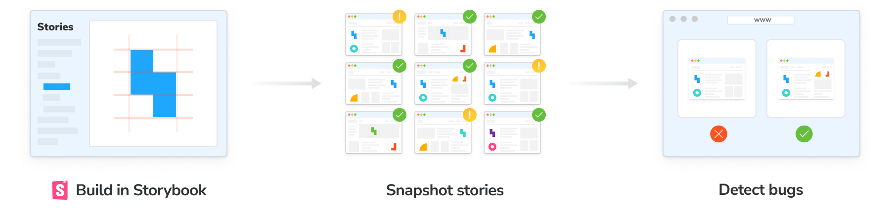

import TroubleshootingSetup from "../shared-snippets/setup/troubleshooting.mdx";
import DemoChromaticUnlinked from "../shared-snippets/demo-chromatic-unlinked.md";
import { TabItem, Tabs } from "../../components/Tabs";

# Setup and publish Storybook

The Chromatic CLI builds then publishes Storybook to a secure workspace in the cloud. That allows your team to access all your stories at [chromatic.com](https://www.chromatic.com/start).



## Sign up

Before publishing, generate a unique project token for your Storybook by signing in to [Chromatic](https://www.chromatic.com/start) and creating a project. Sign in with your GitHub, GitLab, Bitbucket, or email.

<DemoChromaticUnlinked />


## Install

Install the [**chromatic**](https://www.npmjs.com/package/chromatic) package from npm.

<Tabs>
  <TabItem label="npm">
  ```shell
  npm install --save-dev chromatic
  ```
  </TabItem>

  <TabItem label="yarn">
  ```shell
  yarn add --dev chromatic
  ```
  </TabItem>
</Tabs>

<div class="aside">
  Storybook 6.5 or later is required. We also guarantee support for Node 14.18.x
  through Node 16.19.1. Other Node releases may encounter errors. To switch
  between Node versions, we recommend using{" "}
  <a href="https://github.com/nvm-sh/nvm">nvm</a>,{" "}
  <a href="https://github.com/tj/n">n</a>, or another version manager.
</div>

<details>
<summary>Learn how to add <code>chromatic</code> to your package.json</summary>

The `chromatic` command will also give you the option of adding an npm script to your `package.json` so you can run future builds with `npm run chromatic/yarn chromatic`. If you want to add it manually, it should look something like:

```json
{
  "scripts": {
    "chromatic": "chromatic"
  }
}
```

The above script command will pick up your project token by reading the `CHROMATIC_PROJECT_TOKEN` environment variable. After adding the above, ensure you set `CHROMATIC_PROJECT_TOKEN` when you run builds - such as in your CI config.

If you allowed `chromatic` to add the above line, it will also have written the environment variable to your `package.json`. This environment variable can also be set via your CI config for extra privacy.

</details>

<details>
<summary>Setup .gitignore to ignore certain files in your Git repository</summary>

Running the Chromatic command may generate certain files for logging and debugging purposes. Exactly which files it generates depends on your configuration, but these entries should likely be added to your `.gitignore` file:

```
build-storybook.log
chromatic.log
chromatic-build-*.xml
chromatic-diagnostics.json
```

</details>

## Run Chromatic

Once you installed the `chromatic` package and have a project token, run the following command in your project directory.

```shell
npx chromatic --project-token <your-project-token>
```

<div class="aside">
  We use the <code>build-storybook</code> script from your{" "}
  <code>package.json</code> by default. If you have customized the{" "}
  <code>storybook</code> script (for example, adding a static directory with{" "}
  <code>-s</code>), check that you've done the same for{" "}
  <code>build-storybook</code>.
</div>

When complete, you'll see the build status and a link to the published Storybook:

```shell
Build 1 published.

View it online at https://www.chromatic.com/build?appId=...&number=1.
```

## View published Storybook

You published Storybook online! Every time you run the `chromatic` command you get a corresponding build in Chromatic's web app. You can now browse components, view [**UI Tests**](/docs/test) results (if enabled), and navigate to associated PR/MRs for [**UI Review**](/docs/review).


## Get the PR check

Chromatic posts a "Storybook Publish" status check in your pull/merge request that links to the latest published Storybook. This gives teams secure, convenient access to browse components and stories. Get the PR check by [automating Chromatic with CI](/docs/storybook/ci).


<div class="aside">
  During setup we recommend running <code>chromatic</code> on the command line
  to make sure the configuration is correct. For production use run Chromatic in
  CI.
</div>

---

## Next: Catch UI bugs

📸 Now that you published Storybook, let's see how to automate [UI Tests](/docs/storybook/test) to catch bugs.

<a class="btn primary round" href="/docs/storybook/test">
  Read next chapter
</a>

---

<details>
<summary><h3 class="no-anchor">Command options</h3></summary>

If you have customized the way your Storybook runs, you may need to pass additional options to the `chromatic` command. Learn more in the [package documentation](https://github.com/chromaui/chromatic-cli#main-options).

</details>

### Troubleshooting

<TroubleshootingSetup />

<details>
<summary>Chromatic doesn't work with my custom Storybook script</summary>

We do our best to interpret your Storybook script in package.json, but you might need to pass additional options to the `chromatic` command. [Check out all the options »](/docs/cli)

</details>

<details>
<summary>Why do I get errored builds randomly?</summary>

Chromatic builds and runs Storybook flawlessly _most of the time_, but we're not perfect (we wish). Sometimes builds don't run due to rare infrastructure issues. If this happens, try to re-run the build via your CI provider. We keep track of these errors to improve the service.

</details>

<details>
<summary>Why is my build failing with the message <code>Cannot run a build with no stories</code>?</summary>

This happens if certain stories were disabled via the [`chromatic: { disable: true }`](/docs/ignoring-elements#ignore-stories) option at a higher level.

To solve this you can:

1. Remove the top-level [`chromatic: { disable: true }`](/docs/ignoring-elements#ignore-stories) option
1. Enable snapshots for specific stories
1. Run `yarn storybook-build` locally and fix the issues in your stories

</details>
