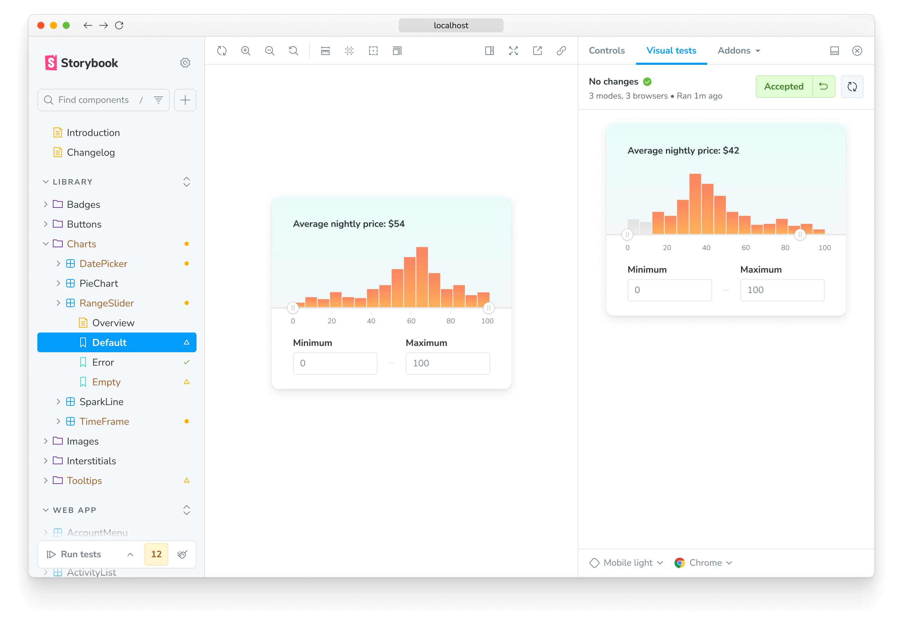
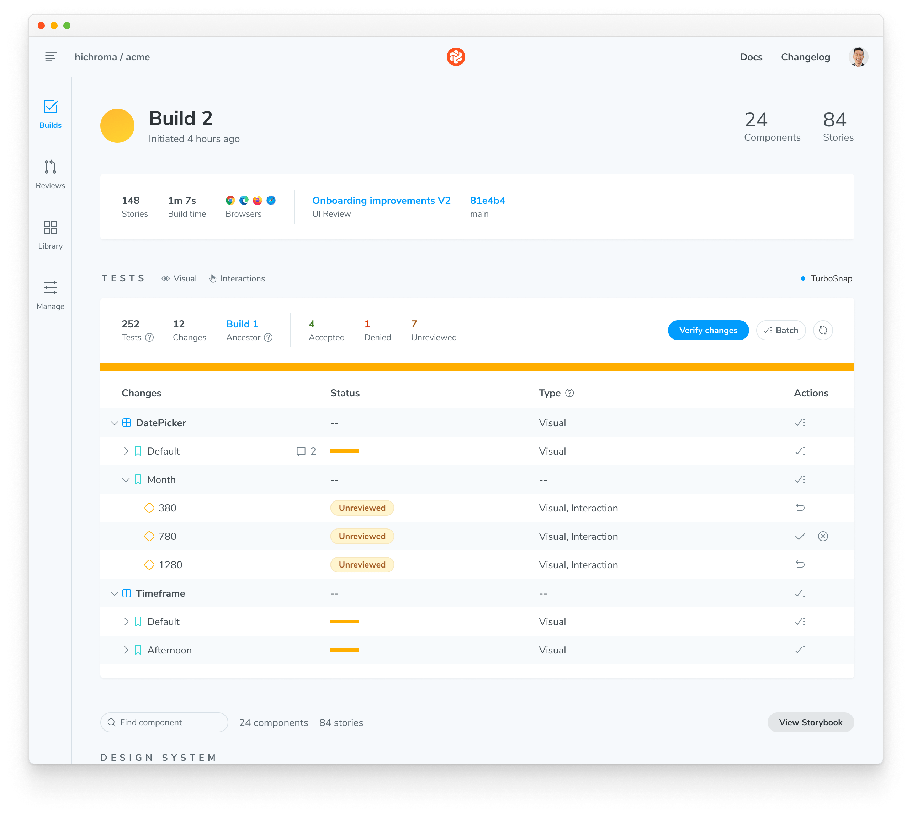

import TroubleshootingSetup from "../shared-snippets/setup/troubleshooting.mdx";
import DemoChromaticUnlinked from "../shared-snippets/demo-chromatic-unlinked.md";
import { TabItem, Tabs } from "../../components/Tabs";
import InstallSnippets from "../../components/InstallSnippets.astro";

# Chromatic for Storybook

<div class="aside" style="margin-bottom: 2rem;">
  👀 If you're unfamiliar with visual testing, check out our [introductory
  guide](/docs) first.
</div>

Chromatic, created by the team behind Storybook, seamlessly integrates visual testing into your UI development workflow. Storybook lets you capture every component state and variation as [stories](https://storybook.js.org/docs/get-started/whats-a-story). Then, Chromatic performs automatic visual tests on those stories, catching any unexpected changes and guaranteeing a flawless UX for your users.

<details>
<summary>Why use Storybook?</summary>

[Storybook](https://storybook.js.org/) is an open source tool built for developing UI components in isolation and creating living, interactive component documentation. Storybook makes it trivial to reproduce hard to reach component states and ensuring those states are documented in code. When you adopt Storybook you also unlock automation for UI components and libraries via Chromatic.

New to Storybook? Check out our hands-on tutorials at [storybook.js.org/tutorials](https://storybook.js.org/tutorials/).

[Stories](https://storybook.js.org/docs/get-started/whats-a-story) capture all states and variations of a component. They’re a pragmatic, reproducible way to keep track of UI test cases. Using [play functions](https://storybook.js.org/docs/writing-stories/play-function), stories allow you to simulate user interactions to run functional tests on components. Chromatic uses these stories to power visual tests.

</details>

Chromatic manages the entire testing process for you. Everything from building and publishing your Storybook to running tests in cloud browsers.


Key advantages of Chromatic's Storybook integration:

- **Story-driven testing:** Eliminate the hassle of writing separate tests. Chromatic automatically converts your stories into visual tests.
- [**Zero-config interaction tests:**](/docs/interactions/#interaction-tests) If you use Storybook's [play functions](https://storybook.js.org/docs/writing-stories/play-function) for functional testing, Chromatic intelligently waits for their completion before capturing snapshots.
- **Parallelized testing:** Chromatic's cloud infrastructure is optimized to test all your stories simultaneously at no extra cost, maximizing speed and efficiency.
- **Cross-browser testing:** Chromatic’s coverage extends to Chrome, Firefox, Safari, and Edge. All browser tests run in parallel.
- [**Effortless variant testing:**](/docs/modes/) Chromatic harnesses the power of [Storybook Globals](https://storybook.js.org/docs/essentials/toolbars-and-globals#globals) to comprehensively test UI variations across themes, viewports, locales, and media features.

### **How does Chromatic integrate with Storybook?**

Chromatic offers two options for integrating UI Tests within your Storybook workflow:

- **Visual Tests Addon (recommended):** Streamline your testing workflow by triggering visual tests and viewing results without leaving Storybook.
- **CLI:** Run Chromatic’s visual tests via CLI, and review test results in the Chromatic web app.

Ready to get started? The next section covers setup instructions for both of these workflows.

<div class="aside">
  🤖 You can also automate Chromatic runs to check every PR for visual errors by
  integrating Chromatic into your CI pipeline. [Learn more about automating
  Chromatic’s visual tests »](/docs/ci)
</div>

## Set up Visual Tests Addon for Storybook

Visual Tests Addon ensures that the dev-to-test feedback loop is as fast as possible by allowing you to run visual tests on demand. It lets you uncover visual bugs in local development without leaving Storybook.

### 1. Install the addon

Add visual tests to your project by installing `@chromatic-com/storybook`:

{/* prettier-ignore-start */}

<InstallSnippets>
  <Fragment slot="npm">
  ```shell
  $ npx storybook@latest add @chromatic-com/storybook
  ```
  </Fragment>
  <Fragment slot="yarn">
  ```shell
  $ yarn dlx storybook@latest add @chromatic-com/storybook
  ```
  </Fragment>
  <Fragment slot="pnpm">
  ```shell
  $ pnpm dlx storybook@latest add @chromatic-com/storybook
  ```
  </Fragment>
</InstallSnippets>

{/* prettier-ignore-end */}

<div class="aside">

Storybook 7.6 and higher required. Read the [migration guide](https://storybook.js.org/docs/migration-guide) for help migrating Storybook versions.

</div>

When you start Storybook, you'll see a new addon panel for Visual Tests where you can run tests and view results.


<div class="aside">

🤖 **Need help or more customization?**<br/>
If you're experiencing issues with the `storybook@latest add` command or want to explore advanced configuration for the Visual Tests addon, be sure to check the [Visual Test addon page »](/docs/visual-tests-addon)

</div>

### 2. Authenticate

Sign in to Chromatic to create a new project or link an existing project.

You’ll see list of available projects that you have access to. Select a project to finish setup. The addon will automatically adjust the configuration file, add the necessary project identifiers, and retrieve any existing baselines if available.

Select a project from your project list to finish setup. If you're setting up the addon for the first time, the configuration files and necessary project identifiers will be added for you automatically.


### 3. Run tests

Click the ▶️ Play button in the Storybook sidebar to run visual tests. This will send your stories to the cloud to take snapshots and detect visual changes.


### 4. Review changes

If there are visual changes in your stories, they will be 🟡 highlighted in the sidebar. Click the story and go to the Visual Tests addon panel to see which pixels changed.

If the changes are intentional, ✅ accept them as baselines locally. If the changes aren't intentional, fix the story and rerun the tests using the ▶️ Play button.


### Chromatic automatically syncs baselines to the cloud

When you accept changes in the addon, your baselines automatically sync to the cloud. Your local-only baselines will graduate to standard baselines.

What that means:

- These baselines will be available for anyone who checks out your branch.
- [TurboSnap](/docs/turbosnap) will skip the stories that haven’t changed.
- Tests with accepted baselines don't need to be rerun or reviewed again, speeding up your pull request process.



## Set up Chromatic CLI for Storybook

For the most seamless Storybook workflow, we strongly recommend the Visual Tests Addon. However, if you'd like to explore Chromatic, the CLI offers a lightweight option for trying it out.

### 1. Sign up and create a new project

Generate a unique project token for your app by signing in to [Chromatic](https://www.chromatic.com/start) and creating a project. Sign in with your GitHub, GitLab, Bitbucket, or email.

<DemoChromaticUnlinked />


### 2. Install

Install the [chromatic](https://www.npmjs.com/package/chromatic) package from npm.

{/* prettier-ignore-start */}

<InstallSnippets>
  <Fragment slot="npm">
  ```shell
  $ npm install --save-dev chromatic
  ```
  </Fragment>
  <Fragment slot="yarn">
  ```shell
  $ yarn add --dev chromatic
  ```
  </Fragment>
  <Fragment slot="pnpm">
  ```shell
  $ pnpm add --save-dev chromatic
  ```
  </Fragment>
</InstallSnippets>

{/* prettier-ignore-end */}

<div class="aside">
  Storybook 6.5 or later is required. We also guarantee support for Node 14.18.x
  through Node 16.19.1. Other Node releases may encounter errors. To switch
  between Node versions, we recommend using{" "}
  <a href="https://github.com/nvm-sh/nvm">nvm</a>,{" "}
  <a href="https://github.com/tj/n">n</a>, or another version manager.
</div>

<details>
<summary>Learn how to add <code>chromatic</code> to your package.json</summary>

The `chromatic` command will also give you the option of adding an npm script to your `package.json` so you can run future builds with `npm run chromatic/yarn chromatic`. If you want to add it manually, it should look something like:

```json
{
  "scripts": {
    "chromatic": "chromatic"
  }
}
```

The above script command will pick up your project token by reading the `CHROMATIC_PROJECT_TOKEN` environment variable. After adding the above, ensure you set `CHROMATIC_PROJECT_TOKEN` when you run builds - such as in your CI config.

If you allowed `chromatic` to add the above line, it will also have written the environment variable to your `package.json`. This environment variable can also be set via your CI config for extra privacy.

</details>

<details>
<summary>Setup .gitignore to ignore certain files in your Git repository</summary>

Running the Chromatic command may generate certain files for logging and debugging purposes. Exactly which files it generates depends on your configuration, but these entries should likely be added to your `.gitignore` file:

```
build-storybook.log
chromatic.log
chromatic-build-*.xml
chromatic-diagnostics.json
```

</details>

## 3. Run Chromatic

Once you installed the `chromatic` package and have a project token, run the following command in your project directory.

{/* prettier-ignore-start */}

<InstallSnippets>
  <Fragment slot="npm">
  ```shell
  $ npx chromatic --project-token <your-project-token>
  ```
  </Fragment>
  <Fragment slot="yarn">
  ```shell
  $ yarn chromatic --project-token <your-project-token>
  ```
  </Fragment>
  <Fragment slot="pnpm">
  ```shell
  $ pnpm chromatic --project-token <your-project-token>
  ```
  </Fragment>
</InstallSnippets>

{/* prettier-ignore-end */}

<div class="aside">
  We use the <code>build-storybook</code> script from your{" "}
  <code>package.json</code> by default. If you have customized the{" "}
  <code>storybook</code> script (for example, adding a static directory with{" "}
  <code>-s</code>), check that you've done the same for{" "}
  <code>build-storybook</code>.
</div>

### 4. Review changes

When Chromatic’s tests are complete, you’ll see the build status and a link to review the changes. Click on that link to open Chromatic.

```shell
Build 1 published.

View it online at https://www.chromatic.com/build?appId=...&number=1.
```



The build will be marked “unreviewed” and the changes will be listed in the “Tests” table. Go through each snapshot to review the diff and approve or reject the change.


Once you accept all changes, your build is marked as passed 🟢. This updates the baselines for those tests, ensuring future snapshots are compared against the latest approved version.


---

## Next: enhance your UI Testing workflow

You're building robust components by uncovering bugs during development. Take your testing to the next level and safeguard against visual bugs by automating Chromatic whenever you push code.


[**Integrate Chromatic into your CI pipeline**](/docs/ci) to get notified about any visual changes introduced by a pull request. Chromatic runs test any time you push code and reports changes via the “UI Tests” badge for your pull request.

### Additional testing strategies

You can further refine your testing process and guarantee polished UIs in all scenarios with these strategies:

- [**Test component functionality with the play function:**](/docs/interactions/#interaction-tests) Simulate clicks, hovers, and more to simultaneously test how components look & function.
- [**Test dark mode and other component variations:**](/docs/modes/) Make sure your UI adapts perfectly to different themes, locales and viewport sizes.
- [**Test for flexible user preferences:**](/docs/media-features/#media-features) Guarantee your components adapt seamlessly to media features like `forced-colors` and `prefers-reduced-motion`.
- [**Speed up tests & optimize usage:**](/docs/turbosnap/#introduction-to-turbosnap) Learn how to use Chromatic’s TurboSnap to only test stories that have code changes associated with them.

---

## Frequently asked questions

<TroubleshootingSetup />

<details>
<summary>Chromatic doesn't work with my custom Storybook script</summary>

We do our best to interpret your Storybook script in package.json, but you might need to pass additional options to the `chromatic` command. [Check out all the options »](/docs/cli)

</details>

<details>
<summary>Why do I get errored builds randomly?</summary>

Chromatic builds and runs Storybook flawlessly _most of the time_, but we're not perfect (we wish). Sometimes builds don't run due to rare infrastructure issues. If this happens, try to re-run the build via your CI provider. We keep track of these errors to improve the service.

</details>

<details>
<summary>Why is my build failing with the message <code>Cannot run a build with no stories</code>?</summary>

This happens if certain stories were disabled via the [`chromatic: { disable: true }`](/docs/ignoring-elements#ignore-stories) option at a higher level.

To solve this you can:

1. Remove the top-level [`chromatic: { disable: true }`](/docs/ignoring-elements#ignore-stories) option
1. Enable snapshots for specific stories
1. Run `yarn storybook-build` locally and fix the issues in your stories

</details>
