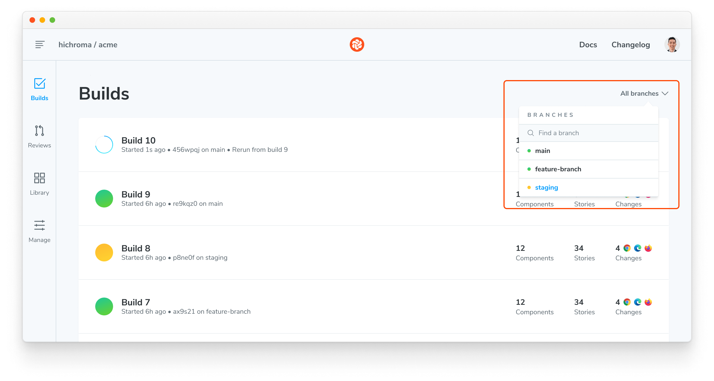

# How do I filter builds by name on the Builds page?

On the Builds page, go to the branch picker and find the branch by name in the search field. By default, the Builds page will show the latest builds across all branches.

You can also manually add a URL parameter `&branch=[BRANCH_NAME]` to the URL in your browser's address bar to filter all builds by a specific branch.
