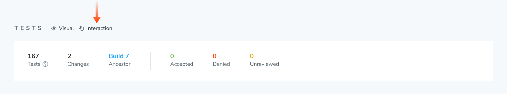

# How do we run an interaction test when snapshots are disabled for a story?

The `disableSnapshot` parameter disables snapshotting and interaction testing for a test. If you've disabled snapshotting for all your tests, Chromatic will no longer show an "Interaction" indicator beside the test table on the Build page.

If you want to run Interaction tests without snapshotting, try setting up the [Storybook test-runner](https://storybook.js.org/docs/writing-tests/integrations/test-runner#set-up-ci-to-run-tests) in CI. Note, this involves running your own browser infrastructure.
