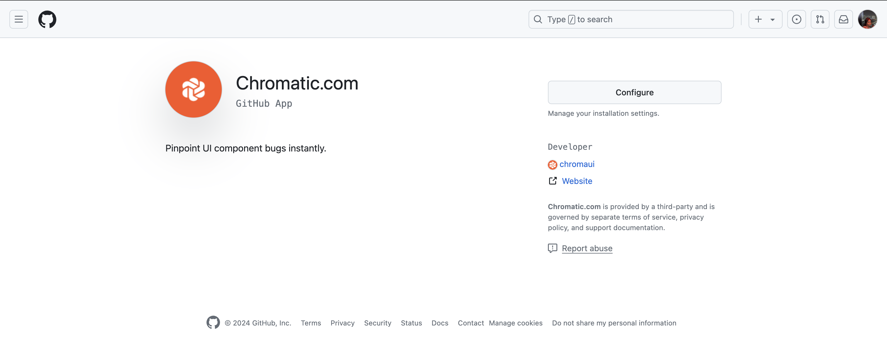
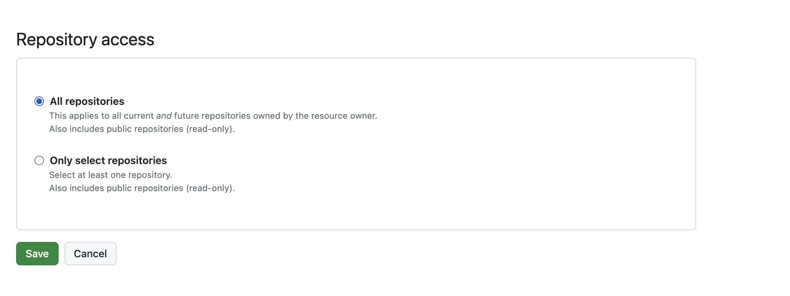

# How can I limit access to a GitHub repository?

To limit access to your GitHub repository, you'll need to do the following:

1. Open Chromatic.com App configuration settings here: https://github.com/apps/chromatic-com
2. Select the `Configure` tab
   
3. Select your chosen git entity
4. Select your chosen repositories and select `save`
   
