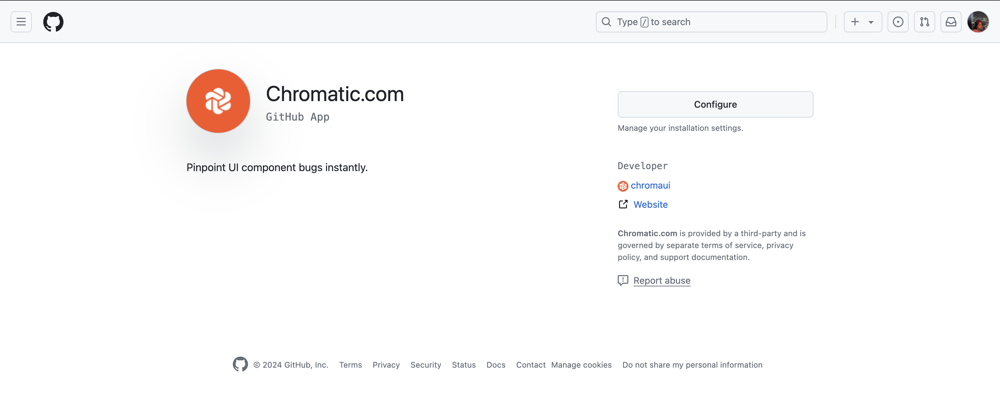
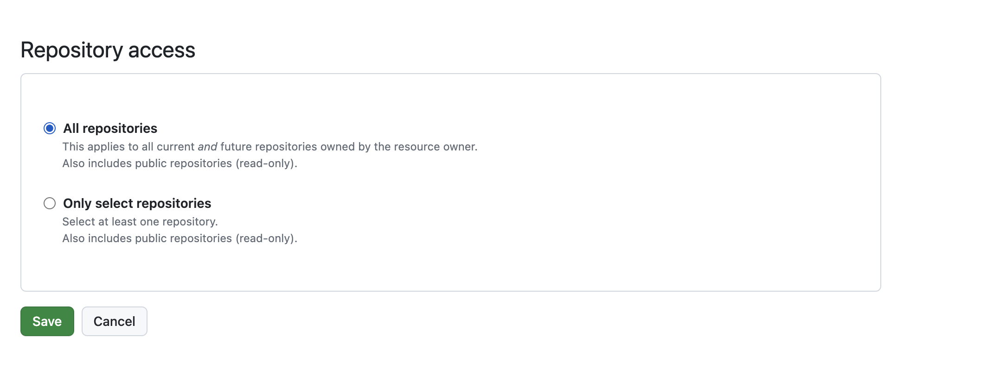

# How can I limit which repositories Chromatic can access?

## GitHub

To limit the repositories available to the Chromatic GitHub App for pull request integration:

1. Open the [Chromatic GitHub App settings](https://github.com/apps/chromatic-com) and select **Configure**.
   
2. Select your GitHub organization.
3. Select the repositories and save your changes.
   

This setting doesn't limit the repositories shown in Chromatic's project picker. The GitHub OAuth connection uses the signed-in profile's repository access. See [OAuth and GitHub App permissions](/docs/faq/link-a-repository#oauth-and-github-app-permissions).

## GitLab

To limit which GitLab projects a connected profile can access, put those projects in a subgroup and add the profile to that subgroup under **Manage > Members**. Don't add the profile to the parent group, since parent members inherit access to its subgroups.

## Bitbucket

Put the repositories in a separate Bitbucket workspace and grant the connected profile access to that workspace. Review its access to other workspaces and repositories in Bitbucket.
