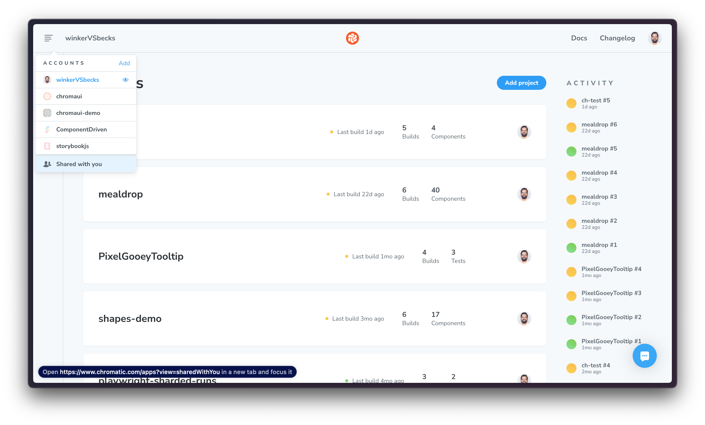

# Where can I find projects shared with me?

Open the account menu in the upper-left corner. Projects shared with you appear under **Shared with you**.

If you have direct access to a repository but aren't a member of its Git organization, ask a project collaborator for the project URL. Open it once to sync your project access and make the project appear in the menu.

If you're on the **Create project** screen and can't see the account menu, create a project on your personal account first.
