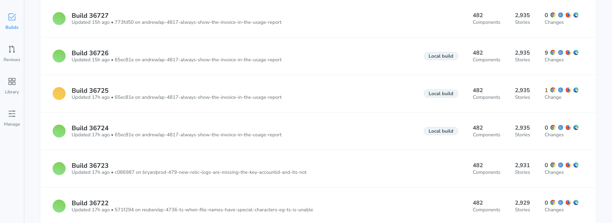

# What are the different type of Chromatic builds?

## Standard build

The standard Chromatic build triggered by the [CLI](/docs/cli) or via [CI](/docs/ci). Chromatic captures a snapshots of all your test and compares them to baselines.

## Infrastructure build

An infrastructure build involves an [infrastructure upgrade](/docs/infrastructure-upgrades#infrastructure-upgrades). It snapshots your baselines and recent changes in the updated browser environment to prevent false positives. You can read more about our infrastructure upgrades in our [capture release notes](/docs/infrastructure-release-notes/).

When a standard build goes through an infrastructure upgrade, Chromatic creates a duplication of the main branch.
This is called an infrastructure build. Please note that the build number will remain the same.

## Local build

A local build is generated using the [Visual Test Addon](/docs/visual-tests-addon/) to run Chromatic from within Storybook.

Updating the baselines in local builds only affects other local builds on a given branch. This allows you to iterate quickly in development without affecting teammates.

