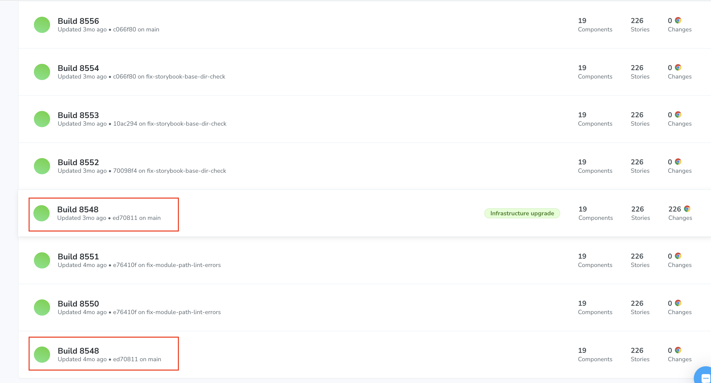

# What type of builds are there?

There are **infrastructure** builds, **local** builds, and **standard** builds.

An infrastructure build involves an infrastructure upgrade. 
It snapshots your baselines and recent changes in the updated browser environment to prevent false positives. 
You can read more about our infrastructure upgrades in our capture release notes here: https://www.chromatic.com/docs/infrastructure-release-notes/

When a standard build goes through an infrastructure upgrade, Chromatic creates a duplication of the main branch.
This is called an infrastructure build. Please note that the build number will remain the same.

A local build is generated using the Visual Test Addon to run Chromatic on Storybook locally. 
Updating the baselines in local builds only affects other local builds on a given branch. This allows you to iterate quickly in development without affecting teammates.

You can learn more about the Visual Test Addon here: https://www.chromatic.com/docs/visual-tests-addon/#installation

