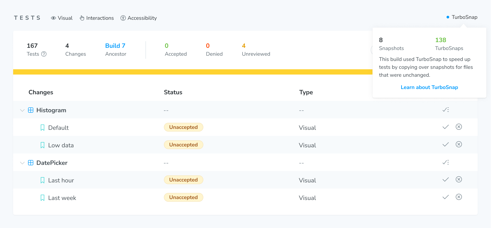

import { YouTubeCallout } from "../../components/YouTubeCallout";

# Setup TurboSnap

Enable TurboSnap by running Chromatic's CLI with the `--only-changed` option. Alternatively, you can use the `onlyChanged` option for the Chromatic [GitHub action](/docs/github-actions#enable-turbosnap).

It will build and test stories that may have been affected by the Git changes since the last build. Depending on your project setup, you may need [additional configuration](#configure).

<div class="aside">
  ⚠️ When using TurboSnap, your builds may complete in less time using fewer
  snapshots. However, we don't allow using TurboSnap immediately when starting
  out with Chromatic since the configuration is more complicated and can lead to
  difficult to debug scenarios or UI changes being missed. Instead, become
  familiar with Chromatic's out-of-the-box behavior, and once your project has
  been running smoothly, consider trying out TurboSnap. TurboSnap is unlocked
  after ten successful builds on CI.
</div>

## Prerequisites

- Chromatic CLI [10.0+](https://www.npmjs.com/package/chromatic)
- Storybook 6.5+
- Git 2.28.0+
- Webpack or Vite based project (Vite is natively supported with Storybook 8+ and can be used in earlier versions with the [vite-plugin-turbosnap](https://github.com/IanVS/vite-plugin-turbosnap))
- Stories correctly [configured](https://storybook.js.org/docs/configure#configure-story-loading) in Storybook's `main.js`
- 10 successful builds on CI
- For GitHub Actions: run on `push` rather than `pull_request` ([learn more](#github-pull_request-triggers))
- UI Tests should be enabled

## Configure

To enable TurboSnap for your project, add the `--only-changed` flag to your `chromatic` script, or add the `onlyChanged: true` option to your GitHub workflow config.

```json
{
  "scripts": {
    "chromatic": "chromatic --only-changed"
  }
}
```

Or for GitHub Actions:

```yaml
steps:
  # ...
  - name: Run Chromatic
    uses: chromaui/action@v1
    with:
      projectToken: ${{ secrets.CHROMATIC_PROJECT_TOKEN }}
      onlyChanged: true
```

TurboSnap can also be enabled through your `chromatic.config.json` file:

```json
{
  "$schema": "https://www.chromatic.com/config-file.schema.json",
  "projectId": "Project:...",
  "onlyChanged": true
}
```

You may need additional config in the following situations:

- You're using `--storybook-build-dir` or `-d` to let Chromatic use a prebuilt Storybook
- You are using the `staticDirs` config in your main Storybook configuration
- You have other files outside the Webpack dependency tree which affect your stories (e.g., Sass or template files)
- You have files that should never trigger a re-test (e.g., in a monorepo)
- You want to enable or disable TurboSnap for specific branches

Jump to the [recipes](#recipes) section for more information.

### Update your configuration using TurboSnap Helper

Having TurboSnap properly configured is essential when trying to optimize build performance. If you're working in a monorepo, or even just a large project with a complex setup, setting up TurboSnap efficiently can feel overwhelming. That's where the TurboSnap helper comes in! We've introduced the `@chromatic-com/turbosnap-helper` CLI utility to simplify the process of managing your configuration.

The TurboSnap Helper utility is designed to assist with properly configuring TurboSnap for Chromatic. It's especially helpful in monorepos, where managing directories, static assets, and build optimizations across multiple projects can get tricky.

Run the utility from the root of your repo using:

```sh
npx @chromatic-com/turbosnap-helper
```

<div class="aside">

❓ **Why run the utility from the repo root rather than the project root?**
TurboSnap Helper supports monorepos. By starting from the root, it can scan across all of your projects, so you're not accidentally missing assets or settings that could cause full rebuilds. If you run the utility from your project root, not a problem. The utility will still work just fine.

</div>

#### Helper modes to give you a deeper analysis

The utility can run in three modes:

- `init` (default) - walks you through creating or updating your TurboSnap config
- `analyze` - reviews your story and component files for dynamic imports
- `preview` - analyzes your preview file for shared dependencies that could cause full rebuilds

Running `init` mode not only prints out configuration options in the CLI, but **automatically adds the correct config options** to your Chromatic config file. We've enhanced the utility to take it beyond directory config help and introduced static asset detection, allowing you to easily add static assets to your `externals` config to ensure you don't miss changes. Don't have an existing Chromatic config file? No worries—the utility will create one for you!

To help further optimize your builds, the utility has an `analyze` mode that scans both story and components files to detect and surface dynamic imports. Dynamic imports are a hidden culprit for confusing TurboSnap behavior that can result in missed regressions or unnecessary rebuilds. `analyze` mode helps you track them down early.

And last is the `preview` mode, which displays an analysis of your Storybook preview file. Use the analysis to help keep your preview file clean and efficient, as a messy preview file can turn small changes into **full rebuilds**. The analysis provides:

- Warnings if your import count is too high (the higher the imports, the more likely you'll see frequent rebuilds)
- Lists shared wrappers/themes that could trigger global rebuilds
- Prints any dynamic imports inside your preview file

### Verify that TurboSnap is working

The best way to see if TurboSnap is working is to inspect your CLI output. There are a couple of messages the CLI outputs of particular relevance:

```shell
Traversing dependencies for X files that changed since the last build
```

<div class="aside">
  This message tells us how many git changes Chromatic has detected since the
  last Chromatic build. Usually, that's just one or two commits' worth of files.
</div>

```shell
Found Y story files affected by recent changes
```

<div class="aside">

This message tells you the number of story files that depend on the X changes above. This message also might be replaced by a message telling you that we need to capture all stories ([see below](#why-are-full-rebuilds-required) ).

</div>

```shell
Tested A stories across B components; capture C snapshots in S seconds.
```

<div class="aside">
  This message tells you how many snapshots we actually took instead of the
  number of stories we found in your Storybook. Usually, C would be the number
  of stories in the Y component files above.
</div>

Once TurboSnap is activated, all subsequent builds will display an indicator with TurboSnap's status. Find it on the Build page above your tests.



---

## Recipes

A few common scenarios require additional configuration.

### TurboSnap with prebuilt Storybook using Webpack

If you're using `--storybook-build-dir` to provide a prebuilt Storybook, adjust your `build-storybook` script to include the `--stats-json` option (or `--webpack-stats-json` option for projects that haven't migrated to Storybook 8+). If Chromatic builds your Storybook for you, this is unnecessary, and will take care of it. For example:

```json
{
  "scripts": {
    "build-storybook": "build-storybook --stats-json"
  }
}
```

In Storybook 6.2, `--webpack-stats-json` must be set to the value of `--output-dir` (`storybook-static` by default). In Storybook 6.3+, the value can be omitted as it automatically uses the value of `--output-dir`. Note that `--webpack-stats-json` was not supported before Storybook 6.2 and, therefore, cannot be used with TurboSnap.

<details>
<summary>How can I pass the `--stats-json` flag when using Storybook with `nx`?</summary>

When using `nx`, you can't pass CLI flags to your `Storybook: build` script since the `nx` executor won't accept them.
You must pass `webpackStatsJson` as a [prop to options](https://nx.dev/nx-api/storybook/executors/build#options) in order to generate the stats file.

</details>

<details>
<summary>How can I fail the CI pipeline if `preview-stats.json` file is missing?</summary>

When TurboSnap is enabled and the `preview-stats.json` is missing, Chromatic doesn't fail the build. Instead, it issues a warning that TurboSnap has **bailed** and runs an un-optimized build.
You can add an explicit verification step to your CI pipeline to fail the entire job if the file is not found and you don't want to run full builds.

To achieve this, build Storybook in a previous step and place the script below before the Chromatic command:

```yml
STATS_FILE="storybook-static/preview-stats.json" # Adjust the path

if; then
  echo "✅ Success: $STATS_FILE found. Chromatic can proceed."
else
  echo "❌ Error: $STATS_FILE not found. This will prevent TurboSnap from functioning."
  echo "Check your build script to ensure the --stats-json (or --webpack-stats-json) flag is correctly configured."
  exit 1
fi
```

</details>

### TurboSnap with prebuilt Storybook using Vite

For projects using Storybook versions prior to 8, use the [vite-plugin-turbosnap](https://github.com/IanVS/vite-plugin-turbosnap). The plugin will automatically generate a stats file when you run the `build-storybook` command.

Vite is natively supported for Storybook 8 and later. To generate the stats file, use the `--stats-json` flag with the `build-storybook` command.

```json title="package.json"
{
  "scripts": {
    "build-storybook": "build-storybook --stats-json"
  }
}
```

<details>
<summary>How to generate the `preview-stats.json` file for Rsbuild?</summary>

Like Webpack and Vite, Rspack should generate a stats file by default. If it doesn't, try setting the `performance.profile` option to `true`.

Another method is to use the `performance.bundleAnalyze` option in your `rsbuild.config.ts` and set `generateStatsFile: true`.

```ts title="rsbuild.config.ts"
export default {
  performance: {
    bundleAnalyze: {
      analyzerMode: "disabled", // Optional: prevents the HTML report from opening
      generateStatsFile: true,
    },
  },
};
```

If you are using Rspack CLI, you can use the `--json` flag to output the stats file.

```Bash
npx rspack --json stats.json
```

</details>

<details>
<summary>How to generate the `preview-stats.json` file for an Angular project?</summary>

When using Angular with Storybook, directly passing a CLI flag will not generate the `preview-stats.json` file.
You must configure the Storybook builder directly within your [`angular.json` file](https://storybook.js.org/docs/get-started/frameworks/angular#how-do-i-configure-angulars-builder-for-storybook) by adding `"statsJson": true`.

```json title="angular.json"
{
  "projects": {
    "your-project-name": {
      "architect": {
        "build-storybook": {
          "builder": "@storybook/angular:build-storybook",
          "options": {
            "outputDir": "dist/storybook/your-project-name",
            "configDir": ".storybook",
            "browserTarget": "your-project-name:build",
            "compodoc": false,
            "statsJson": true
          }
        }
      }
    }
  }
}
```

</details>

### Specify a deviating Storybook base directory

If you're using a prebuilt Storybook, and your `build-storybook` script was not executed from the same directory where you're running `chromatic`, you'll have to specify the relative path to the Storybook project root (where you run `build-storybook` from). For example, when your Storybook lives at `./services/webapp` in your Git repository:

```json title="package.json"
{
  "scripts": {
    // This would be a different package.json than the one with `build-storybook`
    "chromatic": "chromatic --only-changed --storybook-base-dir services/webapp"
  }
}
```

If you're running `chromatic` from the same subdirectory as `build-storybook`, this should not be necessary, as Chromatic will auto-detect the correct base dir.

### Specify external files to trigger a full re-test when they change

TurboSnap relies on Webpack's dependency graph. That means if you're using files processed externally to Webpack, with the output consumed by Webpack, you'll need to trigger a re-test when they change. This includes static assets like fonts, images and CSS files, as well as files that compile to static assets such as Sass, so long as they are not processed through a Webpack loader.

For example, if you use an external Sass compiler (not `sass-loader`) to compile `.sass` files to `.css` files (which may then be consumed by Webpack), then a change to a `.sass` file will not match any dependencies, preventing stories from being captured (i.e., snapshotted).

To work around this, run Chromatic's CLI with the `--externals` flag to specify one or more globs of "externally processed" files. For example:

```shell
chromatic --only-changed --externals "*.sass" --externals "public/**"
```

<div class="aside">

Globs not working as you expected? Verify your pattern using this [picomatch-playground](https://picomatch-playground-ebjlxm.csb.app/).

</div>

If you've set up TurboSnap with Chromatic's [GitHub action](/docs/github-actions#enable-turbosnap), you can extend your existing workflow and provide the `externals` option as follows:

```yml
# .github/workflows/chromatic.yml

# Other necessary configuration

jobs:
  chromatic-deployment:
    steps:
      # 👇 Adds Chromatic as a step in the workflow
      - name: Run Chromatic
        uses: chromaui/action@v1
        # Options required to the GitHub chromatic action
        with:
          # 👇 Chromatic projectToken, refer to the manage page to obtain it.
          projectToken: ${{ secrets.CHROMATIC_PROJECT_TOKEN }}
          externals: |
            *.sass
            public/**
```

#### Add `staticDirs` to external files

If you are using the [`staticDirs`](https://storybook.js.org/docs/configure/integration/images-and-assets#serving-static-files-via-storybook-configuration) option in your main Storybook config (introduced in Storybook 6.4), you should flag those as externals as well.

Whereas, the deprecated `--static-dir` (`-s`) Storybook CLI flag is auto-detected, the config option in `main.js` is not.

### Avoid re-testing dependent stories when certain files changed

You may have certain files in your Webpack dependency graph which are (indirectly) used by a story but which you know are unlikely to cause a meaningful (visual) change. A typical example is a global decorator that imports some utility files. Since a global decorator applies to all stories, changing such a utility file would cause the entire Storybook to be re-tested. You can avoid that problem using the `--untraced` flag:

```shell
chromatic --only-changed --untraced ".storybook/decorators/*.js"
```

TurboSnap works by taking a list of changed files in your Git repository and tracing those down to a set of story files. The `--untraced` flag allows you to skip tracing dependencies for certain files. That means any file in the Webpack dependency graph matching `--untraced` will be ignored, and thus stories (indirectly) depending on it will not get marked for re-testing at that time. However, those stories still might get marked as a result of tracing another changed file (via a different dependency chain).

> Keep in mind that your tests will be less reliable when using `--untraced` because it may skip stories that actually did have meaningful changes. It's recommended to disable TurboSnap on your main branch (see below) so that you can at least catch such changes.

`--untraced` is particularly useful when you're importing "index" files that re-export a bunch of underlying modules. A change to any of these modules would cause any file that imports the index file to be considered "dirty", even if it doesn't actually use the changed module. By using `--untraced` on the index file, all of its re-exported modules are automatically untraced as well, as long as they aren't imported directly.

#### Avoid re-testing on changes to package control files

When certain files that pertain to `node_modules` (`package.json`, `package-lock.json`, `yarn.lock`) change, TurboSnap attempts to determine an exact set of changed dependencies and trace those dependencies to associated stories. We rely on lock file(s) to get actual version numbers rather than semver ranges. TurboSnap retrieves versions for both the current state of the repository and for each baseline commit. If a lockfile is missing or out of sync with package.json, TurboSnap cannot do this, and we'll have to re-test all stories.

Similar to source code changes, the `--untraced` flag can also be used to ignore dependency updates (e.g., `--untraced "services/backend/package.json"`). That way, any dependency updates in that package will not be considered when applying TurboSnap. A typical use case scenario would be to untrace the `services/backend/**` directory and ignore _any_ changes, including dependencies. If you need fine-grained control over what is untraced, you can also enable it for a specific lockfile, with the caveat that untracing the root-level lockfile will ignore any dependency changes in _all_ packages that rely on it (i.e., sub-packages that don't have their lockfile).

### Enable or disable for specific branches

To enable TurboSnap for specific branches, pass a glob to `--only-changed` (e.g., `chromatic --only-changed "feature/*"`). Use a negating glob (e.g. `chromatic --only-changed "!(main)"`) to enable all but certain branches. See the [globs guide] for details.

### Using TurboSnap in a monorepo

TurboSnap will make working in a monorepo more efficient. Because it detects affected stories based on the actual files changed, pushing a commit that touched only backend code will run faster in CI and not use up your snapshot quota. However, it will still build and publish your Storybook. To avoid that, you can [skip Chromatic entirely](/docs/monorepos#only-run-chromatic-when-changes-occur-in-a-subproject), speeding up your CI pipeline even more.

<YouTubeCallout
  client:load
  id="pmVx8Meh4g0"
  summary="Configure Turbosnap in a Monorepo"
/>

When configuring TurboSnap in a monorepo, it's important to ensure that Chromatic understands where your Storybook project is relative to where you're executing your `chromatic` script. This is particularly important because TurboSnap relies on the correct file path resolution to determine which stories have changed and which stories can be skipped. If you're running a subproject out of a monorepo, chances are that you're executing your script from the root of your repository, in which case there are extra considerations to take when configuring TurboSnap.

Chromatic's suggested best practice when executing from your repo root is to set your `--storybook-base-dir` and `--storybook-config-dir` flags. For example, when your Storybook project is located in the `packages/webapp` dir of your repo, you'd update your script to reflect the following:

```json title="package.json"
{
  "scripts": {
    "build-storybook": "build-storybook",
    "chromatic": "chromatic --only-changed --storybook-base-dir packages/webapp --storybook-config-dir packages/webapp/.storybook"
  }
}
```

<div class="aside">

If you're using a prebuilt Storybook as oppposed to having Chromatic build your Storybook, ensure that you are passing the `--storybook-build-dir` option in your `chromatic` script and [adjust your `build-storybook` script to include `--stats-json`](/docs/setup-turbosnap#turbosnap-with-prebuilt-storybook).

</div>

This would ensure we're checking `packages/webapp` for your Storybook project instead of your root directory, which may end up detecting unexpected package control files for other subprojects. Even though the default config directory is being used, you'll want to ensure to set `--storybook-config-dir` as well since this path is relative to your current working directory.

If you're using the `--externals` or `--untraced` flags in a monorepo, you'll want to be mindful that the paths specified are relative to your repository root. For example, let's say you want to ignore some global decorators in your `packages/webapp` project:

```shell
chromatic --only-changed --untraced "packages/webapp/.storybook/decorators/*.js --storybook-base-dir packages/webapp --storybook-config-dir packages/webapp/.storybook"
```

Using the path from the project's root (`.storybook/decorators/*.js`) would result in the files still getting traced by TurboSnap. Keep in mind you can use a pattern such as `--untraced "**/.storybook/decorators/*.js"`, this would work with TurboSnap and would result in changes to the directory going untraced.

<div class="aside">

Learn more about [using --untraced in a monorepo](/docs/monorepos#with-turbosnap).

</div>

If your monorepo has stories from multiple subprojects coming together in one Storybook, you may consider [running Chromatic on a subset of your Storybook](/docs/monorepos#run-tests-on-a-subset-of-stories). With TurboSnap enabled, that happens automatically. For more fine-tuned control over the subset of stories that get considered for testing, explore using the `--only-story-files` or `--only-story-names` options.

<div class="aside">

Learn more about using [onlyStoryFiles](/docs/monorepos#with-onlystoryfiles) and [onlyStoryNames](/docs/monorepos#with-onlystorynames) in your monorepo.

</div>

[globs guide]: /docs/globs

---

## Compatibility

#### GitHub pull_request triggers

GitHub workflows have various "triggers" that a Chromatic action could run on. We recommend sticking to `push` unless you know what you're doing.

TurboSnap is _not_ compatible with the `pull_request` trigger or its variations. The reason is that `pull_request` workflows run against an ephemeral merge commit, which doesn't exist in your Git history yet, but _would_ if you were to merge the PR at that point.

If your pull requests trigger multiple builds before being merged, Chromatic would not be able to find those earlier builds because your Git history does not actually contain the commit for which you ran a Chromatic build.

Our own GitHub Action works around that by using `pull_request.head.sha` as the commit hash for the build, even though it's really running against the merge commit so that we can still track baseline history. However, this discrepancy means TurboSnap would be looking at a different set of changed files than were actually in the recorded commit (which depends on the state of your base branch), yielding unpredictable results.
