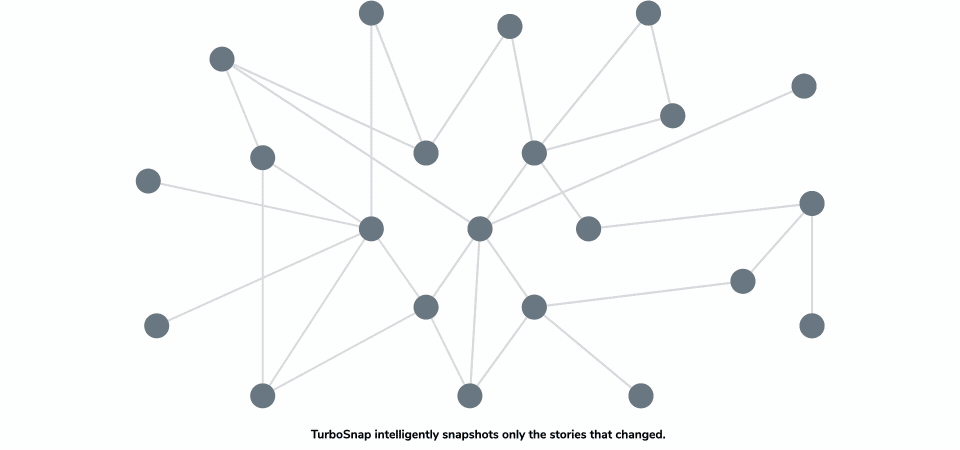

# Introduction to TurboSnap

TurboSnap is an advanced Chromatic feature that speeds up [UI Tests](/docs/test). It analyzes your project's Git history and Webpack's [dependency graph](https://webpack.js.org/concepts/dependency-graph/) to identify which components and their dependencies have changed. It intelligently snapshots only the stories associated with those changes.

## How it works

1. TurboSnap considers the Git changes between the current commit and the [ancestor build's](/docs/branching-and-baselines#find-the-ancestor-builds) commit.
2. Using Webpack's dependency graph, TurboSnap identifies the individual story files affected by those changes.
3. Chromatic utilizes this information to selectively snapshot the stories defined in those specific story files. It also snapshots any tests that were denied on the ancestor build.

Chromatic will not capture a new snapshot for stories that do not have associated code changes. In most cases, this results in faster test runs and reduces the number of billable snapshots.

If you denied any [UI Tests](/docs/test#verify-ui-changes) on the ancestor build, Chromatic will always re-capture those stories even if TurboSnap would otherwise skip them. This is particularly useful for handling [inconsistent snapshots](/docs/snapshots#improve-snapshot-consistency).

### Full rebuilds

Certain code changes have the potential to impact all stories. To avoid false positives, we re-test everything in the following situations:

- Changes to dependency versions in `package.json`, if no valid lockfile is available
- Changes to your Storybook's configuration
- Changes in files that are imported by your [`preview.js`](https://storybook.js.org/docs/react/configure/overview#configure-story-rendering) (as this could affect any story)
- Changes in your static folder (if specified using `--static-dir` / `-s`)
- Changes to files specified by the `--externals` option (see below)
- Re-run of the same build (commit and branch match the ancestor build)
- [Infrastructure upgrades](/docs/infrastructure-upgrades)
- [UI Test in a new browser](/docs/browsers)

### Missing commits (rebasing)

Under the hood, TurboSnap works by calculating the difference between the current commit and its ancestor. However, there are certain cases (i.e., rebasing, force pushing) where the commit linked to the previous build no longer exists in the repository, which prevents Chromatic from doing this computation accurately.

In this case, it will search the existing builds until it finds a suitable "replacement build" with a valid commit in the repository. Once found, it approximates the difference between the two commits alongside any UI changes. This can lead to a story being re-tested if one of the following requirements is met:

- Code changes detected (according to Git) between the current and replacement commit
- Visual changes identified (according to Chromatic) between the ancestor build and the replacement commit's build

## Pricing

When TurboSnap is enabled, Chromatic performs a check to determine if there are any code changes that could affect a story. If no changes are detected, it avoids spinning up cloud browsers to capture a new snapshot. Instead, it reuses the existing snapshot, which we refer to as **TurboSnaps**.

TurboSnaps not only speed up the test runs, they also require less infrastructure resources. We pass these savings on to you by billing TurboSnaps at only 1/5th of the cost of a regular snapshot. That's 80% savings.

For example, consider a Storybook with 50 stories. If your code changes impact 10 stories, Chromatic will capture new snapshots for those 10 stories. The cost of that build will be 18 snapshots:

- 10 regular snapshots
- 40 TurboSnaps (which cost: .2 x 40 = 8 regular snapshots)

Check out the [billing docs](/docs/billing#snapshots-with-turbosnap-enabled) for more details.
