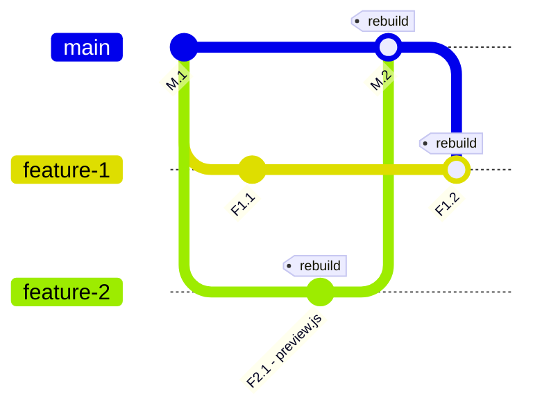
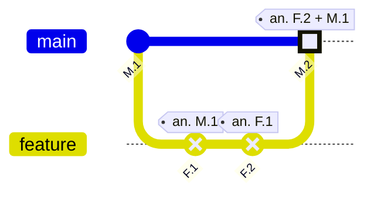
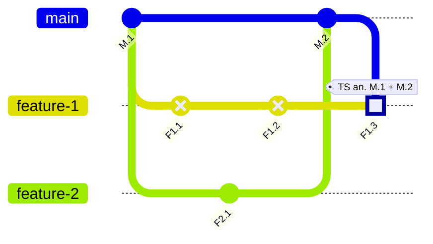

# Introduction to TurboSnap

TurboSnap is an advanced Chromatic feature that speeds up [UI Tests](/docs#test-how-uis-look--function). It analyzes your project's Git history and Webpack's [dependency graph](https://webpack.js.org/concepts/dependency-graph/) to identify which components and their dependencies have changed. It intelligently snapshots only the stories associated with those changes. For the rest, it copies over the snapshots from baselines that didn't change.

<video autoPlay muted playsInline loop>
  <source src="/docs/assets/turbosnap-dep-tracking.mp4" type="video/mp4" />
</video>

## How it works

1. Chromatic determines the [ancestor builds](/docs/branching-and-baselines#find-the-ancestor-builds) associated with your commit.
2. TurboSnap considers the git changes between the current commit and the ancestor build's commit. If more than one ancestor build is found, TurboSnap considers the union of the git changes.
3. Using the dependency graph generated by Webpack or Vite, TurboSnap identifies the individual story files affected by those git-identified changes.
4. Chromatic utilizes this information to selectively snapshot the stories defined in those specific story files. It also snapshots any tests that were denied on the ancestor build.

Chromatic will not capture a new snapshot for stories that do not have associated code changes. In most cases, this results in faster test runs and reduces the number of billable snapshots.

If you denied any [UI Tests](/docs/quickstart#4-review-changes) on the ancestor build, Chromatic will always re-capture those stories even if TurboSnap would otherwise skip them. This is particularly useful for handling [inconsistent snapshots](/docs/snapshots#improve-snapshot-consistency).

### Full rebuilds

Certain code changes have the potential to impact all stories. To avoid false positives, we re-test everything in the following situations:

- Changes to dependency versions in `package.json`, if no valid lockfile is available
- Changes to your Storybook's configuration
- Changes in files that are imported by your [`preview.js`](https://storybook.js.org/docs/configure#configure-story-rendering) (as this could affect any story)
- Changes in your static folder (if specified using `--static-dir` / `-s`)
- Changes to files specified by the `--externals` option (see below)
- Re-run of the same build (commit and branch match the ancestor build)
- [Infrastructure upgrades](/docs/infrastructure-upgrades)
- [UI Test in a new browser](/docs/browsers)

How can I reduce the frequency of full rebuilds?

1. Check your `preview.js` file: you may have a global decorator configured that's [imported from an index or barrel file](/docs/turbosnap/troubleshooting#why-are-changes-not-being-detected-correctly), which itself imports a bunch of other files. This can lead to _all_ stories depending on a large swath of seemingly unrelated files.  
   Whenever a global Storybook file changes, we run a complete build because global Storybook files can change how _any_ story renders. If any of those files or their imports change, we will trace them as dependent changes. If the file changes are frequent, you can utilize `--untraced` on these files to help ensure you're not triggering a complete rebuild each time the file changes.

Learn more about [how to avoid re-testing for certain files](/docs/turbosnap/setup#avoid-re-testing-dependent-stories-when-certain-files-changed).

2. Make sure you have a valid lockfile(s) available and that it's in sync with your `package.json`. If a lockfile is missing or out ouf sync with `package.json`, we'll have to re-test all stories when there are any changes to either file.

Learn more about how to [avoid re-testing on changes to package control files](/docs/turbosnap/setup#avoid-re-testing-on-changes-to-package-control-files).

### Merge commits

Ordinarily, TurboSnap uses git to find all files that have changed since the [ancestor build](/docs/branching-and-baselines#find-the-ancestor-builds) to determine which components/stories to snapshot. The changed file behavior is more complex with merge commits because there are two “ancestor builds”.

When you have a merge commit, we look at both ancestors tied to a build and pull any changes from either build. Chromatic considers **any file that has changed since either ancestor’s commit** to decide if a story needs to be re-snapshotted. In other words, we take the _union_ of the git changes and not an intersection of them.

The reason for this behavior relates to what Chromatic does when it chooses not to re-snapshot a story. In such case, it “copies” the snapshot for the story from one of the ancestor builds, knowing (due to the git check) that the story cannot have changed in the meantime.

In the case of merge commits, TurboSnap does not know ahead of time which side of the merge the snapshot might be copied from because that involves running the [complete baseline selection](/docs/branching-and-baselines#calculate-a-snapshot-baseline-from-the-ancestor-builds) process. Since the baseline selection occurs post-TurboSnap, we need to be conservative and allow for changes on either branch. Otherwise, we may miss snapshot comparisons by copying from the wrong branch.

Why is my rebase/squash/merge commit triggering a full rebuild or listing changes from previous commits?

When there is more than one ancestor, TurboSnap needs to consider the possible changes triggered by either ancestor. This can lead to situations where we need to retest everything or more stories than you were expecting, even if your branch itself is simple.

Let's take a look at an example to understand how a merge impacts the changes TurboSnap considers.

Suppose an update was made to `preview.js` on the `feature-2` branch, causing TurboSnap to trigger a full rebuild on build `F2.1`. This is expected, since changes to `preview.js` require us to retest everything.

The changes from `feature-2` are then merged into the `main` branch in build `M.2`, which now has ancestors from both sides of the merge - `M.1` from `main` and `F2.1` from `feature-2`. The diff between both these ancestors and `M.2` contains the changes to `preview.js`, triggering a full rebuild.

Let's say we want to update `feature-1` to merge in the changes that were made on `feature-2`. When we merge the changes from `main` into `feature-1` on build `F1.2`, we trigger another full rebuild. Similarly to the previous build, the diff between `F1.2` and the ancestor builds (`F1.1` and `M.2`) includes the change to `preview.js` that was introduced on `feature-2` and merged in build `M.2`.

Since we don't know if the baseline that gets calculated will be taken from `F1.1` or `M.2`, we take from both sides which can lead to merges involving more updates than expected. For example, if it's taken from `F1.1`, the baseline won't have the changes from `preview.js`, and so could be affected. For this reason, we retest all stories in the union of git changes from both sides of a merge, and will do a full rebuild if the change triggers one.

This same logic applies even if the change doesn't trigger a rebuild. If we were to imagine the change in `F2.1` was a change to `MyComponent.jsx`, we can assume that `MyComponent.stories.jsx` would be tested in builds `F2.1`, `M.2`, and `F1.2`. While this is less impactful, it's worth noting since this can make a noticeable difference if a lot of files were changed.

### Missing commits (rebasing)

Under the hood, TurboSnap works by calculating the difference between the current commit and its ancestors. We get the ancestor builds for the current Chromatic build using the git history related to a current commit `SHA1`. We calculate the ancestor builds by utilizing various `git rev-list` commands to determine the ancestor builds related to your current commit.

There are certain cases (i.e., rebasing, squashing, force pushing) where the commit linked to the previous build for the branch no longer exists in the repository, which prevents TurboSnap from doing this computation accurately. In these cases, TurboSnap will traverse your repository's git history until a "replacement build" is found with valid commit history.

Once found, it uses the replacement build to approximate the difference between the two commits alongside any UI changes. This can lead to a story being re-tested if one of the following requirements is met:

- Git indicates code changes detected between the current and replacement commit
- Chromatic detects visual changes identified between the ancestor build and the replacement commit's build

Why do I end up with more than one ancestor build when I rebase?

We treat rebases like merges in this regard, since we want to bring baselines across from both sides of the "merge". This way, we don't lose baselines that you've accepted.

Let's take a look at an example to illustrate the logic behind why Chromatic takes an ancestor from each side of your rebase.

Suppose you were to make and accept some changes on `Build F.1`.

After you're done making changes to your `feature` branch, you rebase the changes onto your `main` branch - essentially, rebasing `Build F.2`'s commit onto `Build M.2`'s commit. When you do this, those changes from `Build F.1` are going to come over, so you likely want to bring the new baselines over, too. Otherwise, you'll need to re-accept the changes every time you rebase a branch.

Since we take baselines from ancestor builds, this means that we need to use `Build F.2` as an ancestor for `Build M.2` in order to track the baseline correctly.

Since most folks want to preserve their branch's baseline history, we do this as the default and have a flag available for anyone who wants to ignore the baselines for the last build on a branch (`ignoreLastBuildOnBranch`). Usually, you would only use this option in rare cases where you were doing the rebase in order to _delete_ the baseline changes for the branch.

How does Chromatic determine the ancestor builds for squash/rebase when commits are no longer in the repo?

We use information about the branch from git, along with the last Chromatic build on the rebased/squashed branch, to determine the ancestor build for the missing commit.

- When you are rebasing a branch off your `main` branch, we can find the last build that ran on the branch before the rebase and use that as an ancestor build.
- When you're squash/rebase merging, we can query GitHub, GitLab, or Bitbucket to find out the branch that was just merged, and again use the last build on the branch as an ancestor build.

How does TurboSnap operate when a commit tied to an ancestor build is no longer in the repo?

TurboSnap traverses your git history in order to identify what files have been changed between commits. When you squash/rebase, TurboSnap is prevented from accurately computing the difference between the current commit and its ancestor builds.

This is because the last Chromatic build on your rebased/squashed branch will not have a matching commit in your git history. The previous commit is removed from your git history, leading TurboSnap to being unable to find the commit.

TurboSnap will search for a "replacement build" on the branch with a valid commit in the repo, and use the replacement to approximate the difference between the two commits alongside any visual changes.

Let's take a look at an example to understand the ancestor selection logic TurboSnap uses when the commit tied to the previous build on the branch is no longer in your git history.

In this example, let's say you're working on `feature-1`. There are changes from `feature-2` that were merged into `main`, so you rebase those changes onto your `feature-1` branch on `Build F1.3`.

TurboSnap is attempting to find an ancestor build for each side of your rebase on `Build F1.3`. For the `main` branch, TurboSnap is able to find the commit belonging to `Build M.2` since it is the commit rebased onto `Build F1.3`.

Things get a little more complicated when TurboSnap tries to locate the commit for the last build on `feature` branch (`Build F1.2`) - the commit no longer exists in your git history. TurboSnap then traverses your git history until a replacement build is found with a valid commit, which is `Build M.1` in our example.

## Pricing

  👀 Snapshots skipped by flags
  [`OnlyStoryNames`](/docs/configure#onlystorynames) and
  [`OnlyStoryFiles`](/docs/configure#onlystoryfiles) are charged as TurboSnaps.

By enabling TurboSnap, Chromatic performs a check to identify stories that have no code changes associated with them. Instead of capturing new snapshots, it duplicates snapshots from existing baselines in such cases. We refer to these duplicated snapshots as **TurboSnaps**.

TurboSnaps not only speed up the test runs, they also require less infrastructure resources. We pass these savings on to you by billing them at 1/5th of the cost of a regular snapshot.

For the remaining stories, Chromatic captures new snapshots as usual and bills them at the regular rate.

For example, consider a Storybook with 50 stories. If your code changes impact 10 stories, Chromatic will capture new snapshots for those 10 stories. The cost of that build will be 18 snapshots:

- 10 regular snapshots
- 40 TurboSnaps (which cost: .2 x 40 = 8 regular snapshots)

Check out the [billing docs](/docs/billing#snapshots-with-turbosnap-enabled) for more details.
