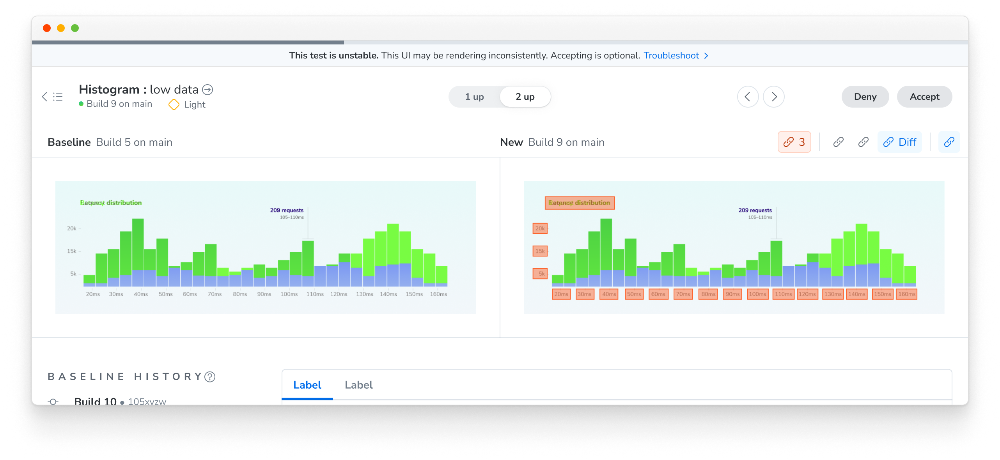

<!-- TODO: Before merging, re-verify every quoted UI string (menu items, section headers, banners) against the shipped app. -->

# Flake Filter

[Unstable tests](/docs/unstable-tests) add a lot of noise to the review process because they fail intermittently without any change to your code.

Flake Filter automatically detects and ignores unstable tests so they don’t require approval or block your build. You can also manually ignore a test to unblock a build without accepting unexpected changes.

A build passes when every other test is passed or accepted.

## Auto-ignored unstable tests

When Chromatic [detects that a test is unstable](/docs/unstable-tests#multiple-snapshots-to-detect-unstable-tests), it ignores that test automatically.

On the build page, actual changes show up top while ignored tests are grouped separately in a collapsed section below.

On the test page, an unstable test has an eyebrow indicating the test is unstable.

## Manually ignore a test

Sometimes a _stable_ test shows a change you're not ready to deal with, for example: an unexpected diff from an unrelated commit, or a new story that isn't ready for review. Ignoring it gets your build passing while you deal with the change later.

To ignore a test, open the context menu on the test's page and select **Ignore this test on this build**.

<!-- TODO(verify): exact menu item copy against the shipped UI -->
<!-- TODO(screenshot): Context (ellipsis) menu showing the ignore action -->

If you change your mind, you can un-ignore the test to return it to the unreviewed state on the same build.

<!-- TODO(screenshot): A manually ignored test showing the undo affordance -->

## Ignores don't persist across builds

Ignoring is scoped to a single build. Auto-ignoring is re-evaluated on every build, so when a test stops flaking, it returns to normal on the next build automatically. Similarly, a manually ignored test is captured and compared as usual on future builds.

Ignoring a test also doesn't affect your [baselines](/docs/branching-and-baselines) unless you take action to accept or deny it, and it doesn't surface changes in the [UI Review](/docs/review) workflow.

## Frequently asked questions

Do ignored tests count toward my snapshot usage?

Yes. Chromatic has to capture a test to determine whether it's stable, so ignored tests still count toward your snapshot usage. However, even when Chromatic [captures a test multiple times](/docs/unstable-tests#multiple-snapshots-to-detect-unstable-tests) to detect instability, you are only billed for one snapshot per test.

Can I turn off auto-ignoring for unstable tests?

No. Unstable tests are ignored automatically on every build. If you'd rather resolve the instability itself, use the attached trace to find the root cause. See [Troubleshooting Snapshots](/docs/troubleshooting-snapshots#improve-snapshot-consistency) for common causes and fixes.

