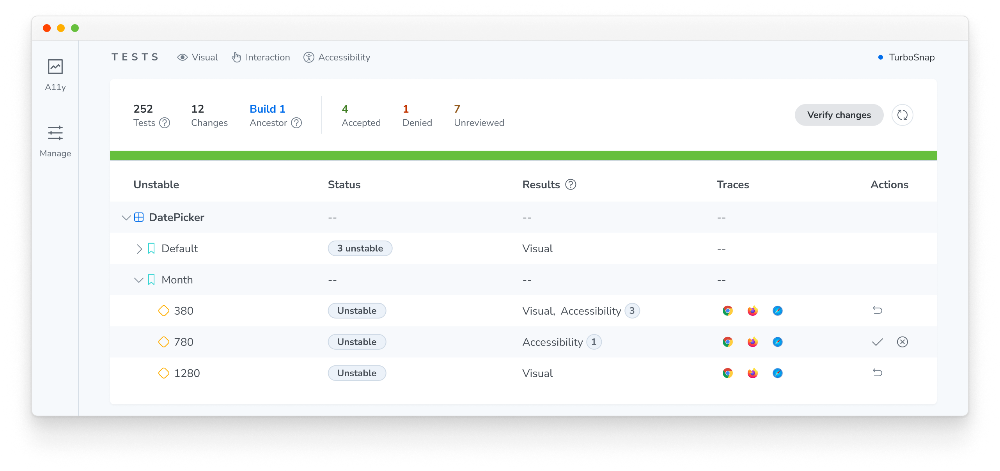
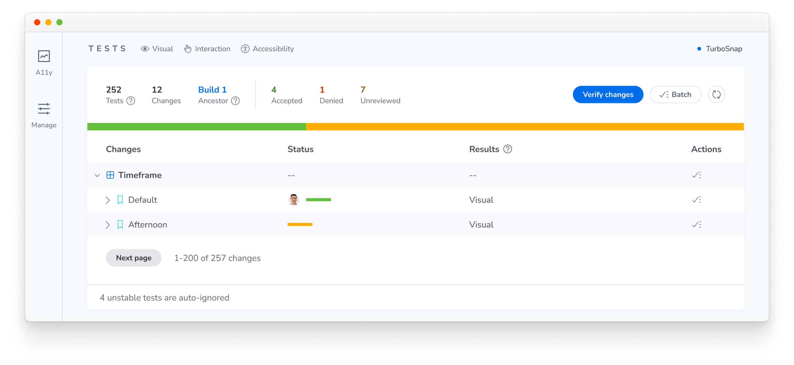

# Flake filter

Flaky tests fail intermittently because they render differently on each test run without any change to your code. This might be because of an animation caught mid-frame, a font that loads late, randomized or dynamic data, a network request that doesn't finish in time, etc.

Flake filter detects such tests automatically, labeling them as **Unstable**, and automatically ignoring them so they don't block your build. Chromatic also records a [trace](#fix-unstable-tests) of the rendering session so you can diagnose the root cause without re-running the build.

## How it works

Chromatic verifies every visual change by rendering a test multiple times to evaluate whether it's a genuine change, a transient flake, or an unstable test. Under the hood, a single test may be rendered two or three times, but you’re billed only one snapshot per test.

How does Chromatic decide a test is unstable?

When Chromatic detects that a test is unstable, it ignores that test automatically so it doesn't require an approval for the build to pass. On the build page, actual changes show up top while ignored tests are grouped separately in a collapsed section below.

Need to park the changes on a _stable_ test? You can also [ignore tests](/docs/ignore-tests) on a build.

### Auto-ignores don't persist across builds

Auto-ignoring is scoped to a single build and re-evaluated on every build, so when a test stops flaking, it returns to normal on the next build automatically. Ignoring a test also doesn't affect your [baselines](/docs/branching-and-baselines) unless you take action to accept or deny it, and it doesn't surface changes in the [UI Review](/docs/review) workflow.

## Fix unstable tests

Instability is a signal that a test needs attention. To help you diagnose it, every unstable test includes a [Playwright trace](https://playwright.dev/docs/trace-viewer) recorded during the snapshot process.

The trace includes network requests, console logs, and DOM snapshots from the test run, giving you the information you need to pinpoint why the test rendered inconsistently. Learn how to read a trace in [Debug snapshots with the trace viewer](/docs/trace-viewer).

Once you've identified the cause, the [Troubleshooting unstable tests](/docs/troubleshooting-snapshots) page covers common fixes, such as pausing animations, preloading fonts, and seeding randomness.

## Frequently asked questions

Do ignored tests count toward my snapshot usage?

Yes. Chromatic has to capture a test to determine whether it's stable, so ignored tests still count toward your snapshot usage. However, even when Chromatic [captures a test multiple times](#how-it-works) to detect instability, you are only billed for one snapshot per test.

Can I turn off auto-ignoring for unstable tests?

Yes. You can turn off auto-ignoring for unstable tests in your project settings.

