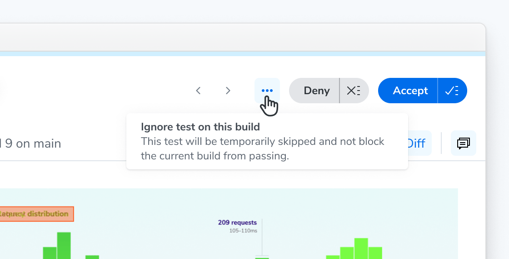
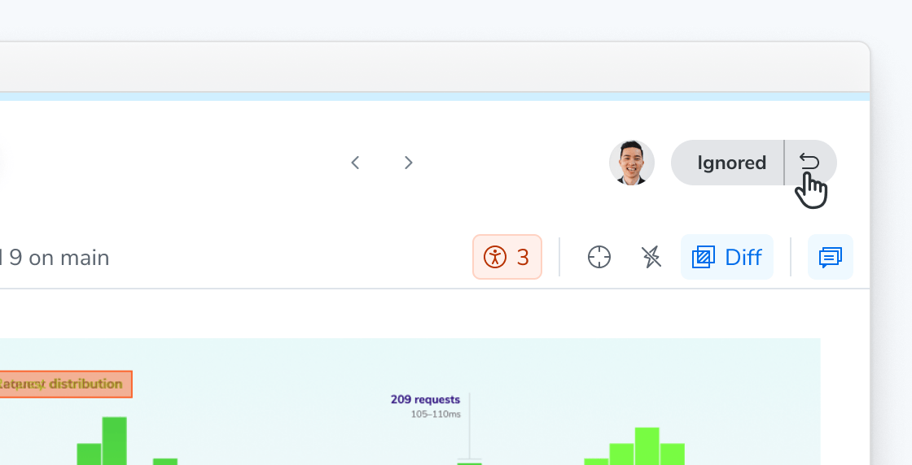

# Ignore tests

Sometimes a _stable_ test shows a change you're not ready to deal with, for example: an unexpected diff from an unrelated commit, or a new story that isn't ready for review. Ignoring it gets your build passing while you deal with the change later.

Looking for a different kind of ignore? [Flake Filter](/docs/flake-filter) automatically ignores unstable tests. You can also [ignore specific elements](/docs/ignoring-elements) within a snapshot, or [disable snapshots](/docs/disable-snapshots) for tests you never want captured.

To ignore a test, open the context menu on the test's page and select **Ignore this test on this build**.

If you change your mind, you can un-ignore the test to return it to the unreviewed state on the same build.

## Ignores don't persist across builds

Ignoring is scoped to a single build: an ignored test is captured and compared as usual on future builds. Ignoring a test also doesn't affect your [baselines](/docs/branching-and-baselines) unless you take action to accept or deny it, and it doesn't surface changes in the [UI Review](/docs/review) workflow.
