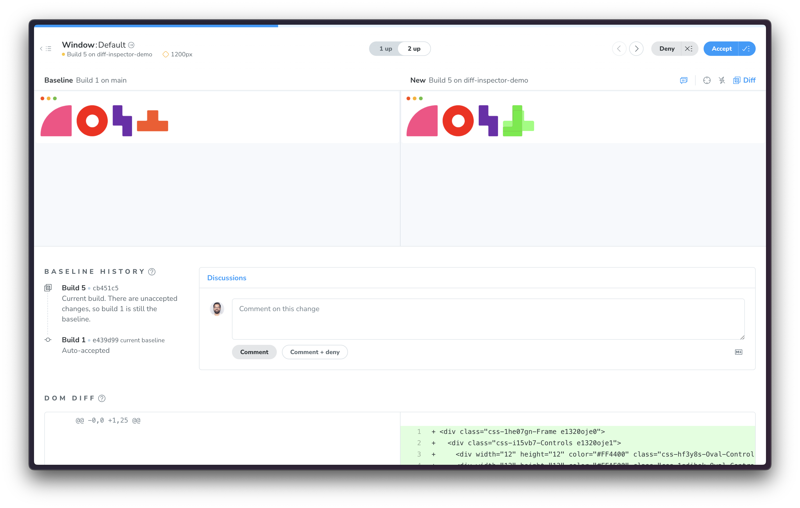

import IntegrationSnippets from "../../components/IntegrationSnippets.astro";

# Analyzing visual changes with Chromatic's Diff Inspector

Diff Inspector is a tool in the Chromatic web app that helps you see what visually changed between the test baseline and the new snapshot. Changed areas are automatically highlighted in neon green for immediate visibility.



## Diff view options

Chromatic offers flexible ways to analyze visual changes:

- **Unified view (1 Up):** See changes directly overlaid on top of your baseline for a focused comparison.
- **Split view (2 Up):** Compare your baseline and new snapshot side-by-side, with changes clearly highlighted in the new version.

<video autoPlay muted playsInline loop width="542px" style="margin-bottom: 1em">
  <source src="/docs/assets/1up-2up.mp4" type="video/mp4" />
</video>

## Emphasize subtle changes

Sometimes it can be tough to see subtle UI differences. For example, you might miss tweaks to properties like border-radius and font rendering. Chromatic offers two additional modes to help you pinpoint small UI changes faster.

### Diff strobing

Diff strobing, a.k.a, _party mode_, emphasizes the highlight even more by quickly toggling between the baseline and the new snapshot.


### Autofocus

Focus mode is designed to save you valuable time by spotlighting minor changes. For maximum convenience, focus mode activates automatically when it senses minimal pixel variations.


### Zoom-in

When in focus mode, hover over the new snapshot to activate a magnifying glass. This zooms into the snapshot diff to help you see the change in greater detail.


## Configure diffing behavior

### Adjust threshold for changes

Customize how Chromatic identifies visual changes by adjusting the `diffThreshold` configuration option. The default setting strikes a balance between accuracy and minimizing false positives caused by minor rendering variations. Tailor this threshold to your specific component or library's needs.

[Learn more about diff threshold »](/docs/threshold)

{/* prettier-ignore-start */}

<IntegrationSnippets>
  <Fragment slot="storybook">
    ```ts title="MyComponent.stories.ts|tsx"

    // Replace your-framework with the framework you are using (e.g., nextjs, vue3-vite)
    import type { Meta, StoryObj } from "@storybook/your-framework";

    import { MyComponent } from "./MyComponent";

    const meta = {
      component: MyComponent,
      title: "MyComponent",
    } satisfies Meta<typeof MyComponent>;

    export default meta;
    type Story = StoryObj<typeof meta>;

    export const StoryName: Story = {
      args: {
        with: "props",
      },
      parameters: {
        // Sets the diffThreshold for 0.2 for a specific story.
        chromatic: { diffThreshold: 0.2 },
      },
    };
    ```
  </Fragment>
  <Fragment slot="playwright">
    ```js title="tests/mytest.spec.js"
    test.describe("some block", () => {
      // 👇 your option overrides
      test.use({ diffThreshold: 0.2 });

      test("some test", async ({ page }) => {
        await page.goto("https://some-url.com");
        // ... your test code
      });
    });
    ```
  </Fragment>
  <Fragment slot="cypress">
    ```js title="cypress/e2e/some-test.cy.js|ts"
    it("A test that does something", {
      env: { diffThreshold: 0.2 }
    }, () => {
      cy.visit("https://some-url.com");
      // ... your test code
    });
    ```
  </Fragment>
</IntegrationSnippets>

{/* prettier-ignore-end */}

### Ignored regions

You can configure Chromatic to ignore changes in certain parts of a snapshot by attaching the `chromatic-ignore` as a class or a data attribute to DOM elements. These ignored regions can then be easily highlighted within the Diff Inspector.

[Learn more about ignoring elements »](/docs/ignoring-elements)

<video autoPlay muted playsInline loop width="542px" style="margin-bottom: 1em">
  <source src="/docs/assets/ignored-regions.mp4" type="video/mp4" />
</video>
