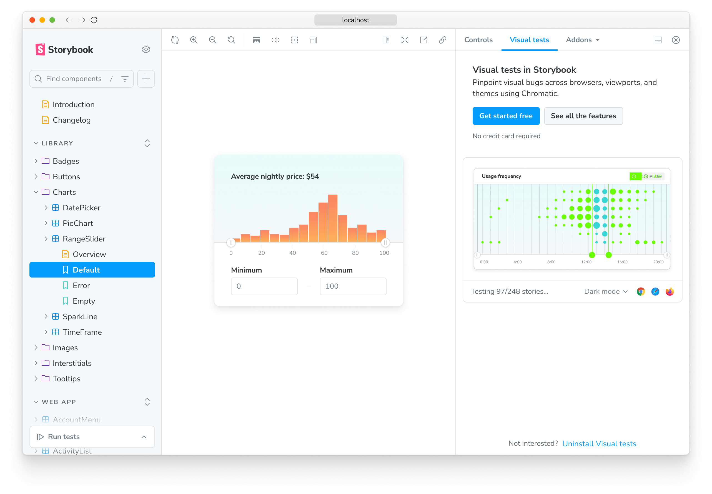
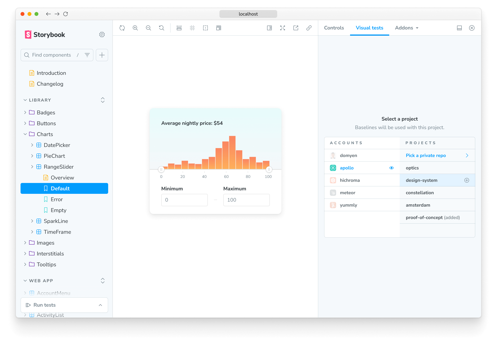
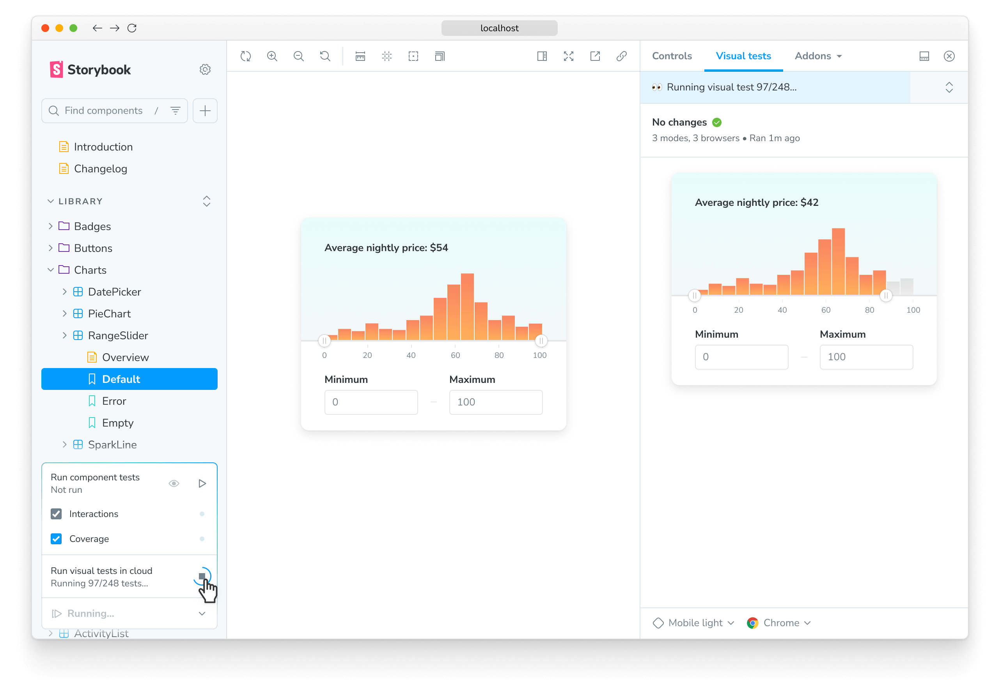
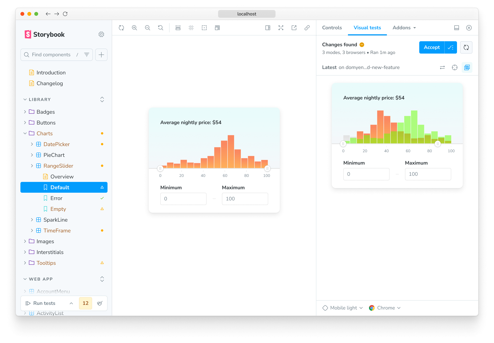
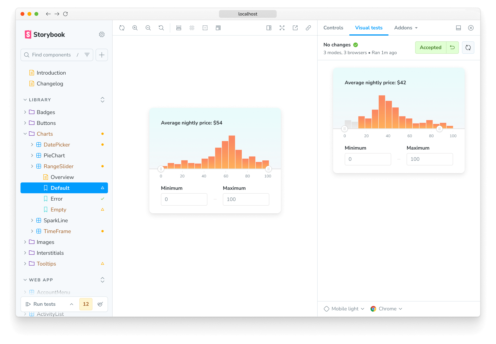

import InstallSnippets from "../../components/InstallSnippets.astro";
import { YouTubeCallout } from "../../components/YouTubeCallout";

# Visual Tests addon for Storybook

Pinpoint visual bugs in local development without leaving Storybook.

## Set up Visual Tests Addon for Storybook

Visual Tests Addon ensures that the dev-to-test feedback loop is as fast as possible by allowing you to run visual tests on demand. It lets you uncover visual bugs in local development without leaving Storybook.

<YouTubeCallout
  client:load
  id="7KPqS9Rvo84"
  summary="Visual test addon workflow"
/>

### 1. Install the addon

Add visual tests to your project by installing `@chromatic-com/storybook`:

{/* prettier-ignore-start */}

<InstallSnippets>
  <Fragment slot="npm">
  ```shell
  $ npx storybook@latest add @chromatic-com/storybook
  ```
  </Fragment>
  <Fragment slot="yarn">
  ```shell
  $ yarn dlx storybook@latest add @chromatic-com/storybook
  ```
  </Fragment>
  <Fragment slot="pnpm">
  ```shell
  $ pnpm dlx storybook@latest add @chromatic-com/storybook
  ```
  </Fragment>
</InstallSnippets>

{/* prettier-ignore-end */}

<div class="aside">

Storybook 7.6 and higher required. Read the [migration guide](https://storybook.js.org/docs/releases/migration-guide) for help migrating Storybook versions.

</div>

When you start Storybook, you'll see a new addon panel for Visual Tests where you can run tests and view results.



<div class="aside">

🤖 **Need help or more customization?**<br/>
If you're experiencing issues with the `storybook@latest add` command or want to explore advanced configuration for the Visual Tests addon, be sure to check the [Storybook documentation »](https://storybook.js.org/docs/writing-tests/visual-testing)

</div>

### 2. Authenticate

Sign in to Chromatic to create a new project or link an existing project.

You’ll see a list of available projects that you have access to. Select a project to finish the setup. The addon will automatically adjust the configuration file, add the necessary project identifiers, and retrieve any existing baselines if available.

Select a project from your project list to finish setup. If you're setting up the addon for the first time, the configuration files and necessary project identifiers will be added for you automatically.



### 3. Run tests

Click the ▶️ Play button in the Storybook sidebar to run visual tests. This will send your stories to the cloud to take snapshots and detect visual changes.



### 4. Review changes

If there are visual changes in your stories, they will be 🟡 highlighted in the sidebar. Click the story and go to the Visual Tests addon panel to see which pixels changed.

If the changes are intentional, ✅ accept them as baselines locally. If the changes aren't intentional, fix the story and rerun the tests using the ▶️ Play button.



### 5. Chromatic automatically syncs baselines to the cloud

When you accept changes in the addon, your baselines automatically sync to the cloud. Your local-only baselines will graduate to standard baselines.

What that means:

- These baselines will be available for anyone who checks out your branch.
- [TurboSnap](/docs/turbosnap) will skip the stories that haven’t changed.
- Tests with accepted baselines don't need to be rerun or reviewed again, speeding up your pull request process.



---

## Addon configuration options

Chromatic is configured using the [`./chromatic.config.json`](/docs/cli#chromatic-config-file) file. By default, the recommended configuration for most projects is already applied. You can also customize the default behavior and provide additional options for full control.

The shortlist of options that are addon-specific are below. View the full list of [options](/docs/configure#options).

| Option            | Description                                                                                                                  |
| ----------------- | ---------------------------------------------------------------------------------------------------------------------------- |
| `projectId`       | Automatically configured. Sets the value for the project identifier <br/> `"projectId": "Project:64cbcde96f99841e8b007d75"`  |
| `buildScriptName` | Defines the custom Storybook build script <br/> `"buildScriptName": "deploy-storybook"`                                      |
| `debug`           | Output verbose debugging information to the console <br/> `"debug": true`                                                    |
| `zip`             | Recommended for large projects. Configures the addon to deploy your Storybook to Chromatic as a zip file <br/> `"zip": true` |

```json title="./chromatic.config.json"
{
  "projectId": "Project:64cbcde96f99841e8b007d75",
  "buildScriptName": "deploy-storybook",
  "debug": true,
  "zip": true
}
```

<details>
<summary >Custom addon config files & environments</summary>

If you have separate config for different environments, use `configFile` to specify which file to load. Here's how you'd apply one config for `development` and another for `production`.

```ts title=".storybook/main.ts"
// Replace your-framework with the framework you are using (e.g., react-webpack5, vue3-vite)
import type { StorybookConfig } from "@storybook/your-framework";

const config: StorybookConfig = {
  stories: ["../src/**/*.mdx", "../src/**/*.stories.@(js|jsx|mjs|ts|tsx)"],
  addons: [
    // Other Storybook addons
    {
      name: "@chromatic-com/storybook",
      options: {
        //👇 Loads the configuration file based on the current environment
        configFile:
          process.env.NODE_ENV === "development"
            ? "chromatic.config.json"
            : "production.config.json",
      },
    },
  ],
};
export default config;
```

</details>

---

## Frequently asked questions

<details>
<summary>What are "local" builds and how are they different from builds?</summary>

A build is an automated visual test run. When you set up Chromatic in CI, a build runs every time you push a commit to your repository.

With the addon, you're able to visually test uncommitted code. This is useful when you want to quickly check your work in progress for visual changes. The addon creates local builds to designate ephemeral uncommitted code from normal builds which use committed code. "Local" just means local to you.

Updating baselines in local builds only affects your other local builds on a given branch. This allows you to iterate quickly in development without affecting teammates. When you want to update the baselines with teammates, you commit and push your work, which triggers a normal build via CI.

If the code is the same between your last local build and the normal build triggered by CI, Chromatic will automatically auto-accept baselines in the normal build so that you don't need to review twice. If you have TurboSnap, Chromatic will intelligently test only the stories that changed and copy over snapshots from stories that were unchanged.

</details>

<details>
<summary>What’s the difference between testing with the addon vs. CI?</summary>

The addon allows running tests on-demand to detect bugs earlier in development. It saves time because you don’t have to wait for CI jobs to finish running. But the addon doesn't replace CI, Chromatic still requires CI to do its job.

</details>

<details>
<summary>Why are Doc pages missing in the published Storybook generated by my "local" build?</summary>

By default, [Docs](https://storybook.js.org/docs/writing-docs) are disabled in local builds created by Visual Tests addon.

You can enable Docs by setting the following flags: `disableBlocks`, `disableAutoDocs`, `disableMDXEntries`, and `disableDocgen` to `false` in your `.storybook/main.ts`. Learn more about these flags [here](https://storybook.js.org/docs/api/main-config/main-config-build#test).

```ts title=".storybook/main.ts"
// Replace your-framework with the framework you are using (e.g., react-webpack5, vue3-vite)
import type { StorybookConfig } from "@storybook/your-framework";

const config: StorybookConfig = {
  // ...
  build: {
    test: {
      disableBlocks: false,
      disableAutoDocs: false,
      disableMDXEntries: false,
      disableDocgen: false,
    },
  },
};

export default config;
```

That said, we don't recommend turning Docs on for local builds because this will cause the build time to increase considerably.

</details>

---

## Troubleshooting

<details>
<summary>Running Storybook with the addon enabled throws an error</summary>

When running Storybook with the addon enabled, you may encounter the following error:

```shell
const stringWidth = require('string-width');

Error [ERR_REQUIRE_ESM]: require() of ES Module /my-project/node_modules/string-width/index.js is not supported.
```

This is a [known issue](https://github.com/storybookjs/storybook/issues/22431#issuecomment-1630086092) when using an older version of the Yarn package manager (e.g., version 1.x). To solve this issue, you can upgrade to the latest stable version. However, if you cannot upgrade, adjust your `package.json` file and provide a resolution field to enable the Yarn package manager to install the correct dependencies. In doing so, you may be required to delete your `node_modules` directory and `yarn.lock` file before installing the dependencies again.

```json title="package.json"
{
  "resolutions": {
    "jackspeak": "2.1.1"
  }
}
```

</details>

<details>
<summary>Why am I seeing the "Login Error: Failed to fetch initial project list" error?</summary>

This error typically means Chromatic's Visual Tests Addon cannot retrieve your list of projects during the login or authentication step. Here are the most common causes and how to resolve them:

#### 1. Missing or invalid `chromatic.config.json` file

Ensure your project has a `chromatic.config.json file` in the root directory with a valid `projectId`. Example:

```json title="chromatic.config.json"
{
  "$schema": "https://www.chromatic.com/config-file.schema.json",
  "projectId": "Project:your_project_id_here"
}
```

- This file must be committed to your repository.
- The `projectId` is different from your `projectToken`. It's the number from the Chromatic link.

#### 2. Insufficient GitHub permissions

If Chromatic cannot retrieve your projects, your <b>git provider</b> account may not have the necessary access. Check:

- You granted access to the correctgit provider organization when authorizing Chromatic.
- You're logged in with the same git provider account with access to the target project.
- Try signing in via an incognito or private browser window to avoid caching or token issues.

#### 3. Blocked network requests

If your network blocks requests to Chromatic’s API, the Visual Tests Addon may not work properly. Check your network:

- Confirm you can access `https://www.chromatic.com/api` and `https://index.chromatic.com/graphql` from your browser.
- If you use a corporate <b>proxy</b>, <b>VPN</b>, <b>firewall</b>, or <b>SSL</b> inspection, they might be interfering with the request.

</details>

<details>
<summary>Does the addon affect snapshot usage?</summary>

The Visual Tests addon uses the same [pricing tiers as Chromatic](https://www.chromatic.com/pricing), providing the number of snapshots subscribed to in your plan. If you have any questions about snapshot costs or billing, please contact us <a class="intercom-concierge-bot"><b>via in-app chat</b></a>.

</details>

<details>
<summary id="turbosnap-support">Does the addon support TurboSnap?</summary>

Yes. Visual Tests addon supports TurboSnap via the [`./chromatic.config.json`](/docs/cli#chromatic-config-file) file.

</details>

<details>
<summary>Can I deny a change with the addon?</summary>

No. Denying changes is only available when running builds from CI or the CLI. If you need to, you can revert changes by clicking the ”Unaccept” button in the addon panel.

</details>

<details>
<summary id="git-addon">Do I need Git to run the addon?</summary>

Yes, Visual Tests addon requires Git to track baselines for each story. To use Chromatic, you need to have git initialized in your project repository and have at least one commit.

</details>
