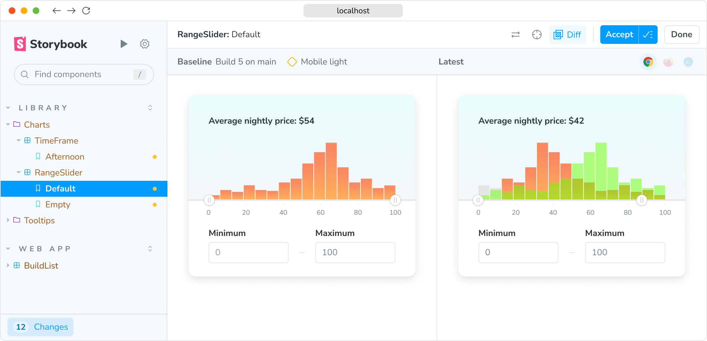
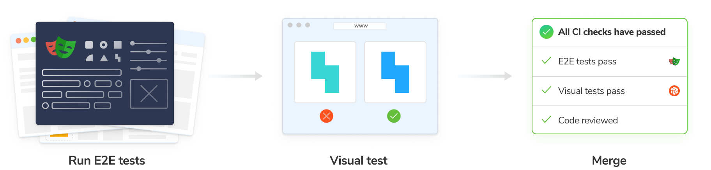

import { YouTubeCallout } from "../../components/YouTubeCallout";

# Visual testing with Chromatic

Visual Tests are a powerful tool for catching visual regressions and ensuring your app functions as expected. They work by capturing [snapshots](/docs/snapshots) of every test within a cloud browser environment. Then, whenever you push code, Chromatic compares your new snapshots to [baseline versions](/docs/branching-and-baselines#whats-a-baseline) to identify visual changes. If changes are detected, you will be prompted to verify that they are intentional or fix any errors.

## Why use visual testing?

Functional UI tests excel at ensuring your app _works_, but they often fail to catch bugs in UI appearance. This is because functional tests don’t validate the pixels rendered by your application UI. Instead, they only verify the logic and behavior of components and pages.

For instance, buggy CSS might hide your app's “checkout” button behind a notification banner. Your [functional test](https://www.chromatic.com/blog/functional-testing/) might indicate that the button is clickable—because, technically, it is, even though it’s now inaccessible to your users. Visual testing catches such bugs and safeguards your app’s user experience.

## How does visual testing work?

You can think of Chromatic’s visual testing as "before-and-after" [snapshots](/docs/snapshots) of your app's interface. You begin by capturing a perfect "before" image—this becomes your [baseline](/docs/branching-and-baselines#whats-a-baseline). After any code changes, Chromatic compares a new "after" snapshot pixel-by-pixel against the baseline, revealing any visual differences.

Chromatic's streamlined workflow involves four steps:

1. **Cloud Rendering:** Chromatic renders your UI components in a cloud-based browser.
2. **Snapshot Capture:** Chromatic takes a snapshot for each test, with all tests running simultaneously to save you time.
3. **Automated diffing:** Whenever you update your code, Chromatic generates new snapshots and compares them to the baselines.
4. **Review and Verification:** When Chromatic detects changes, you’re prompted to review them to ensure they're intentional. Any unexpected changes trigger notifications so you can fix them quickly.

<video
  autoPlay
  muted
  playsInline
  loop
  style="margin-bottom: 1em; border: 1px solid rgba(0,0,0,0.1);"
>
  <source src="/docs/assets/visual-test-hero.mp4" type="video/mp4" />
</video>

## How does Chromatic fit into my stack?

Chromatic leverages your existing setup—configuration, mocking, and tests—to enable visual testing of your application's UI. That means you can verify how UIs look and function simultaneously.

###  Visual testing with Storybook

[Storybook](https://storybook.js.org) is an open source workshop for developing components and pages in isolation. Chromatic is built and maintained by the team behind Storybook, ensuring a seamless integration.

Storybook lets you define the different states and variations of components as [stories](https://storybook.js.org/docs/get-started/whats-a-story). This gives you an ideal setup for functional testing. Attach a [play function](https://storybook.js.org/docs/writing-stories/play-function) to mimic how users interact with your components and include assertions to verify the expected behavior. Chromatic uses these stories to power visual tests.

Chromatic integrates with Storybook via an [addon](https://www.chromatic.com/storybook) to unlock on-demand visual testing right from within your familiar Storybook environment. With a single click, you can run visual checks on all your stories simultaneously. Chromatic runs the tests in the cloud, notifying you directly in Storybook if any component's appearance deviates from expectations. In addition to this local workflow, you can also run these tests in CI.

[**Get started with Storybook & Chromatic »**](/docs/quickstart)

###  Visual testing with Playwright

[Playwright](https://playwright.dev/) is an open source end-to-end (E2E) test runner developed by Microsoft. It verifies key app flows like "sign up" and "add to cart" by driving the browser to simulate user interactions.

Chromatic integrates with Playwright by extending its test and expect utilities. While your Playwright tests run, Chromatic captures an archive of the page (including DOM, styling, and assets) and uploads it to the cloud. There, Chromatic generates snapshots and performs pixel diffing to identify any unintended visual changes.

Playwright offers native visual testing capabilities, but Chromatic's unique snapshot approach and powerful diffing tools provide a more comprehensive testing experience.

[**Get started with Playwright & Chromatic »**](/docs/playwright)

###  Visual testing with Cypress

[Cypress](https://www.cypress.io/) is another popular E2E test runner like Playwright, but it lacks built-in visual testing features. While Cypress tests can verify your app's functionality, they won't detect visual regressions in the interface. This is where Chromatic becomes an essential tool for Cypress users.

Chromatic integrates with Cypress via a plugin. While your Cypress tests execute, Chromatic captures complete archives of your test cases (DOM, styling, and assets) and uploads them to the cloud. There, Chromatic generates snapshots and performs pixel diffing, enabling you to catch any unintended visual changes in your application.

[**Get started with Cypress & Chromatic »**](/docs/cypress)
