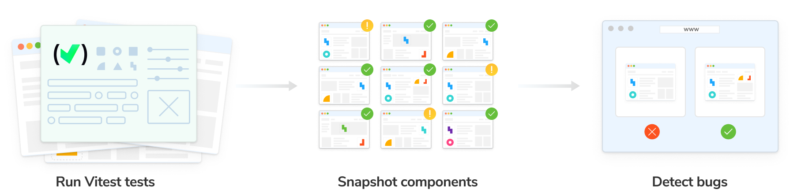
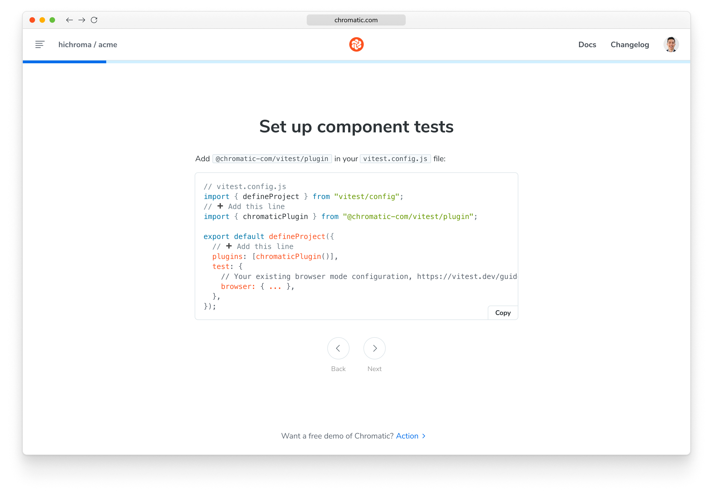
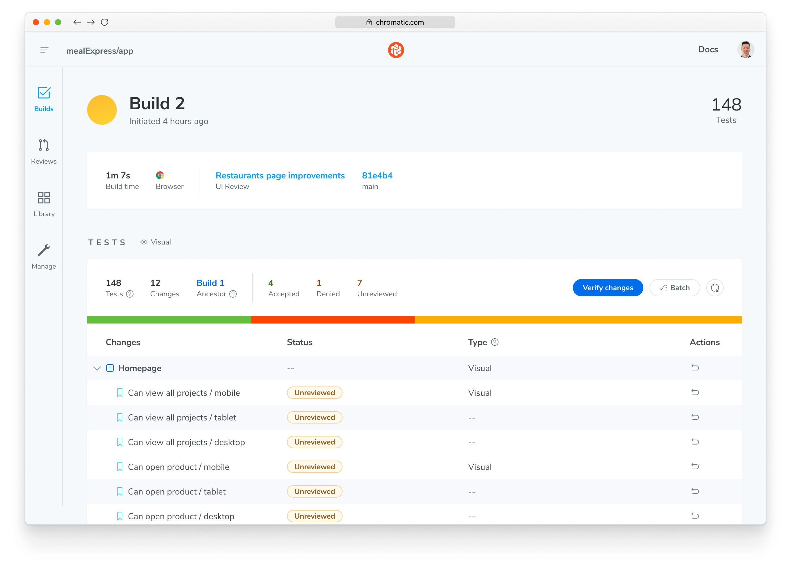
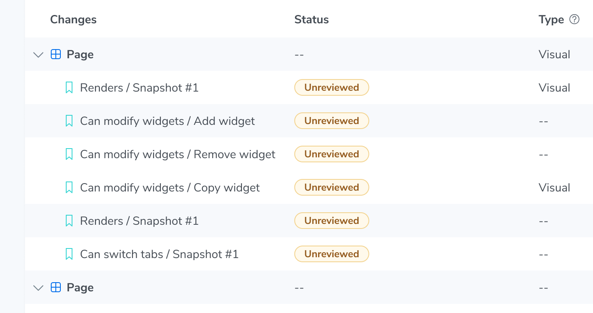
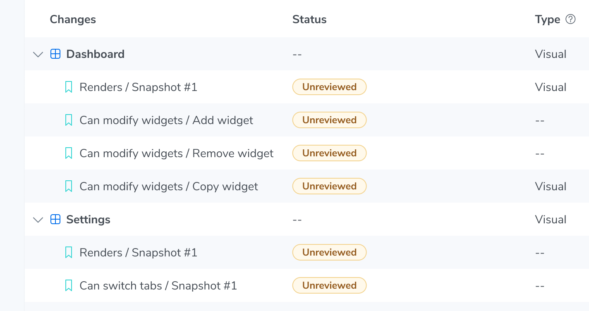
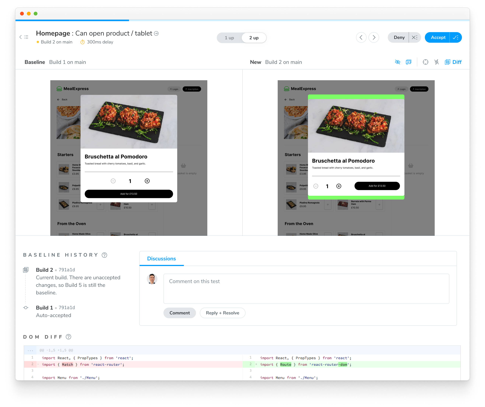
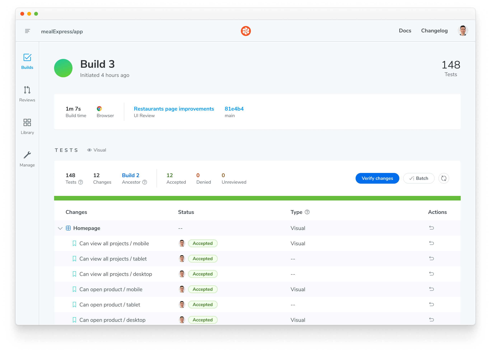

import DemoChromaticUnlinked from '../../shared-snippets/demo-chromatic-unlinked.mdx';
import TroubleshootingSetup from '../../shared-snippets/setup/troubleshooting.mdx';
import RunE2E from '../../shared-snippets/setup/run-e2e.mdx';
import InstallSnippets from '../../components/InstallSnippets.astro';

# Chromatic for Vitest (beta)

Chromatic’s visual tests integrate with Vitest via a plugin. This means you can transform your existing Vitest Browser Mode tests into visual regression tests with a minimal configuration file change. Start capturing interactive snapshots while Vitest tests run, and review visual changes in Chromatic’s cloud environment.



<div class="callout">

🚧 **Early access:** Chromatic for Vitest is currently in early access. If you’re interested in trying it out, [request access here](https://share.hsforms.com/1jy-S7e-8TLWGnI_dT7T9Uwr5etx?ref=chromaticblog.ghost.io&__hstc=243929690.cdaecf856b9dae7a6940d569e83ab885.1777500929046.1780520573197.1780527451431.43&__hssc=243929690.1.1780527451431&__hsfp=38ac06b2498e4056a6274f360c3c04aa).

</div>

## Why visual test with Vitest?

Vitest Browser Mode enables you to write component tests that drive the browser to simulate and verify key user interactions like ‘toggle accordion’ and ‘filter search results’. By snapshotting the UI states generated during your component tests, you can proactively catch visual bugs that might slip through traditional logic-based tests.

## How does Chromatic work?

Chromatic works alongside your Browser Mode component tests. During your test run, Chromatic captures an [**archive**](/docs/faq/what-is-archive#what-is-an-archive) of each test case and uploads it to Chromatic’s cloud. There, Chromatic generates snapshots and performs pixel diffing to identify any unintended visual changes.

### How does Chromatic’s visual testing differ from Vitest’s?

While Vitest offers a basic ability to capture and visually compare screenshots of UI. Chromatic’s difference is that it provides a significantly more robust and developer-friendly visual testing solution:

- **Robustness:** Chromatic captures [archives](/docs/faq/what-is-archive) (including DOM, styling, and assets) of your test cases, which you can debug interactively in the Chromatic app, using browser dev tools. This eliminates the need to run further tests to troubleshoot errors.
- **Workflow:** Chromatic removes the need to manage snapshots locally in your repo. Chromatic’s snapshots are indexed automatically, linked to git commits, and stored in the cloud for easy access.
- **Parallelized testing:** Chromatic's cloud infrastructure automatically scales to run all tests simultaneously, eliminating the need for you to configure multiple workers on your CI.
- **Dedicated review app:** Chromatic offers a suite of visual diffing tools to spot regressions fast. Features include unified and split diffs, highlighting ignored regions, spotlight mode to focus and zoom in on changes, and strobe diff to pinpoint subtle changes.

## Requirements

- Vitest version 4.0.0 and above
- Vitest project must use [@vitest/browser-playwright](https://vitest.dev/config/browser/playwright)

## Set up Chromatic for Vitest

### 1. Sign up and create a new project

Create a Chromatic account and/or sign in with your GitHub, GitLab, Bitbucket, or email. Then reach out to your point of contact at Chromatic to enable Vitest support for your account.

Generate a unique project token for your app by creating a project.

<div class="callout">
  If your repository already has a Chromatic project linked to it, you can create an additional
  Chromatic project to run visual tests with Vitest. Follow the instructions for [sub-projects
  support](/docs/monorepos#run-chromatic-for-each-subproject).
</div>

<DemoChromaticUnlinked />



### 2. Install Chromatic

Install **[`chromatic`](https://www.npmjs.com/package/chromatic)** and **[`@chromatic-com/vitest`](https://www.npmjs.com/package/@chromatic-com/vitest)** packages from npm.

{/* prettier-ignore-start */}

<InstallSnippets>
  <Fragment slot="npm">
  ```shell
  $ npm install --save-dev chromatic @chromatic-com/vitest
  ```
  </Fragment>
  <Fragment slot="yarn">
  ```shell
  $ yarn add --dev chromatic @chromatic-com/vitest
  ```
  </Fragment>
  <Fragment slot="pnpm">
  ```shell
  $ pnpm add --dev chromatic @chromatic-com/vitest
  ```
  </Fragment>
</InstallSnippets>

{/* prettier-ignore-end */}

### 3. Add Chromatic to Vitest tests

Add `chromaticPlugin` in your [Vitest configuration file](https://vitest.dev/config/).

```ts title="vitest.config.ts"
import { defineConfig } from 'vitest/config';
import { playwright } from '@vitest/browser-playwright';
import { chromaticPlugin } from '@chromatic-com/vitest/plugin'; // [!code ++]

export default defineConfig({
  plugins: [chromaticPlugin()], // [!code ++]

  test: {
    // Your existing browser mode configuration, https://vitest.dev/guide/browser/#configuration
    browser: {
      provider: playwright(),
      enabled: true,
      instances: [{ browser: 'chromium' }],
    },
  },
});
```

If you are using browser mode in a single [Vitest project](https://vitest.dev/guide/projects.html), you can apply the plugin on project level:

```ts title="vitest.config.ts"
import { defineConfig } from "vitest/config";
import { chromaticPlugin } from "@chromatic-com/vitest/plugin"; // [!code ++]

export default defineConfig({
  test: {
    projects: [
      {
        test: {
          name: "Unit Tests",
          include: ["**/*.test.ts"],
        },
      },

      // Option 1: For all browser tests
      {
        plugins: [chromaticPlugin()],  // [!code ++]
        test: {
          name: "Browser Tests",
          include: ["**/*.test.tsx"],
          browser: { ... }
        },
      },

      // Option 2: For tests ending with "*.visual.test.tsx" only
      {  // [!code ++]
        plugins: [chromaticPlugin()], // [!code ++]
        test: { // [!code ++]
          name: "Visual Regression", // [!code ++]
          include: ["**/*.visual.test.tsx"], // [!code ++]
          browser: { ... }, // [!code ++]
        }, // [!code ++]
      }, // [!code ++]
    ],
  },
});
```

### 4. Run Vitest

Run your Vitest tests as you normally would.

While your Vitest tests are running, Chromatic captures an [archive](/docs/faq/what-is-archive) of your app’s UI for each test.

{/* prettier-ignore-start */}

<InstallSnippets>
  <Fragment slot="npm">
  ```shell
  $ npx vitest
  ```
  </Fragment>
  <Fragment slot="yarn">
  ```shell
  $ yarn vitest
  ```
  </Fragment>
  <Fragment slot="pnpm">
  ```shell
  $ pnpm vitest
  ```
  </Fragment>
</InstallSnippets>

{/* prettier-ignore-end */}

### 5. Run Chromatic

Use your project token and run the following command in your project directory.

{/* prettier-ignore-start */}

<InstallSnippets>
  <Fragment slot="npm">
  ```shell
  $ npx chromatic --vitest -t=<TOKEN>
  ```
  </Fragment>
  <Fragment slot="yarn">
  ```shell
  $ yarn chromatic --vitest -t=<TOKEN>
  ```
  </Fragment>
  <Fragment slot="pnpm">
  ```shell
  $ pnpm chromatic --vitest -t=<TOKEN>
  ```
  </Fragment>
</InstallSnippets>

{/* prettier-ignore-end */}

<RunE2E type="Vitest" />

### 6. Review changes

When complete, you’ll see the build status and a link to review the changes. Click on that link to open Chromatic.

```shell
✔ Started build 1
  → Continue setup at https://www.chromatic.com/setup?appId=...
✔ Build 1 auto-accepted
  → Tested X stories across 10 components; captured 10 snapshots in 1 minute 3 seconds
```



<details>
<summary id="change-title">How can I change the name of a test?</summary>

By default, the name and surrounding hierarchy of a test in a Chromatic build is generated based on the file path, suite name(s), and test name in Vitest. Sometimes, the file path and component result in a less than helpful display in the build table. For example, you could have test files located at `src/pages/dashboard/Page.test.tsx` and `src/pages/settings/Page.test.tsx`, which would result in both tests being displayed as `Page` in the build table, making it difficult to differentiate between them:



You can customize this name by calling `configure` function from `@chromatic-com/vitest` with the [`title` option](/docs/vitest/configure#test-run-options) in the test file.

```jsx title="src/pages/dashboard/Page.test.tsx"
import { describe, test } from 'vitest';
import { configure } from '@chromatic-com/vitest'; // [!code ++]

import { Page } from './Page';

configure({ title: 'Dashboard' }); // [!code ++]

test('Dashboard', async () => {
  await render(<Page />);
});
```

Which displays like this in the build table:



</details>

The build will be marked “unreviewed” and the changes will be listed in the “Tests” table. Go through each snapshot to review the diff and approve or reject the change.



Once you accept all changes, your build is marked as passed 🟢. This updates the baselines for those tests, ensuring future snapshots are compared against the latest approved version.



---

## Next: enhance your UI Testing workflow

You're building robust components by uncovering bugs during development. Take your testing to the next level and safeguard against visual bugs by automating Chromatic whenever you push code.


[**Integrate Chromatic into your CI pipeline**](/docs/ci) to get notified about any visual changes introduced by a pull request. Chromatic runs test any time you push code and reports changes via the “UI Tests” badge for your pull request.

### Advanced configuration options

Take full control of your Chromatic and Vitest setup to match your team's specific workflows. Here are some powerful customizations we offer:

- [**Take targeted snapshots:**](/docs/vitest/targeted-snapshots) Learn how to programmatically capture snapshots at specific points during your tests.
- [**Fine-tune snapshot capture:**](/docs/vitest/configure#snapshot-options) Add delays before snapshots, modify the sensitivity threshold for change detection, and employ other granular controls.
- [**Test for flexible user preferences:**](/docs/media-features#media-features) Ensure your UI gracefully adapts to user preferences like `forced-colors` and `prefers-reduced-motion`.
- [**Manage sharded Vitest runs:**](/docs/vitest/sharding) If your Vitest test suite is distributed across multiple CI jobs, learn how to coordinate their completion before running Chromatic.

---

## Frequently asked questions

<TroubleshootingSetup />

<details>
<summary id="disable-auto-snapshot">How can I disable automatic snapshots for a test?</summary>

By default, Chromatic captures a snapshot at the end of each test. You can disable this behavior for specific test cases, a suite of tests, test files, or the entire project using the [`disableAutoSnapshot` option](/docs/vitest/configure).

You can also make automatic snapshots opt-in instead of opt-out, by disabling them at the project level and then re-enabling them for specific test files, suites, or test cases.

Regardless of whether a test has automatic snapshots enabled or disabled, you can always capture a snapshot programmatically at any point during the test using the [`takeSnapshot` function](/docs/vitest/targeted-snapshots).

</details>

<details>
<summary id="turbosnap-support">Can I use TurboSnap with Vitest visual tests?</summary>

Yes. TurboSnap is supported. See the [dedicated guide](/docs/vitest/turbosnap) for more information.

</details>

<details>
<summary id="storybook-step">Why is there a `Build your Storybook` step when running Vitest visual tests?</summary>

Chromatic creates and runs a Storybook [archive](/docs/faq/what-is-archive) based on your Vitest project, so the build Storybook step is required. Chromatic doesn't run Vitest directly.

</details>

<details>
<summary id="chrome-browser">Is using `@vitest/browser-playwright` with Chromium based browsers mandatory when running Vitest with Chromatic?</summary>

Yes. Chromatic relies on Chromium for snapshotting, so Chromium based browsers **must** be included in your Vitest configuration.
Omitting it will trigger error: `Failed to run chromatic --vitest`

If you have use case for other browser providers, feel free to [send a feature request](https://github.com/chromaui/chromatic-e2e/issues/new/choose).

Refer to Vitest documentation: [**Vitest | Browser Mode**](https://vitest.dev/guide/browser)

</details>
