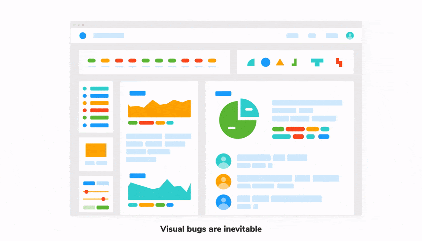

# Before a pull request

Chromatic helps you prepare a pull request by verifying the appearance and functionality of a UI in different browsers, viewports, themes, and more.

TK new diagram for before PR workflow

### Build in Storybook, Playwright, or Cypress

Chromatic reuses your existing stories and end-to-end tests for visual testing.

In Storybook, developers build UI components in isolation using [component-driven development](https://www.componentdriven.org/), a process for building UIs from the “bottom up,” starting with atomic components and ending with pages. This methodology allows you to naturally capture all component states and variations as stories as you flesh out the UI.

Chromatic uses these stories as visual test cases automatically.

Playwright integration

Developers test user flows end-to-end by navigating between pages with Playwright. This methodology allows you to simulate how users behave. Chromatic uses these E2E tests as visual tests cases by automatically snapshotting key moments in the test.

[TK Learn how to setup Playwright](/docs/)

Cypress integration

Developers test user flows end-to-end by navigating between pages with Cypress. This methodology allows you to simulate how users behave. Chromatic uses these E2E tests as visual tests cases by automatically snapshotting key moments in the test.

[TK Learn how to setup Cypress](/docs/)

### 2. Run Chromatic in CI

We recommend [configuring your CI](/docs/ci) to run a Chromatic build whenever you push code. This ensures the published Storybook on Chromatic is up to date and ensures comprehensive coverage for UI Tests and UI Review.

How often should I run Chromatic?

We recommend running Chromatic on every push. This ensures that Chromatic is regularly updating baselines and can catch unintentional changes.

Each snapshot is associated with a commit. That enables you to pinpoint the particular commit where a change was introduced.

It also allows you to [visualize baseline history](/docs/branching-and-baselines#how-do-i-visualize-baseline-history-for-a-story). You can review the commits to see how a component changes over time.

Not running Chromatic on every commit makes it harder to review diffs and increases the risk of missing changes.

Let's say you run Chromatic on a commit. Then skip it for four commits and then rerun it. The Chromatic build for that fifth commit will also include changes from all the previous four commits. That makes it much harder to discern what is an acceptable change vs a UI bug.

How do I budget snapshots?

Our main recommendation is to use Chromatic’s [TurboSnap](/docs/turbosnap#turbosnap) feature. It uses Git and your project’s dependency graph to identify component files that changed, then intelligently builds and snapshots only the stories associated with those components.

This enables you to run Chromatic regularly while reducing the snapshot count per build.

### 3. UI Tests help you catch bugs before opening a pull request

Changes in development are inevitable, and bugs can easily slip in, especially with UIs. A small tweak to the CSS can cause a component or one of its states to break. Even worse, the bug can have a cascading effect cause other components and pages to break.

You use Storybook to isolate UI components, mock their variations, and save the supported test cases as stories. Chromatic then captures a snapshot of each story in a cloud browser for testing.

Chromatic’s [UI tests](/docs/test) are designed to catch visual and interaction bugs.

What are visual bugs?

Visual bugs are the unintentional errors in your UIs appearance that make it look untrustworthy. For example: cut-off elements, incorrect colors or font styles, broken layouts, and missing error states.

What are interaction bugs?

Interaction bugs are unintentional errors in UI behavior that prevents it from working as intended. For example: a dialog doesn't open or a form doesn't respond to typing events.

[Interactive stories combined with assertions](/docs/interactions) enable you to test how components respond to user input. Attach a [play function](https://storybook.js.org/docs/react/writing-stories/play-function) to the story to simulate user behavior (e.g., click and type) and assert against that behavior.

Interaction tests in Chromatic run behind the scenes without you having to configure anything. You'll be notified of any test failures via the Chromatic UI.

These are designated as critical failures that need immediate attention. You won't be able to pass the build until the test is fixed.

To debug, you can launch the published Storybook to reproduce the exact state of your story when the test failed. Click the "View Storybook" button on the test page to open the failed story.

UI Tests are similar to other types of testing (unit, E2E, etc.), in that they enable developers to catch and fix regressions. UI Tests compare the snapshot of a story with the previously accepted [baseline](/docs/branching-and-baselines#whats-a-baseline) in your git history (typically on the same branch). If there are changes, you'll get a diff of the changes. If the changes are intentional, press the accept button to update the baselines.

Once all changes are approved, the UI is considered “ready” and you can move to the UI Review phase.

---

## Next: During pull request

See how Chromatic helps you get feedback, manage change requests, and get stakeholder sign off.

<a class="btn primary round" href="/docs/during-pull-request">Read next chapter</a>
