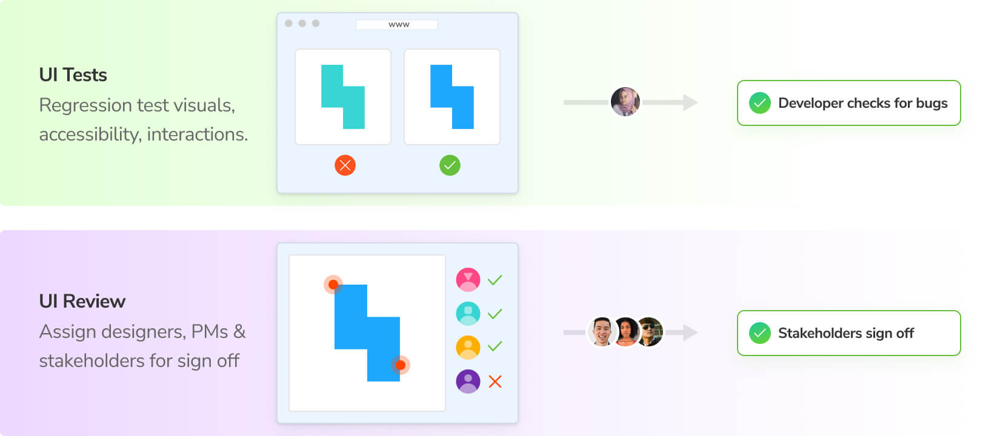
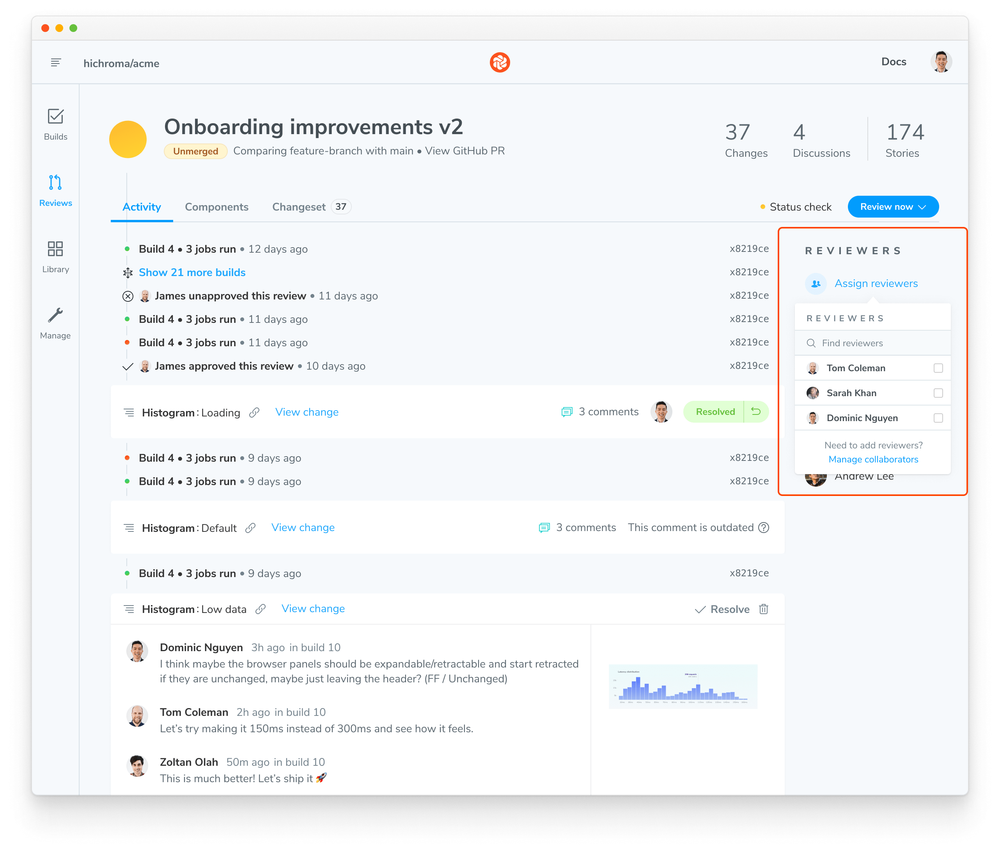

# During pull request

During the pull request, Chromatic runs in CI whenever you push code to prevent bugs and streamline stakeholder sign off. There are two key workflows:

### 1. UI Tests catch bugs automatically

It's easy for bugs to sneak into user interfaces. For example, a small CSS tweak can cause a component or one of its states to break. What's more, a bug can cascade to other components and pages causing them to break too.

Chromatic’s [UI Tests](/docs/test) are designed to prevent visual and functional bugs. UI Tests are similar to other types of testing (unit, E2E, etc.), in that they enable developers to catch and fix regressions before opening a pull request. They run in CI automatically when you push code so you can see the visual impact of code changes while you develop.

TK image of comparison

UI Tests compare the snapshot of a story with the previously accepted [baseline](/docs/branching-and-baselines#whats-a-baseline) in your git history (typically on the same branch). If there are changes, you'll get a diff of the changes. If the changes are intentional, press the accept button to update the baselines. Once all changes are approved, the UI is considered “ready” for review from stakeholders.

### 2. UI Review to get team sign off

In tools like GitHub, GitLab, and Bitbucket you assign other devs to review the code for a pull request. Chromatic complements this workflow by allowing you to assign designers, product managers, and other stakeholders to review UI changes in that pull request.

UI Review is the opportunity to discuss changes and get final team sign off. In the past, teams had to manually click through the UI to review all possible variations. Chromatic's superpower is that it knows exactly which stories have changed. It generates a changeset for reviewers that shows precisely what they need to sign off on.

Shouldn't the edge cases be solved earlier in the product or design spec?

Developers often run into edge cases or technical hurdles that're impossible for teams to predict ahead of time. UI Review acknowledges that even the best plans lack fidelity, and that UI can change between planning and shipping.

How to invite reviewers to a project?

Invite reviewers by going to the project's Manage page » Collaborate tab. You can invite collaborators by email or by sharing an invite link.

[More on inviting collaborators »](/docs/collaborators#external-collaborators)

How to assign designers and product managers to review?

Use the Assign Reviewers link on the PR Activity page to choose reviewers from the project’s collaborators. Reviewers will be emailed a link to the PR screen to begin their review.

How do I track change requests?

Reviewers can request changes to the implementation via the comment box beneath each story. These get aggregated at the bottom of the PR screen’s activity tab. Developers can see a [list of tasks](/docs/review#ui-checklist) which must be completed before UI is ready to merge.

#### Publish and share Storybook for review

During the build process, Chromatic builds and publishes your Storybook to its secure workspace (CDN) accessible to your entire team. It's a shared reference point for your entire team, making cross-discipline collaboration easier. This keeps everyone in sync with the latest UI implementation. No fussing with dependencies, git, or local dev environments.

- [Share permalinks with collaborators](/docs/permalinks#share-permalinks-with-collaborators)
- [Custom domain for published Storybook](/docs/permalinks#custom-domain-for-your-storybook)

### Merge with confidence with PR checks

Chromatic will badge PRs to notify you about publish, test, and review results. Once all checks are complete, you’re ready to merge!

---

## How to get stakeholders involved in review

See how Chromatic works from the reviewer point of view. See how easy it is to keep teams in the loop. Learn about comments, notifications, and integrations with tools like Figma or Slack.

<a class="btn primary round" href="/docs/during-pull-request">Read next chapter</a>
