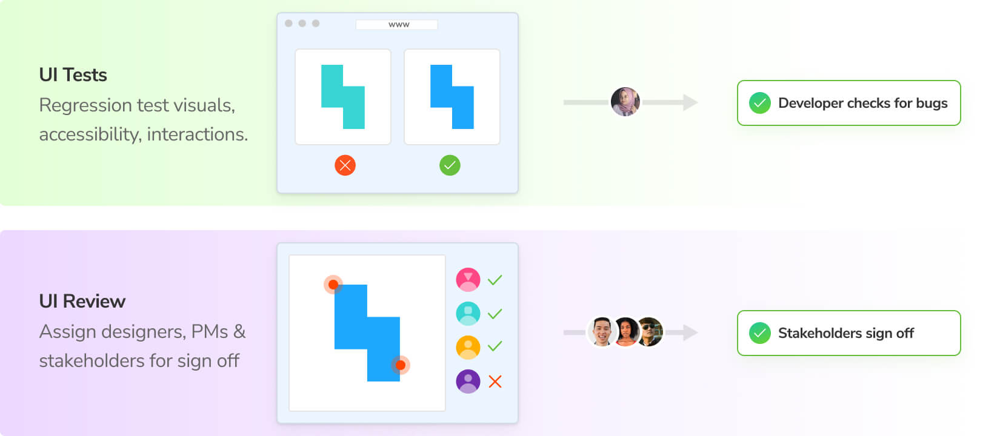

# In pull request workflow

During the pull request, Chromatic runs in CI when you push code to prevent bugs and streamline stakeholder sign-off. There are two key workflows: UI Tests and UI Review.

### UI Tests catch bugs automatically

[UI Tests](/docs/test) prevent visual and functional bugs. They're similar to other types of testing (unit, E2E, etc.), in that they enable developers to catch and fix regressions. UI Tests run in CI automatically when you push code so you can see the impact of code changes on the user interface while you develop.

| UI Tests     | What dimensions are tested                                                                                                                                       |
| ------------ | ---------------------------------------------------------------------------------------------------------------------------------------------------------------- |
| Visual       | [Browsers](/docs/browsers), [Viewports](/docs/viewports), [Themes](/docs/themes), [Locales](/docs/custom-decorators), [CSS Media Features](/docs/media-features) |
| Interactions | [Click, type, hover](docs/interactions)                                                                                                                          |

UI Tests compare the snapshot of a story with the previously accepted [baseline](/docs/branching-and-baselines#whats-a-baseline) in your git history (typically on the same branch). If there are changes, you'll get a diff of the changes. If the changes are intentional, press the accept button to update the baselines. Once all changes are approved, UI Tests will pass, signaling that it's “ready” for review from stakeholders.

### UI Review to get team sign off

After UI Tests pass, the workflow progresses to UI Review. In tools like GitHub, GitLab, and Bitbucket, you assign other developers to review the code for a pull request. Chromatic complements this workflow by allowing you to assign designers, product managers, and other stakeholders to review UI changes in that pull request.

UI Review is different than UI Tests because it shows you what will change on the base branch when you merge a pull request. This is identical to the difference between code review and testing in CI.

How to assign designers and product managers to review?

Click on Assign Reviewers on the review's Activity tab to choose reviewers from the project’s collaborators. Reviewers will be emailed a link to the review page to begin their review.

UI Review is the opportunity to discuss changes and get final team sign off. In the past, teams had to manually click through the UI to review all possible variations. Chromatic's superpower is that it knows exactly which stories have changed. It generates a changeset for reviewers that shows precisely what they need to sign off on.

Why UI Review when all the edge cases should be addressed in the spec?

UI Review acknowledges that even the best laid plans lack fidelity. Developers often run into edge cases or technical hurdles that are impossible for teams to predict ahead of time.

How to invite reviewers to a project?

Invite reviewers by going to the project's Manage page » Collaborate tab. You can invite collaborators by email or by sharing an invite link.

[More on inviting collaborators »](/docs/collaborators#external-collaborators)

Reviewers leave feedback and request changes by starting discussions. Chromatic helps developers gather discussions in one place that every participant can follow. Resolve a discussion to signal that the work is done. Once all discussions are resolved and stakeholders approve, the UI Review will pass.

### Merge with confidence when pull request checks pass

The status of UI Tests and UI Review appears on your pull request as a check. This keeps your team abreast of any changes to the user interface that need attention. When all checks pass, you’re ready to merge!

---

## Next: How to get stakeholders involved in review

See how Chromatic works from the reviewer point of view. Learn about comments, notifications, and integrations with tools like Figma and Slack.

<a class="btn primary round" href="/docs/guide-for-reviewers">Read next chapter</a>
