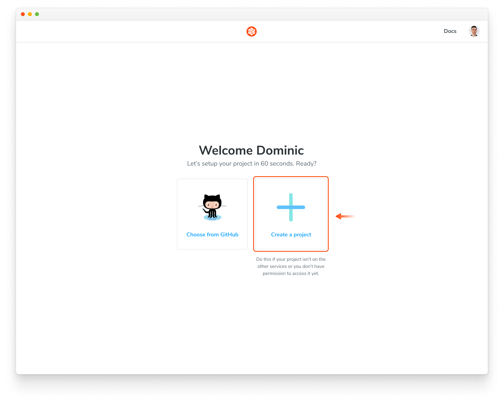

["Unlinked" projects](/docs/access#unlinked-projects) are the way to go if you use an OAuth provider or Git host that Chromatic doesn't support yet, or if you need an enterprise plan but wish to trial Chromatic with your project first.

To set up Chromatic with an "unlinked" project:

1. Make sure your code is in a local or self-hosted repository (Chromatic uses Git history to track baselines).
2. Sign in via any of the supported providers, and make sure you're on your personal account. This authenticates your profile only; it doesn't link the project to your Git provider.
3. Select "Create a project" and type your project name to create an unlinked project.

Nice! You created an unlinked project. This will allow you to get started with [UI Testing](/docs) workflow regardless of the underlying git provider. You can then configure your CI system to automatically run a Chromatic build on push.

The Chromatic CLI provides the option to generate a JUnit XML report of your build, which you can use to handle commit/pull request statuses yourself. For details, see the configuration reference [options](/docs/configure#options).

Unlinked projects have certain drawbacks:

- You won't get automatic PR checks, so pull requests will not be marked with our status messages. You'll need to set this up manually via your CI provider.
- Authentication and access control must be handled manually through user invites.
